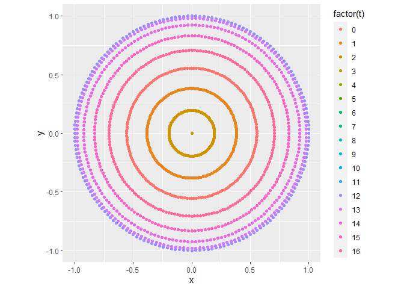
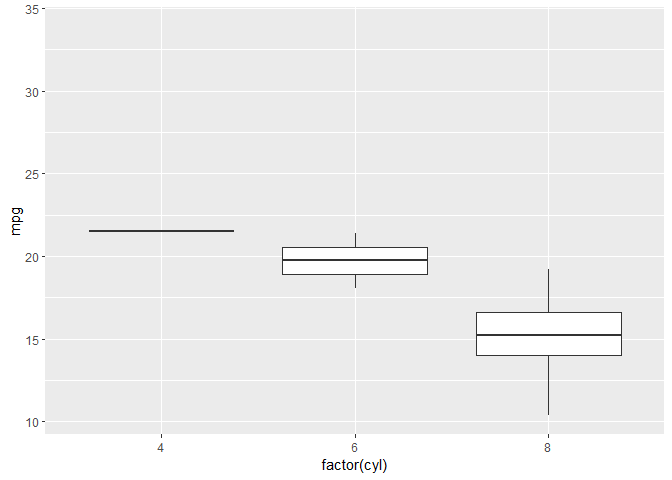

<!-- README.md is generated from README.Rmd. Please edit that file -->

# Infinite loop: Fiesta

<!-- badges: start -->
<!-- badges: end -->

For this piece I use the following package:

``` r
library(dplyr) # A Grammar of Data Manipulation
#> 
#> Attaching package: 'dplyr'
#> The following objects are masked from 'package:stats':
#> 
#>     filter, lag
#> The following objects are masked from 'package:base':
#> 
#>     intersect, setdiff, setequal, union
library(gganimate) # A Grammar of Animated Graphics 
#> Loading required package: ggplot2
library(ggplot2) # Create Elegant Data Visualisations Using the Grammar of Graphics
library(glue) # Interpreted String Literals
library(MexBrewer) # Color Palettes Inspired by Works of Mexican Muralists 
library(purrr) # Functional Programming Tools
```

I will create an infinite loop by taking slices of spheres in ways that
resemble fireworks.

## Slicing spheres

These are the parameters for the coordinates of a sphere. The first
angle $\theta$ is with respect to the plane passing through the center
of the sphere. The second angle $\alpha$ is with respect to the center
of the circular section defined by the angle. $R$ is the radius of the
sphere:

``` r
# Radius of sphere
R <- 1

# Sequence of angles to take slices of sphere
theta <- seq(0, pi, by = pi/16)

# Sequence of angles to points in the circumference of the circular slice of sphere at theta
a <- seq(0, 2 * pi, by = 2 * pi/ 180)
```

The radius of the circular slice of sphere is given by:

``` r
r <- R * sin(theta)
```

Calculate the coordinates of points on the circumference of the circular
slices of sphere for a given value of `r`:

``` r
df <- data.frame(x = max(r) * sin(a), y = max(r) * cos(a))
```

Now for all values of `r` in parallel:

``` r
x_0 <- 0
y_0 <- 0
starting_time <- sample.int(length(r), 1)

df <- map2_dfr(r, 
                 starting_time:(length(r) + starting_time - 1) %% length(r),
                 .f = function(r, t, x0 = x_0, y0 = y_0){
                   data.frame(x = x0 + r * cos(a), 
                              y = y0 + r * sin(a),
                              t = t,
                              r = r,
                              id = (t:(length(a) + t - 1)) %% length(a))}) 
```

Randomly selecte a color palette from package
[`MexBrewer`](https://paezha.github.io/MexBrewer/):

``` r
seed <- sample.int(100000000, 1)
set.seed(seed)

col_palette_name <- sample(c("Alacena", "Atentado", "Aurora", "Concha", "Frida", "Huida", "Maiz", "Ofrenda", "Revolucion", "Ronda", "Taurus1", "Taurus2", "Tierra", "Vendedora"), 1)

col_palette <- c(rev(mex.brewer(col_palette_name)), mex.brewer(col_palette_name))
```

Plot:

``` r
ggplot(df, aes(x, y, color = factor(t))) + 
  geom_point() + 
  coord_equal()
```

<!-- -->

Animate:

``` r
ggplot(df,
       aes(x, 
           y, 
           group = id)) + 
  geom_point(aes(color = id)) + 
  coord_equal(expand = FALSE) +
  scale_color_gradientn(colors = col_palette) +
  theme_void() +
  theme(legend.position = "none",
        plot.background = element_rect(color = NA,
                                       fill = "white")) +
  transition_time(t) +
  shadow_wake(wake_length = 0.4)
```

Make a second sphere:

``` r
set.seed(seed)

# Radius of sphere
R <- runif(1, 0.25, 0.75)

# Sequence of angles to take slices of sphere
theta <- seq(0, pi, by = pi/16)

# Sequence of angles to points in the circumference of the circular slice of sphere at theta
a <- seq(0, 2 * pi, by = 2 * pi/ 90)
```

The radius of the circular slice of sphere is given by:

``` r
r <- R * sin(theta)
```

Calculate the coordinates of points on the circumference of the circular
slices of sphere for given r:

``` r
set.seed(seed)

#random angle to place inner circle
ra <- runif(1, 0, 2 * pi)
x_0 <- (max(df$r) - R) * cos(ra)
y_0 <- (max(df$r) - R) * sin(ra)
starting_time <- sample.int(length(r), 1)

df_2 <- map2_dfr(r, 
                 starting_time:(length(r) + starting_time - 1) %% length(r),
                 .f = function(r, t, x0 = x_0, y0 = y_0){
                   data.frame(x = x0 + r * cos(a), 
                              y = y0 + r * sin(a),
                              t = t,
                              r = r,
                              id = (t:(length(a) + t - 1)) %% length(a))}) %>%
  mutate(id = id + max(df$id))
```

``` r
ggplot(mtcars, aes(factor(cyl), mpg)) + 
  geom_boxplot() + 
  # Here comes the gganimate code
  transition_states(
    gear,
    transition_length = 2,
    state_length = 1
  ) +
  enter_fade() + 
  exit_shrink() +
  ease_aes('sine-in-out')
```

<!-- -->

Animate:

``` r
ggplot() + 
  geom_point(data = df,
             aes(x, 
                 y, 
                 group = id,
                 color = id)) +
  geom_point(data = df_2,
             aes(x, 
                 y, 
                 group = id,
                 color = id)) +
  coord_equal(expand = FALSE) +
  scale_color_gradientn(colors = col_palette) +
  theme_void() +
  theme(legend.position = "none",
        plot.background = element_rect(color = NA,
                                       fill = "white")) +
  transition_time(t) +
  shadow_wake(wake_length = 0.4)
```

Add a third sphere:

``` r
set.seed(seed)

# Radius of sphere
R <- runif(1, 0, R)

# Sequence of angles to take slices of sphere
theta <- seq(0, pi, by = pi/16)

# Sequence of angles to points in the circumference of the circular slice of sphere at theta
a <- seq(0, 2 * pi, by = 2 * pi/ 45)
```

The radius of the circular slice of sphere is given by:

``` r
r <- R * sin(theta)
```

Calculate the coordinates of points on the circumference of the circular
slices of sphere for given `r`:

``` r
set.seed(seed)

#random angle to place inner circle
ra <- runif(1, 0, 2 * pi)
x_0 <- x_0 + (max(df_2$r) - R) * cos(ra)
y_0 <- y_0 + (max(df_2$r) - R) * sin(ra)
starting_time <- sample.int(length(r), 1)

df_3 <- map2_dfr(r, 
                 starting_time:(length(r) + starting_time - 1) %% length(r),
                 .f = function(r, t, x0 = x_0, y0 = y_0){
                   data.frame(x = x0 + r * cos(a), 
                              y = y0 + r * sin(a),
                              t = t,
                              r = r,
                              id = (t:(length(a) + t - 1)) %% length(a))}) %>%
  mutate(id = id + max(df_2$id))
```

Create plot for animation (the colors depend on the `id` or `t` - the
animations after coloring by `t` are indicated in the names of the
file)(after trying colors by `id` and by `t` I think I like the latter
better; notice that `r` is a function of t, but likely changes at a
different rate, might be interesting to try):

``` r
set.seed(seed)

p <- ggplot() + 
  geom_point(data = rbind(df, 
                          df_2, 
                          df_3) %>%
               mutate(t = t + 1),
             aes(x, 
                 y, 
                 group = id,
                 color = t),
             size = 0.01) +
  coord_equal(expand = FALSE) +
  scale_color_gradientn(colors = col_palette) +
  lims(x = c(min(df$x) - 0.1, 
                max(df$x) + 0.1),
       y = c(min(df$y) - 0.1, 
                max(df$y) + 0.1)) +
  theme_void() +
  theme(legend.position = "none",
        plot.background = element_rect(color = NA,
                                       fill = "black")) +
  transition_time(t) +
  shadow_wake(wake_length = 0.4)
```

Render animation:

``` r
animate(p, 
        rewind = FALSE,
        fps = 10,
        duration = 7,
        res = 300,
        height = 2, 
        width = 2, 
        units = "in")
```

<!-- -->

Save animation:

``` r
anim_save(glue::glue("fiesta-t-{seed}.gif"))
```
