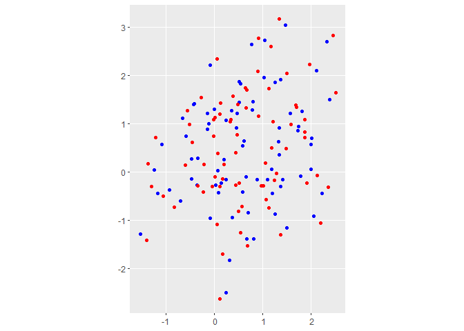
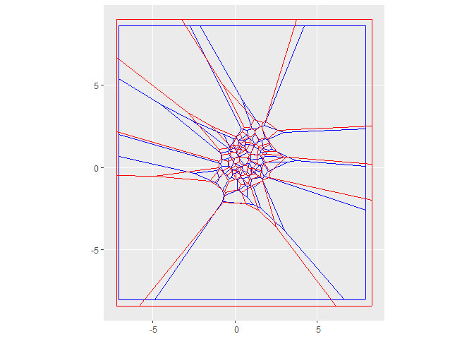

<!-- README.md is generated from README.Rmd. Please edit that file -->

# Glitch art

<!-- badges: start -->
<!-- badges: end -->

[Glitch art](https://en.wikipedia.org/wiki/Glitch_art) involves
introducing errors for aesthetic purposes. This is achieved by
corrupting the original data or physically manipulating electronic
devices. Here, I will take a set of voronoi polygons, and I will
superimpose a glitched version of the same.

For this piece I use the following packages:

``` r
library(dplyr) # A Grammar of Data Manipulation
#> 
#> Attaching package: 'dplyr'
#> The following objects are masked from 'package:stats':
#> 
#>     filter, lag
#> The following objects are masked from 'package:base':
#> 
#>     intersect, setdiff, setequal, union
library(sf) # Accelerating 'ggplot2'  
#> Linking to GEOS 3.9.1, GDAL 3.4.3, PROJ 7.2.1; sf_use_s2() is TRUE
library(ggplot2) # Create Elegant Data Visualisations Using the Grammar of Graphics
library(glue) # Interpreted String Literals
library(MexBrewer) # Color Palettes Inspired by Works of Mexican Muralists 
```

## Generate a random seed

``` r
seed <- sample.int(100000000, 1)
```

## Points for tessellation

Generate points:

``` r
set.seed(seed)

# Number of points
n <- 75
# Number of colors
n_c <- 10

# Generate points
df1 <- data.frame(x = rnorm(n, 0.5),
                 y = rnorm(n, 0.5),
                 fill = sample.int(n_c, n, replace = TRUE))
```

Glitch the positions of the points and the value of `fill` which will be
used for choosing colors:

``` r
set.seed(seed)

# Randomly choose the amount of glitch
glitch <- runif(1, min = 0.1, 0.5)

# Obtain a second set of points; these points are a glitched version of the original
df2 <- df1 |>
  mutate(x = sample(c(-1,1), n, replace = TRUE) * glitch + x,
         y = sample(c(-1,1), n, replace = TRUE) * glitch + y,
         fill = fill + 10 * glitch)
```

Convert to sf:

``` r
df1 <- df1 |>
  st_as_sf(coords = c("x", "y"))

df2 <- df2 |>
  st_as_sf(coords = c("x", "y"))
```

Plot the original points (in blue) and the glitched points (in red):

``` r
ggplot() +
  geom_sf(data = df1,
          color = "blue") +
  geom_sf(data = df2,
          color = "red")
```

<!-- -->

Use the coordinate of the points to obtain the voronoi polygons for the
original set of points and the glitched set of points:

``` r
# The function `do.call(what, arg)` applies a function
# `what` to the argument `arg`. In this case, we extract 
# the geometry of the `sf` object (i.e., the coordinates 
# of the points) and apply the function `c()` to concatenate 
# the coordinates to obtain a MULTIPOINT object.   
# The pipe operator passes the MuLTIPOINT object to function `st_voronoi()`
v1 <- do.call(c, st_geometry(df1)) %>% 
  st_voronoi() %>% 
  # The output of `st_voronoi()` is a collection of geometries, 
  # which we pass to the following function for extraction.
  st_collection_extract()

v2 <- do.call(c, st_geometry(df2)) %>% 
  st_voronoi() %>% 
  st_collection_extract()
```

Intersect the voronoi polygons and the points to obtain a simple
features data frame that includes also the variable `fill`:

``` r
df_v1 <- df1
df_v1$geometry <- v1[unlist(st_intersects(df_v1, v1))] 

df_v2 <- df2
df_v2$geometry <- v2[unlist(st_intersects(df_v2, v2))] 
```

Plot the original polygons (blue) and the glitched polygons (red):

``` r
ggplot() +
  geom_sf(data = v1,
          color = "blue",
          fill = NA) +
  geom_sf(data = v2,
          color = "red",
          fill = NA)
```

<!-- -->

## Rendering

Randomly select a color palette from package
[`MexBrewer`](https://paezha.github.io/MexBrewer/):

``` r
set.seed(seed)

col_palette_name <- sample(c("Alacena", "Atentado", "Aurora", "Concha", "Frida", "Huida", "Maiz", "Ofrenda", "Revolucion", "Ronda", "Taurus1", "Taurus2", "Tierra", "Vendedora"), 1)
```

Generate image:

``` r
# Find the bounding box of the randomly generated points
box <- df1 |>
  st_bbox()

# Find the range in x and y
rx <- box[3] - box[1]
ry <- box[4] - box[2]

if(rx > ry){
  xlim = c(box[1] - glitch * 5, box[3] + glitch * 5)
}else{
  xlim = c(box[2] - glitch * 5, box[4] + glitch * 5)
}

# Plot
ggplot() +
  # Plot the first set of voronoi polygons with some transparency
  geom_sf(data = df_v1,
          aes(fill = fill,
              color = fill + 1),
          alpha = 0.5) +
  # Plot the second set of voronoi polygons with some transparency
  geom_sf(data = df_v2,
          aes(fill = fill,
              color = fill - 1),
          alpha = 0.5) +
  # Use randomly chosen color palette
  scale_fill_mex_c(palette_name = col_palette_name) +
  # Define the limits of the plot based on the bounding box and the amount of glitch
  xlim(xlim) +
  ylim(xlim) +
  # Theme the plot
  theme_void() +
  theme(legend.position = "none")

# Save plot
ggsave(filename = glue::glue("glitched-voronoi-{seed}.png"),
       height = 7,
       width = 7)
```


