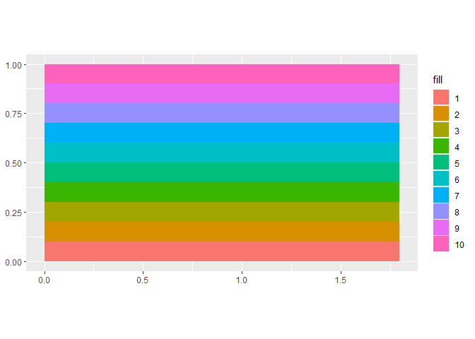
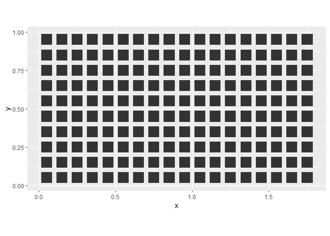
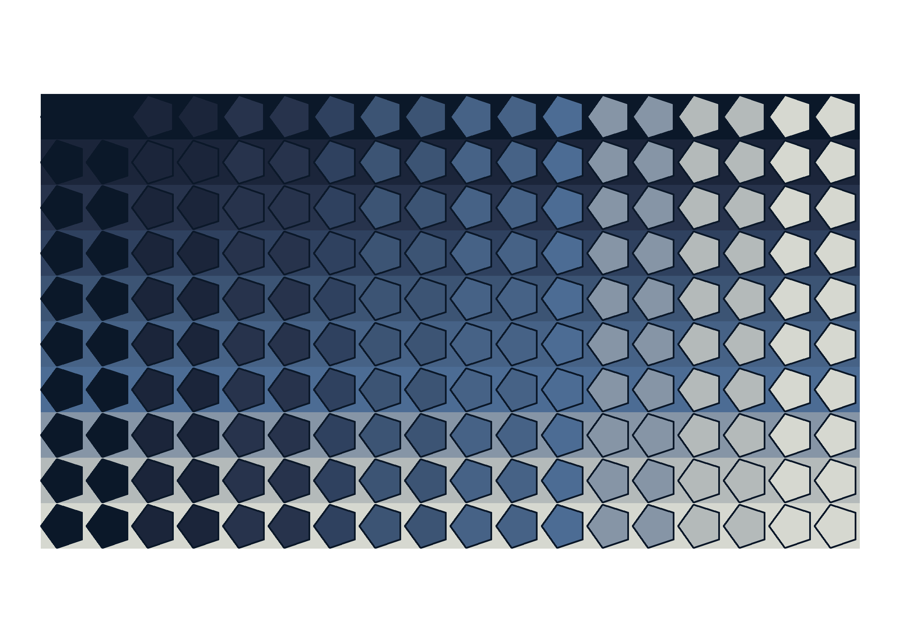

<!-- README.md is generated from README.Rmd. Please edit that file -->

# Intersections: Transchromations

<!-- badges: start -->
<!-- badges: end -->

The prompt for Day 4 is pretty open ended: intersections. I thought of
intersecting geometries using package [`sf`]() but instead I will
intersect colors using regular geometries.

For this piece I use the following packages:

``` r
library(dplyr) # A Grammar of Data Manipulation
#> 
#> Attaching package: 'dplyr'
#> The following objects are masked from 'package:stats':
#> 
#>     filter, lag
#> The following objects are masked from 'package:base':
#> 
#>     intersect, setdiff, setequal, union
library(ggforce) # Accelerating 'ggplot2'
#> Loading required package: ggplot2
library(ggplot2) # Create Elegant Data Visualisations Using the Grammar of Graphics
library(glue) # Interpreted String Literals
library(MexBrewer) # Color Palettes Inspired by Works of Mexican Muralists 
```

## Generate a random seed

``` r
seed <- sample.int(100000000, 1)
```

## Horizontal bands

Create horizontal bands using a canvas of proportions 1:1.8:

``` r
df <- data.frame(fill = factor(1:10),
                 ymin = seq(0, 0.9, 0.1), 
                 ymax = seq(0.1, 1, 0.1),
                 xmin = 0,
                 xmax = 1.80)
```

Plot:

``` r
ggplot(data = df) +
  geom_rect(aes(xmin = xmin, 
                xmax = xmax,
                ymin = ymin,
                ymax = ymax,
                fill = fill)) + 
  coord_equal()
```

<!-- -->

Create a grid for placing the polygons:

``` r
df2 <- expand.grid(x = seq(0.05, 1.75, 0.1),
                   y = seq(0.05, 0.95, 0.1))
```

Plot polygons:

``` r
ggplot() +
  geom_regon(data = df2,
             aes(x0 = x,
                 y0 = y,
             angle = 0,
             r = 0.05,
             sides = 4)) + 
  coord_equal()
```

<!-- -->

## Rendering

For the final image, the regular polygons are “intersected” with the
horizontal bands. The alternation of colors creates the illusion of
vanishing intersections.

Randomly select a color palette from package
[`MexBrewer`](https://paezha.github.io/MexBrewer/):

``` r
set.seed(seed)

col_palette_name <- sample(c("Alacena", "Atentado", "Aurora", "Concha", "Frida", "Huida", "Maiz", "Ofrenda", "Revolucion", "Ronda", "Taurus1", "Taurus2", "Tierra", "Vendedora"), 1)

col_palette <- mex.brewer(col_palette_name, n = 10)
```

Generate image:

``` r
set.seed(seed)

# Mutate dataframe to randomize parameters for regular polygons
df2 <- df2 |>
  # The color is a decreasing function of position in x
  mutate(fill = 1.75 - x,
         fill = cut(fill, 
                    breaks = 10,
                    labels = c("1", "2", "3", "4", "5", "6", "7", "8", "9", "10")),
         # Randomize the angle (constant or variable)
         angle = ifelse(sample(c(TRUE, FALSE), 1), 
                        pi/2, 
                        -100 * pi * (x - 0.05)/360),
         # Randomize the number of sides
         sides = sample(c(3, 4, 5, 6, 100), 1))

# Randomly choose to plot in cartesian or polar coordinates
if(sample(c(TRUE, FALSE), 1)){
  ggplot() +
  # Plot horizontal bands
  geom_rect(data = df,
            aes(xmin = xmin, 
                xmax = xmax,
                ymin = ymin,
                ymax = ymax,
                fill = fill)) +
  # Plot regular polygons
  geom_regon(data = df2, 
             aes(x0 = x,
                 y0 = y,
                 angle = angle,
                 fill = fill,
                 r = 0.05,
                 sides = sides),
             color = sample(c(col_palette[1], col_palette[10]), 1)) + 
  # Use randomly chosen color palette
  scale_fill_manual(values = col_palette) +
  coord_equal() + 
  # Theme the plot
  theme_void() +
  theme(legend.position = "none")
}else{
  ggplot() +
  # Plot horizontal bands
  geom_rect(data = df,
            aes(xmin = xmin, 
                xmax = xmax,
                ymin = ymin,
                ymax = ymax,
                fill = fill)) +
  # Plot regular polygons
  geom_regon(data = df2, 
             aes(x0 = x,
                 y0 = y,
                 angle = angle,
                 fill = fill,
                 r = 0.05,
                 sides = sides),
             color = NA) + 
  # Use randomly chosen color palette
  scale_fill_manual(values = col_palette) +
  coord_polar() + 
  # Theme the plot
  theme_void() +
  theme(legend.position = "none")
}


# Save plot
ggsave(filename = glue::glue("outputs/transchromation-{seed}.png"),
       #height = 7,
       width = 7)
#> Saving 7 x 5 in image
```


