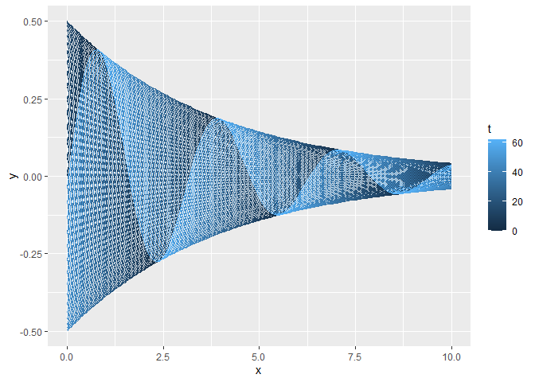
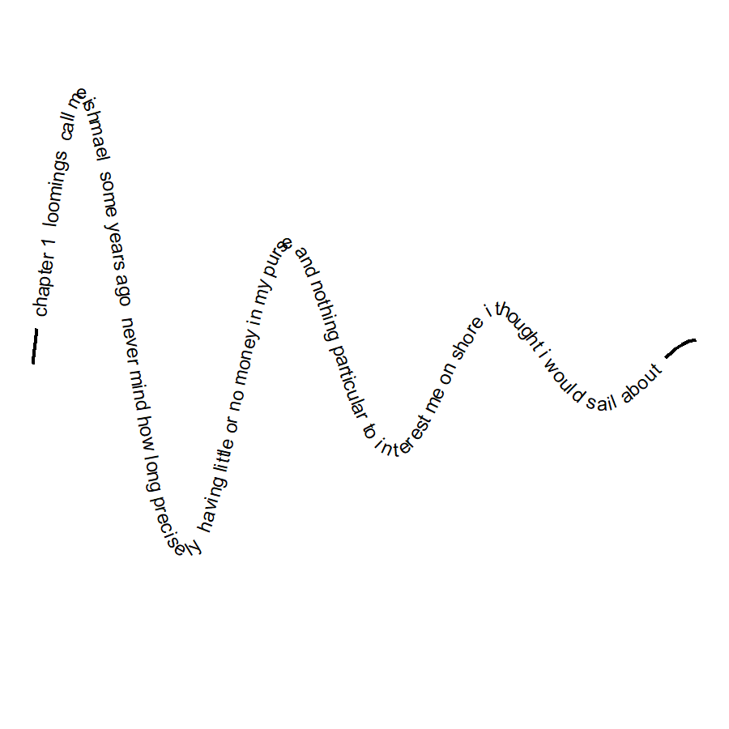

<!-- README.md is generated from README.Rmd. Please edit that file -->

# Debug view

<!-- badges: start -->
<!-- badges: end -->

The prompt for Day 5 is Debug View. Here I present one step in the
debugging process of creating a wave with damping.

For this piece I use the following packages:

``` r
library(dplyr) # A Grammar of Data Manipulation
#> 
#> Attaching package: 'dplyr'
#> The following objects are masked from 'package:stats':
#> 
#>     filter, lag
#> The following objects are masked from 'package:base':
#> 
#>     intersect, setdiff, setequal, union
library(geomtextpath) # Curved Text in 'ggplot2'
#> Loading required package: ggplot2
library(gganimate) # A Grammar of Animated Graphics
library(ggplot2) # Create Elegant Data Visualisations Using the Grammar of Graphics
library(MexBrewer) # Color Palettes Inspired by Works of Mexican Muralists
library(stringr) # Simple, Consistent Wrappers for Common String Operations
```

## Wave equation

The equation of a wave that moves in one dimension: $$
y(x, t) = A\sin(kx + \omega t - \phi)
$$

- $A$: amplitude
- $k$: speed of propagation
- $\omega$: angular frequency
- $\phi$: phase

The amplitude $A$ can be parameterized in terms of time or position. I
try the following: $$
A(x) = \alpha\cdot\exp(-\beta x)
$$

## Simulate a wave

Create a data frame with values of $x$ and $t$ (I use $0 \le t \le 62$
because this value creates a full cycle of the wave…but I am not sure
why!):

``` r
df <- expand.grid(x = seq(0, 10, 0.1),
                  t = 0:62) |>
  mutate(y = 0.5 * exp(-0.25 * x) * sin(2 * x + 0.1 * t))
```

In the above, $\alpha = 0.5$ (this is the maximum amplitude) and
$\beta = 0.25$, meaning that the wave’s amplitude decays by about 92%
when $x=10$. Plot:

``` r
ggplot() + 
  geom_line(data = df,
            aes(x = x, 
                y = y,
                group = t,
                color = t))# +
```

<!-- -->

``` r
  #transition_time(time = t)
```

## Process text

``` r
text1.v <- scan("melville.txt", what="character", sep="\n")
```

Find where the main text starts and ends:

``` r
start.v <- which(text1.v == "CHAPTER 1. Loomings.")
end.v <- which(text1.v == "orphan.")
```

Separate any metadata from the text of the novel proper:

``` r
start.metadata.v <- text1.v[1:start.v - 1]
end.metadata.v <- text1.v[(end.v + 1): length(text1.v)]
metadata.v <- c(start.metadata.v, end.metadata.v)
novel.lines.v <- text1.v[start.v:end.v]
```

Join all the lines into one long string and convert to lower case:

``` r
novel.lower.v <- novel.lines.v %>%
  paste(collapse = " ") %>%
  tolower()
```

Collect only words to list and simplify to vector:

``` r
moby.words.l <- strsplit(novel.lower.v, "\\W")
moby.word.v <- unlist(moby.words.l)
```

Convert text to a single string:

``` r
moby.text <- paste(moby.word.v, collapse = " ")
```

``` r
moby.fragment <- moby.text |>
  str_sub(1, 200) #|> 
  #str_extract_all(boundary("character")) |> 
  #unlist()
```

Join text to data frame:

``` r
#df$text <- rep(moby.fragment, 63)
df$text <- moby.fragment
```

Plot and animate the wave:

``` r
p <- ggplot() + 
  geom_textpath(data = df,
            aes(x = x, 
                y = y,
                label = text),
            size = 2) +
  theme_void() +
  # theme(axis.line = element_blank(),
  #       panel.background = element_rect(fill = clr1),
  #       plot.background = element_rect(fill = clr1),
  #       panel.border = element_blank(),
  #       panel.grid = element_blank()) +
  transition_time(time = t)
```

Render animation:

``` r
animate(p, 
        rewind = FALSE,
        fps = 30,
        duration = 7,
        res = 300,
        height = 3, 
        width = 3, 
        units = "in")
```

<!-- -->

Save animation:

``` r
anim_save(glue::glue("outputs/debug-view.gif"))
```
