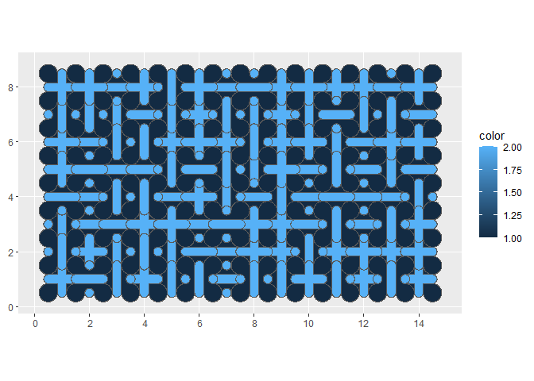
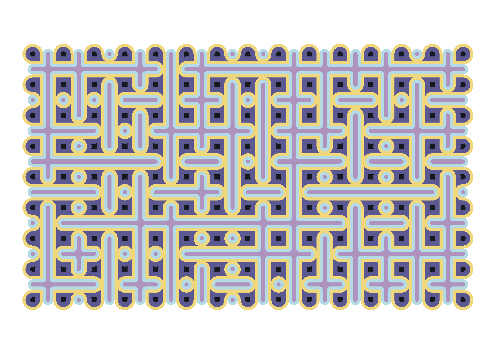

<!-- README.md is generated from README.Rmd. Please edit that file -->

# Sample a color palette from your favorite movie/album cover

<!-- badges: start -->
<!-- badges: end -->

For this one, I create a truchet mosaic with colors from one of my
favorite Ghibli Studio movies: Laputa.

Package [`truchet`](https://paezha.github.io/truchet/index.html)
provides functions to easily create truchet mosaics. Load the packages:

``` r
library(dplyr) # A Grammar of Data Manipulation
#> 
#> Attaching package: 'dplyr'
#> The following objects are masked from 'package:stats':
#> 
#>     filter, lag
#> The following objects are masked from 'package:base':
#> 
#>     intersect, setdiff, setequal, union
library(ggplot2) # Create Elegant Data Visualisations Using the Grammar of Graphics
library(ghibli) # Studio Ghibli Colour Palettes
library(glue) # Interpreted String Literals 
library(sf) # Simple Features for R
#> Linking to GEOS 3.9.1, GDAL 3.4.3, PROJ 7.2.1; sf_use_s2() is TRUE
library(truchet) # Package for creating Truchet tiles and random mosaics
```

## Generate a random seed

``` r
seed <- sample.int(100000000, 1)
```

## Create truchet mosaic

Create a mosaic:

``` r
set.seed(seed = seed)
df <- st_truchet_ms(tiles = c("-", "+", "|"),
                    p1 = 1,
                    xlim = c(1, 14),
                    ylim = c(1, 8))
```

Plot the base mosaic:

``` r
ggplot() +
  geom_sf(data = df,
          aes(fill = color))
```

<!-- -->

Buffer and disolve the base mosaic:

``` r
df2 <- df |>
  st_buffer(dist = c(-0.10)) |>
  st_truchet_dissolve() |>
  mutate(color = color + 2)

df3 <- df |>
  st_buffer(dist = c(-0.25)) |>
  st_truchet_dissolve() |>
  mutate(color = color + 4)
```

## Rendering

Plot mosaics to generate final figure:

``` r
set.seed(seed = seed)
col_palette <- sample(ghibli_palette("LaputaMedium"))

ggplot() +
  geom_sf(data = df,
          aes(fill = factor(color)),
          color = NA) + 
  geom_sf(data = df2,
          aes(fill = factor(color)),
          color = NA) + 
  geom_sf(data = df3,
          aes(fill = factor(color)),
          color = NA) +
  scale_fill_manual(values = col_palette) +
  theme_void() +
  theme(legend.position = "none")

# Save plot
ggsave(filename = glue::glue("outputs/truchet-ghibli-{seed}.png"),
       #height = 7,
       width = 7)
#> Saving 7 x 5 in image
```


