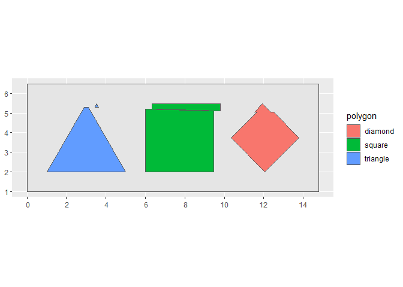

<!-- README.md is generated from README.Rmd. Please edit that file -->

# Signed distance functions

<!-- badges: start -->
<!-- badges: end -->

A signed distance function
([SDF](https://en.wikipedia.org/wiki/Signed_distance_function)) is, in
simple terms, the orthogonal distance from a point to a boundary. The
sign of the function is positive if the point is *outside* the boundary,
and negative if it is *inside*.

[Simple features](https://r-spatial.github.io/sf/) make it easy to
compute signed distance functions, since they are essentially buffers!

For this prompt I use the following packages:

``` r
library(dplyr) # A Grammar of Data Manipulation
#> 
#> Attaching package: 'dplyr'
#> The following objects are masked from 'package:stats':
#> 
#>     filter, lag
#> The following objects are masked from 'package:base':
#> 
#>     intersect, setdiff, setequal, union
library(ggplot2) # Create Elegant Data Visualisations Using the Grammar of Graphics
library(glue) # Interpreted String Literals 
library(lwgeom)
#> Linking to liblwgeom 3.0.0beta1 r16016, GEOS 3.9.1, PROJ 7.2.1
library(MexBrewer)
library(sf) # Simple Features for R
#> Linking to GEOS 3.9.1, GDAL 3.4.3, PROJ 7.2.1; sf_use_s2() is TRUE
```

## Generate a random seed

``` r
seed <- sample.int(100000000, 1)
```

## Create canvas

Canvas:

``` r
container_polygon <- matrix(c(0, 1, 
                              0, 3 + sqrt(4^2 - 2^2), 
                              10 + 1/3 + sqrt(4^2 - 2^2) + 1, 3 + sqrt(4^2 - 2^2),  
                              10 + 1/3 + sqrt(4^2 - 2^2) + 1, 1,
                              0, 1),
                            ncol = 2,
                            byrow = TRUE)

# Convert coordinates to polygons and then to simple features
container_polygon <- data.frame(id = 1,
                                geometry = st_polygon(list(container_polygon)) |> 
                                  st_sfc()) |> 
  st_as_sf()
```

# Create primitive polygons

Create a triangle:

``` r
triangle <- matrix(c(1, 2, 
                     3, 2 + sqrt(4^2 - 2^2), 
                     5, 2,  
                     1, 2),
                   ncol = 2,
                   byrow = TRUE)

# Convert coordinates to polygons and then to simple features
triangle <- data.frame(id = 1,
                       geometry = st_polygon(list(triangle)) |> 
                         st_sfc()) |> 
  st_as_sf()
```

Create a square:

``` r
square <- matrix(c(6, 2, 
                   6, 2 + sqrt(4^2 - 2^2), 
                   6 + sqrt(4^2 - 2^2), 2 + sqrt(4^2 - 2^2),  
                   6 + sqrt(4^2 - 2^2), 2,
                   6, 2),
                 ncol = 2,
                 byrow = TRUE)

# Convert coordinates to polygons and then to simple features
square <- data.frame(id = 1,
                     geometry = st_polygon(list(square)) |> 
                       st_sfc()) |> 
  st_as_sf()
```

Create a diamond:

``` r
diamond <- matrix(c(10 + 1/3 + sqrt(4^2 - 2^2)/2, 2, 
                    10 + 1/3, 2 + sqrt(4^2 - 2^2)/2, 
                    10 + 1/3 + sqrt(4^2 - 2^2)/2, 2 + sqrt(4^2 - 2^2),  
                    10 + 1/3 + sqrt(4^2 - 2^2), 2 + sqrt(4^2 - 2^2)/2,
                    10 + 1/3 + sqrt(4^2 - 2^2)/2, 2),
                  ncol = 2,
                  byrow = TRUE)

# Convert coordinates to polygons and then to simple features
diamond <- data.frame(id = 1,
                     geometry = st_polygon(list(diamond)) |> 
                       st_sfc()) |> 
  st_as_sf()
```

Plot the primitive polygons:

``` r
ggplot() +
  geom_sf(data = container_polygon) +
  geom_sf(data = triangle,
          fill = "red") +
  geom_sf(data = square,
          fill = "blue") +
  geom_sf(data = diamond,
          fill = "green")
```

<!-- -->

## Create blade

Create a blade with randomly chosen start and end points:

``` r
set.seed(seed)

blade <- matrix(c(0, runif(1, 2.1, 2.9 + sqrt(4^2 - 2^2)),#2 + sqrt(4^2 - 2^2)/2,
                  10 + 1/3 + sqrt(4^2 - 2^2) + 1, runif(1, 2.1, 2.9 + sqrt(4^2 - 2^2))), #2 + sqrt(4^2 - 2^2)/2),
                nrow = 2,
                byrow = TRUE)

# Convert coordinates to lines and then to simple features
blade <- data.frame(id = 1,
                    geometry = st_linestring(blade) |> 
                      st_sfc()) |> 
  st_as_sf()
```

Plot the primitive polygons and blade:

``` r
ggplot() +
  geom_sf(data = container_polygon) +
  geom_sf(data = triangle,
          fill = "red") +
  geom_sf(data = square,
          fill = "blue") +
  geom_sf(data = diamond,
          fill = "green") +
  geom_sf(data = blade)
```

<!-- -->

Split geometries

``` r
set.seed(seed)

triangle_2 <- triangle |>
  st_split(blade) |>
  st_collection_extract(c("POLYGON"))

triangle_2$geometry[2] <- triangle_2$geometry[2] + c(runif(1, -1, 1), 0) 

square_2 <- square |>
  st_split(blade) |>
  st_collection_extract(c("POLYGON")) 

square_2$geometry[2] <- square_2$geometry[2] + c(runif(1, -1, 1), 0) 


diamond_2 <- diamond |>
  st_split(blade) |>
  st_collection_extract(c("POLYGON"))

diamond_2$geometry[2] <- diamond_2$geometry[2] + c(runif(1, -1, 1), 0) 
```

Union the split geometries:

``` r
triangle_2 <- triangle_2 |>
  st_union()

square_2 <- square_2 |>
  st_union()

diamond_2 <- diamond_2 |>
  st_union()
```

Bind the polygons:

``` r
polygons <- rbind(triangle_2 |> 
                    st_as_sf(), 
                  square_2 |> 
                    st_as_sf(), 
                  diamond_2 |> 
                    st_as_sf()) |>
  mutate(polygon = c("triangle",
                     "square",
                     "diamond"))
```

Plot the sliced polygons:

``` r
ggplot() +
  geom_sf(data = container_polygon) +
  geom_sf(data = polygons,
          aes(fill = polygon))
```

<!-- -->

Positive buffers:

``` r
polygons_c <- st_combine(polygons) |> st_as_sf()

psdf <- purrr::map_dfr(.x = seq(3, 0.0, -0.1),
           .f = function(x){st_buffer(polygons_c, x)}) |>
  mutate(b = seq(3, 0.0, -0.1),
         b = b)
```

Negative buffers:

``` r
nsdf <- purrr::map_dfr(.x = seq(0, -1.4, -0.1),
           .f = function(x){st_buffer(polygons_c, x)}) |>
  mutate(b = seq(0, -1.4, -0.1),
         b = b)
```

Bind positive and negative signed distance function values:

``` r
sdf <- rbind(psdf,
             nsdf)
```

## Rendering

Randomly select a color palette from package
[`MexBrewer`](https://paezha.github.io/MexBrewer/):

``` r
set.seed(seed)

col_palette_name <- sample(c("Alacena", "Atentado", "Aurora", "Concha", "Frida", "Huida", "Maiz", "Ofrenda", "Revolucion", "Ronda", "Taurus1", "Taurus2", "Tierra", "Vendedora"), 1)

col_palette <- mex.brewer(col_palette_name, n = nrow(sdf))
```

Plot:

``` r
set.seed(seed = seed)

ggplot() + 
  geom_sf(data = sdf |> st_intersection(container_polygon),
          aes(fill = b)) +
  #geom_sf(data = polygons,
  #        color = "black",
  #        fill = NA) + 
  #scale_fill_manual(values = col_palette) +
  scale_fill_mex_c(col_palette_name, direction = sample(-1, 1, 1)) +
  theme_void() + 
  theme(legend.position = "none")
#> Warning: attribute variables are assumed to be spatially constant throughout all
#> geometries

# Save plot
ggsave(filename = glue::glue("outputs/sdf-{seed}.png"),
       #height = 7,
       width = 7)
#> Saving 7 x 5 in image
```


