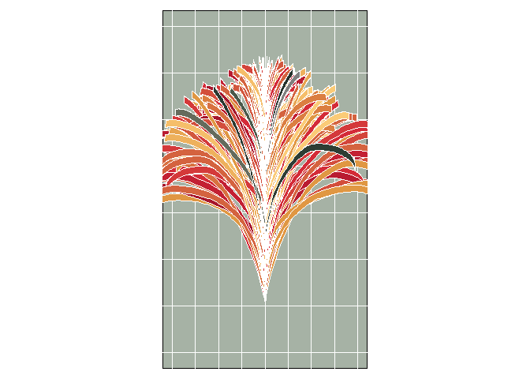

<!-- README.md is generated from README.Rmd. Please edit that file -->

# Generative Music

<!-- badges: start -->
<!-- badges: end -->

For today’s prompt I use [Pierre
Casadebaig’s](https://github.com/picasa) package
[`generate`](https://github.com/picasa/generate). As explained
[here](https://github.com/picasa/generative_examples/blob/master/R/sequence_collatz.rmd#L25),
vegetation-like shapes can be obtained by defining a curve that maps a
sequence of integers to segment lengths, changing the angle between
segments by some pre-determined amount. Nodes are made of multiple
curves, and stems are made of multiple nodes.

For this piece I use the following packages:

``` r
library(dplyr) # A Grammar of Data Manipulation
#> 
#> Attaching package: 'dplyr'
#> The following objects are masked from 'package:stats':
#> 
#>     filter, lag
#> The following objects are masked from 'package:base':
#> 
#>     intersect, setdiff, setequal, union
#Sys.unsetenv("GITHUB_PAT")
#renv::install("picasa/generate")
library(generate) # Might Generate Rtistry
library(ggforce) # Accelerating 'ggplot2'
#> Loading required package: ggplot2
library(ggplot2) # Create Elegant Data Visualisations Using the Grammar of Graphics
library(glue) # Interpreted String Literals # Interpreted String Literals
library(MexBrewer) # Color Palettes Inspired by Works of Mexican Muralists # Color Palettes Inspired by Works of Mexican Muralists 
library(tuneR) # Analysis of Music and Speech
```

## Set random seed

``` r
seed <- sample.int(1000000000, 1)
```

## Read music file

Read midi file with Bach’s Crab Canon:

``` r
crab <- readWave("inputs/crab_canon.wav")
crab.mid <- readMidi("inputs/crab_canon.mid")
crab.notes <- getMidiNotes(crab.mid)
```

## Generate leaves

``` r
set.seed(seed)
# plot a single node with dense polygons
p_node = nrow(crab.notes) + 1#300 + sample.int(500, 1)
p_imin = 15 + sample.int(20, 1)
p_imax = 55 + sample.int(40, 1)
p_lmax = runif(1, 400, 500)
p_amin = runif(1, -30, 0)
p_amax = runif(1, 0, 30)
p_shift = c(0, 2)
p_width = c(0, 15)
p_shape <- "spiral" #sample(c("spiral", "wave"), 1)
p_render = "spline" #sample(c("path", "spline", "polygon", "polygon_lm"), 1)#"spline"

data_dense <- gen_node(
  n = p_node,
  imin = p_imin,
  imax = p_imax,
  lmax = p_lmax,
  end = 1,
  amin = p_amin,
  amax = p_amax,
  shift = p_shift,
  width = c(0, 15),
  scale = 1,
  shape = p_shape,
  method = p_render,
  seed = seed)
```

## Select color palette

``` r
set.seed(seed)

col_palette_name <- sample(c("Alacena", "Atentado", "Aurora", "Concha", "Frida", "Huida", "Maiz", "Ofrenda", "Revolucion", "Ronda", "Taurus1", "Taurus2", "Tierra", "Vendedora"), 1)

col_palette <- mex.brewer(col_palette_name)
```

Generate random numbers for coloring the leaves:

``` r
# Create random variable to add colors
col_table <- data.frame(id = 1:max(data_dense$id)) %>%
  mutate(color = crab.notes$note[1:max(data_dense$id)])

# Join to data table
data_dense_plus <- data_dense %>%
  left_join(col_table,
            by = c("id"))
```

## Render the image

``` r
data_dense_plus %>%
  ggplot(aes(x,
             y,
             group = id)) +
  geom_shape(aes(fill = color),
             color = sample(c("black",
                                     "white"),
                                     1),
             linewidth = 0.5, 
             radius = grid::unit(0, 'pt')) +
  #coord_fixed() +
  coord_fixed(xlim = c(-200, 200),
              ylim = c(-100, 600)) +
  scale_fill_gradientn(colors = col_palette) +
  theme_void() +
  theme(axis.text = element_blank(),
        panel.background = element_rect(fill = sample(col_palette, 1)),
        panel.grid = element_line(color = "white"),
        legend.position = "none",
        plot.margin = rep(grid::unit(10, "pt"), 4))
```

<!-- -->

``` r

ggsave(filename = glue::glue("outputs/crab-plant-{seed}.png"),
       height = 7,
       width = 4)
```


