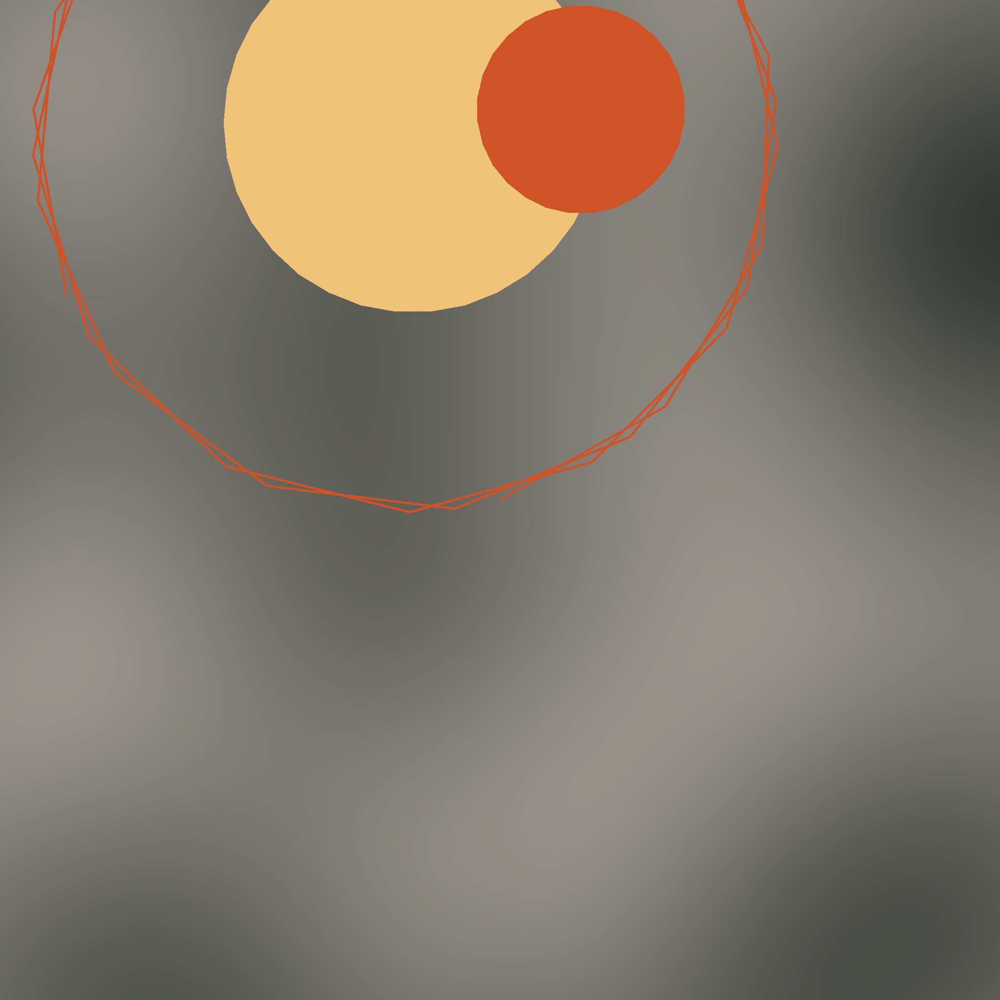

<!-- README.md is generated from README.Rmd. Please edit that file -->

# Suprematism

<!-- badges: start -->
<!-- badges: end -->

[Suprematism](https://en.wikipedia.org/wiki/Suprematism) is an artistic
movement founded amidst the chaos of early 20th Century Russia, and in
the immediacy of the Revolution of 2017. Its founder, [Kazimir
Malevich](https://en.wikipedia.org/wiki/Kazimir_Malevich), was inspired
by cubism to create a purely abstract form of expression to convey “the
supremacy of pure artistic feeling” over any representation of real
objects. Suprematism is characterized by the use of regular or
semi-regular geometric shapes and color palettes with limited ranges.

Kazimir Malevich went as far as to change his method to avoid his
painting to be confused with any concrete object, such as [building
footprints](https://youtu.be/jM1sBxVeWjg?t=216).

Suprematism presents an interesting challenge for generative art. While
it is relatively straightforward to create shapes algorithmically, can
pure artistic feeling be algorithmically generated? A machine cannot
experience artistic feeling, can only convey the feeling of the
artist-coder.

More food for thought: Suprematism sounds a bit authoritarian: it denies
the viewer agency to interpret what they are seeing. Who is the artist
to dictate what others can see in a piece of art?

For this prompt I use the following packages:

``` r
library(ambient) # A Generator of Multidimensional Noise
library(dplyr) # A Grammar of Data Manipulation
#> 
#> Attaching package: 'dplyr'
#> The following objects are masked from 'package:stats':
#> 
#>     filter, lag
#> The following objects are masked from 'package:base':
#> 
#>     intersect, setdiff, setequal, union
library(ggforce) # Accelerating 'ggplot2'
#> Loading required package: ggplot2
library(ggplot2) # Create Elegant Data Visualisations Using the Grammar of Graphics
library(glue) # Interpreted String Literals 
library(MexBrewer) # Color Palettes Inspired by Works of Mexican Muralists
```

## Generate a random seed

``` r
seed <- sample.int(100000000, 1)
```

## Generate minimal radial walk

Initialize the parameters for the walk:

``` r
set.seed(seed)

# Initialize radius of circle 1
rad_1 <- runif(1, 0.15, 0.90)

# Initialize data frame 1
df_1 <- data.frame(x = 0, y = 0)

# Initialize radius of circle 1
rad_2 <- runif(1, 0.15, 0.50)

angle_2 <-  runif(1, 0, 2 * pi)

# Initialize data frame 2
df_2 <- data.frame(x = cos(angle_2),
                   y = sin(angle_2))

# Initialize the angle; this parameter is important, if it coincides with some values it creates closed polygons
angle <- runif(1, 0, 180) * pi/180
```

A minimal radial walk is as follows: the turtle walks from it initial
position at (0,0) a distance of rad with direction angle \* i, and the
from that point takes a new step *without returning to the initial
position*:

``` r
n_steps <- sample.int(50, 1)
for(i in 1:n_steps){
  df_1 <- df_1 |>
    rbind(df_1 |>
            slice_tail() |>
            mutate(x = x + rad_1 * cos(angle * i),
                   y = y + rad_1 * sin(angle * i)))
}

n_steps <- sample.int(50, 1)
for(i in 1:n_steps){
  df_2 <- df_2 |>
    rbind(df_2 |>
            slice_tail() |>
            mutate(x = x + rad_2 * cos(angle * i),
                   y = y + rad_2 * sin(angle * i)))
}

# Bind walks
df <- rbind(df_1,
            df_2)
```

## Rendering

Randomly select a color palette from package
[`MexBrewer`](https://paezha.github.io/MexBrewer/):

``` r
set.seed(seed)

col_palette_name <- sample(c("Alacena", "Atentado", "Aurora", "Concha", "Frida", "Huida", "Maiz", "Ofrenda", "Revolucion", "Ronda", "Taurus1", "Taurus2", "Tierra", "Vendedora"), 1)

col_palette <- mex.brewer(col_palette_name, n = 25)

# Select colors from the palette
col_fill <- sample(col_palette, 6)
```

``` r
set.seed(seed)

# Coordinates of center of first circle
x0_1 <- mean(df_1$x)
y0_1 <- mean(df_1$y) 

# Coordinates of center of second circle
x0_2 <- mean(df_2$x)
y0_2 <- mean(df_2$y) 

# Plot limits are the tightest of the radius or the extents of the walk
cmin_1 <- min(min(df_1$x),min(df_1$y), -rad_1)
cmax_1 <- max(max(df_1$x), max(df_1$y), rad_1)

cmin_2 <- min(min(df_2$x),min(df_2$y), -rad_2)
cmax_2 <- max(max(df_2$x), max(df_2$y), rad_2)

cmin <- min(cmin_1, cmin_2)
cmax <- max(cmax_1, cmax_2)

# Make noise in the interval of cmin and cmax (uses package {ambient})
noise_complaint <- expand.grid(x = seq(floor(cmin), 
                                       ceiling(cmax),
                                       by = (cmax  - cmin)/1000),
                              y = seq(floor(cmin), 
                                      ceiling(cmax), 
                                      by = (cmax  - cmin)/1000)) |>
  mutate(noise = ambient::gen_perlin(x, 
                                     y,
                                     frequency = runif(1, 0.1, 2)),
         noise = 0.5 * (noise - min(noise))/(max(noise) - min(noise)))
```

Plot:

``` r
set.seed(seed = seed)

ggplot() +
  geom_raster(
    data = noise_complaint,
    aes(x, y, alpha = noise),
    fill = col_fill[6]) +
  geom_regon(aes(x0 = x0_1, y0 = y0_1,
                 angle = 0,
                 # The number of sides is a random number
                 sides = sample(3:50, 1),
                 # The radius of the circle rad
                 r = rad_1),
             alpha = 1,
             # Use the first color to fill the circle
             fill = col_fill[1],
             color = NA) +
  geom_regon(aes(x0 = x0_2, y0 = y0_2,
                 angle = 0,
                 # The number of sides is a random number
                 sides = sample(3:50, 1),
                 # The radius of the circle rad
                 r = rad_2),
             alpha = 1,
             # Use the first color to fill the circle
             fill = col_fill[2],
             color = NA) +
  # Plot walk using geom_diag
  geom_path(data = df_1,
            aes(x, y),
            # Use the second sampled color for the lines
            color = col_fill[2],
            linewidth = 25/n_steps) +
  # Set the limits of the plot
  coord_equal(xlim = c(-2, 2),
              ylim = c(-2, 2)) + 
  # Theme parameters
  theme_void() + 
  theme(legend.position = "none",
        # Use the third sampled color for the background of the plot
        plot.background = element_rect(color = NA,
                                       fill = col_fill[3]),
        plot.margin = rep(grid::unit(0, "pt"), 4))

# Save plot
ggsave(filename = glue::glue("outputs/supreme-walks-{seed}.png"),
       height = 7,
       width = 7)
```


