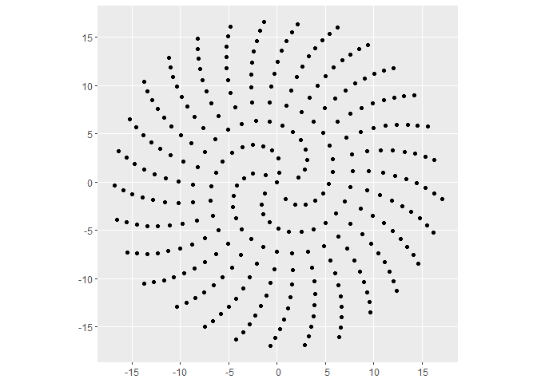
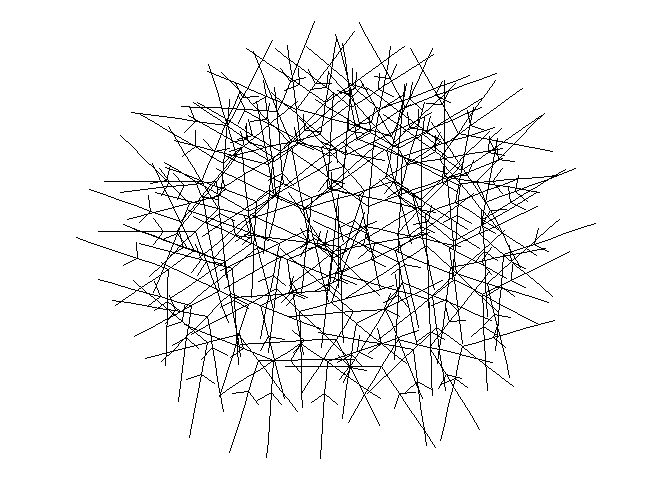
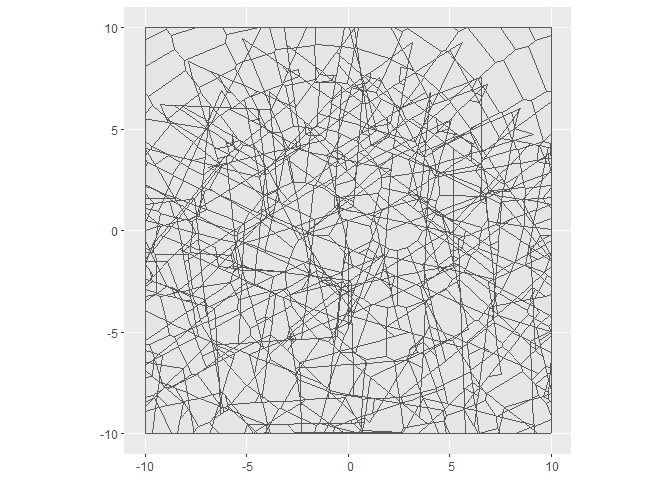

<!-- README.md is generated from README.Rmd. Please edit that file -->

# Tessellation

<!-- badges: start -->
<!-- badges: end -->

This piece is a homage to [Research
Remora](https://twitter.com/researchremora/status/1473134507918245894)
whose shattered tessellations I’ve long admired. I have not been able to
figure out how he gets that awesome effect of shattering. Here, I take a
Voronoi tessellation and smash it with a recursive L-system that I
lifted from [Fronkonstin](https://fronkonstin.com/2017/07/18/plants/).

For this piece I use the following packages:

``` r
library(dplyr) # A Grammar of Data Manipulation
#> 
#> Attaching package: 'dplyr'
#> The following objects are masked from 'package:stats':
#> 
#>     filter, lag
#> The following objects are masked from 'package:base':
#> 
#>     intersect, setdiff, setequal, union
library(ggplot2) # Create Elegant Data Visualisations Using the Grammar of Graphics
library(glue) # Interpreted String Literals
library(gsubfn) # Utilities for Strings and Function Arguments
#> Loading required package: proto
library(lwgeom) # Bindings to Selected 'liblwgeom' Functions for Simple Features
#> Linking to liblwgeom 3.0.0beta1 r16016, GEOS 3.9.1, PROJ 7.2.1
library(MetBrewer) # Color Palettes Inspired by Works at the Metropolitan Museum of Art 
library(MexBrewer) # Color Palettes Inspired by Works of Mexican Muralists
#> Registered S3 method overwritten by 'MexBrewer':
#>   method        from     
#>   print.palette MetBrewer
library(rayshader) # Create Maps and Visualize Data in 2D and 3D
library(stringr) # Simple, Consistent Wrappers for Common String Operations
library(sf) # Simple Features for R # Simple Features for R
#> Linking to GEOS 3.9.1, GDAL 3.4.3, PROJ 7.2.1; sf_use_s2() is TRUE
```

## Generate a random seed

``` r
seed <- sample.int(100000000, 1)
# seed <- 83744970
```

## Bounding box

Create a bounding box to contain the spiral:

``` r
bbox <- matrix(c(-10, -10, 
                 -10, 10, 
                 10, 10,  
                 10, -10,
                 -10, -10),
               ncol = 2,
               byrow = TRUE)

# Convert coordinates to polygons and then to simple features
bbox <- data.frame(id = 1,
                   geometry = st_polygon(list(bbox)) |> 
                     st_sfc()) |> 
  st_as_sf()
```

## Points for tessellation

The generative process is a spiral. The following chunk of code
implements two types of spirals: An Archimedean spiral, or a
[phyllotactic
spiral](https://www.r-bloggers.com/2019/01/playing-around-with-phyllotactic-spirals/)
with a randomly chosen angle:

``` r
set.seed(seed)

if(sample(c(TRUE, FALSE), 1)){
  # Archimedean spiral
  k <- sample.int(4, 1)
  
  sprl <- data.frame(t = seq(0, 10, 0.05)) |>
    mutate(id = 1:n(),
           x_sp = t * cos((5 + k) * t),
           y_sp = t * sin((5 + k) * t),
           x = t * cos((5 + k) * t),
           y = t * sin((5 + k) * t)) |>
    st_as_sf(coords = c("x", "y"))
}else{
  # Number of points for the spiral; this parameter is the square of the radius of the spiral 
  n <- 300
  
  # Choose an angle 
  angle <- sample(c("pi*(3-sqrt(5))", # Golden angle
                    "sqrt(2)",
                    "sqrt(3)",
                    "sqrt(5)",
                    "pi/7",
                    "pi/9",
                    "pi/46",
                    "2",
                    "2"),
                  1)
  
  eval(parse(text = paste0("angle <-", angle)))
  
  theta <- runif(1, 0, 2 * pi)
  
  # Data frame with spiral points is converted to simple features
  sprl <- data.frame(
    idx = c(0:(n-1))) |> ## you can increase the number here to use more lines.
    mutate(t = seq(0,2*pi,length.out=n()),  ## since I used 0 to 1800 above, need to add 1
           r = sqrt(idx), ## radius   
           x_sp = r * cos(theta * angle * idx),
           y_sp = r * sin(theta * angle * idx),
           x = r * cos(theta * angle * idx),
           y = r * sin(theta * angle * idx),
           color_angle = atan2(y = y,
                               x = x) ## get angle between x-axis and the vector from the origin to x,y
    )  |>
    st_as_sf(coords = c("x", "y"))
}
```

Plot the base spiral:

``` r
ggplot() + 
  geom_sf(data = sprl)
```

<!-- -->

Use the points of the spiral to create a Voronoi tessellation:

``` r
# The function `do.call(what, arg)` applies a function
# `what` to the argument `arg`. In this case, we extract 
# the geometry of the `sf` object (i.e., the coordinates 
# of the points) and apply the function `c()` to concatenate 
# the coordinates to obtain a MULTIPOINT object.   
# The pipe operator passes the MuLTIPOINT object to function `st_voronoi()`
sprl_v<- do.call(c, st_geometry(sprl)) %>% 
  st_voronoi() %>% 
  # The output of `st_voronoi()` is a collection of geometries, 
  # which we pass to the following function for extraction.
  st_collection_extract()

sprl_v <- sprl |>
  st_set_geometry(st_geometry(sprl_v)) |>
  st_intersection(bbox)
#> Warning: attribute variables are assumed to be spatially constant throughout all
#> geometries

coords <- sprl_v |>
  st_centroid() |> 
  st_coordinates()
#> Warning in st_centroid.sf(sprl_v): st_centroid assumes attributes are constant
#> over geometries of x

sprl_v <- sprl_v |>
  mutate(x_v = coords[,1],
         y_v = coords[,2])
```

Plot tessellation:

``` r
ggplot() +
  geom_sf(data = sprl_v)
```

<!-- -->

## L-system

An L-system is the output of a recursive algorithm that depends on an
*axiom*, a list of ón_rules\_, and a *depth*.

A. Sanchez Chinchón defines these terms in a [blog
post](https://fronkonstin.com/2017/07/18/plants/). Briefly, the *axiom*
is the seed of the drawing: it says what rules to apply and in what
order. The rules indicate the actions involved in the axiom. Here “F” is
“draw a one-unit line”; “+” and “-” indicate right and left turns by the
stipulated angle; “\[” and ”\]” mean setting a checkpoint and returning
to the most recent checkpoint; and the depth is the number of times that
the axiom will be implemented.

``` r
set.seed(seed)

# The shattering
axiom <- "X"
rules <- list("X"="FF[+XF][-XF]FFF", "F"="F")
angle <- runif(5, 30, 70)
depth <- 8

# Expand the axiom by the depth
for (i in 1:depth) axiom <- gsubfn(".", 
                                   rules, 
                                   axiom)

# Extract the actions from the axiom
actions <- axiom |>
  str_extract_all("\\d*\\+|\\d*\\-|F|L|R|\\[|\\]|\\|") |>
  unlist()

# Initialize the status or check point
status <- data.frame(x = numeric(0),
                     y = numeric(0),
                     alfa = numeric(0))

# Initialize the points for the drawing. Here, I start at y = -5 because that more or less centers the L-system at origin of the spiral
points <- data.frame(x1 = 0, 
                     y1 = -5, 
                     x2 = NA, 
                     y2 = NA, 
                     alfa = 90, 
                     depth = 1)
```

Implement the recursive algorithm to generate the L-system:

``` r
set.seed(seed)

for (action in actions){
  if (action == "F")
  {
    x <- points[1, "x1"] + cos(points[1, "alfa"] * (pi/180))
    y <- points[1, "y1"] + sin(points[1, "alfa"] * (pi/180))
    points[1, "x2"] <- x
    points[1, "y2"] <- y
    points <- data.frame(x1 = x, 
                         y1 = y, 
                         x2 = NA, 
                         y2 = NA, 
                         alfa = points[1, "alfa"],
                         depth = points[1,"depth"]) |>
      rbind(points)
  }
  if (action %in% c("+", "-")){
    alfa <- points[1, "alfa"]
    points[1, "alfa"] <- eval(parse(text = paste0("alfa", action, sample(angle, 1))))
  }
  if(action=="["){ 
    status <- data.frame(x = points[1, "x1"],
                         y = points[1, "y1"],
                         alfa = points[1, "alfa"]) |> 
      rbind(status)
    points[1, "depth"] <- points[1, "depth"] + 1
  }
  
  if(action=="]"){ 
    depth <- points[1, "depth"]
    points <- points[-1,]
    points <- data.frame(x1 = status[1, "x"],
                         y1 = status[1, "y"],
                         x2 = NA,
                         y2 = NA, 
                         alfa = status[1, "alfa"],
                         depth = depth - 1) |> 
      rbind(points)
    status <- status[-1,]
  }
}
```

Plot the L-system:

``` r
ggplot() + 
  geom_segment(aes(x = x1, 
                   y = y1, 
                   xend = x2,
                   yend = y2), 
               lineend = "round", 
               colour="black",
               data=na.omit(points)) + 
  coord_fixed(ratio = 1) +
  theme_void()
```

<!-- -->

Convert the L-system to simple features:

``` r
# Extract the coordinates of the starting points of the lines
begin.coord <- points |>
  # Exclude the first point (it has non end-point)
  slice_tail(n = nrow(points) - 1) |>
  select(x1, y1) |>
  rename(x = x1, y = y1)

# Extract the coordinates of the end points of the lines
end.coord <- points |>
  # Exclude the first point (it has non end-point)
  slice_tail(n = nrow(points) - 1) |>
  select(x2, y2) |>
  rename(x = x2, y = y2)

# Create list of simple feature geometries (linestrings)
l_sf <- vector("list", nrow(begin.coord))
for (i in seq_along(l_sf)){
  l_sf[[i]] <- st_linestring(as.matrix(rbind(begin.coord[i, ], end.coord[i,])))
}

# Convert to simple features
l_sf <- l_sf |>
  st_as_sfc()
```

Take the bounding box and split it using the lines of the L-system:

``` r
l_sf <- bbox |>
  st_split(l_sf) |>
  st_collection_extract(c("POLYGON"))
```

Plot the split bounding box:

``` r
ggplot() +
  geom_sf(data = l_sf)
```

<!-- -->

## Smash the tessellation

To “smash” the tessellation, intersect the voronoi polygons with the
split bounding box:

``` r
# Intersect the Voronoi polygons and the L-system
sprl_v <- sprl_v |>
  st_intersection(l_sf)
#> Warning: attribute variables are assumed to be spatially constant throughout all
#> geometries

# Cast to polygons
#prl <- data.frame(geometry = sprl) |>
#  mutate(id = 1:n()) |>
#  st_as_sf() |>
#  st_cast(to = "POLYGON")

# Extract the coordinates of the centroids of the polygons; these values can be used to choose the colors
coords <- st_centroid(sprl_v) |>
  st_coordinates()
#> Warning in st_centroid.sf(sprl_v): st_centroid assumes attributes are constant
#> over geometries of x

sprl_v <- sprl_v |>
  mutate(x_sm = coords[,1],
         y_sm = coords[,2])
```

Choose a schema for coloring the polygons, based on the coordinates of
the voronoi polygons or the smashed polygons:

``` r
set.seed(seed)

fill_schema <- sample(c("spiral", "voronoi", "smashed"), 1)

# Add the coordinates of the polygon centroids and create a variable for the fill
sprl_v <- sprl_v |>
  mutate(x_sm = coords[,1],
         y_sm = coords[,2],
         fill = case_when(fill_schema == "spiral" ~ 0.75 * sqrt(x_sp^2 + y_sp^2) * runif(n(), 0.94, 1.05),
                          fill_schema == "voronoi" ~ 0.75 * sqrt(x_v^2 + y_v^2) * runif(n(), 0.94, 1.05),
                          fill_schema == "smashed" ~ 0.75 * sqrt(x_sm^2 + y_sm^2) * runif(n(), 0.94, 1.05)))
```

``` r
ggplot() +
  geom_sf(data = sprl_v)
```

<!-- -->

## Render

Randomly select a color palette from package
[`MexBrewer`](https://paezha.github.io/MexBrewer/) or [`MetBrewer`]():

``` r
set.seed(seed)

color_edition <- sample(c("MetBrewer", "MexBrewer"), 1)

if(color_edition == "MetBrewer"){
  col_palette_name <- sample(c("Archambault", "Austria", "Benedictus", "Cassatt1", "Cassatt2", "Cross", "Degas", "Demuth", "Derain", "Egypt", "Gauguin", "Greek", "Hiroshige", "Hokusai1", "Hokusai2", "Hokusai3", "Homer1", "Homer2", "Ingres", "Isfahan1", "Isfahan2", "Java", "Johnson", "Juarez", "Kandinsky", "Klimt", "Lakota", "Manet", "Moreau", "Morgenstern", "Nattier", "Navajo", "NewKingdom", "Nizami", "OKeefe1", "OKeefe2", "Paquin", "Peru1", "Peru2", "Pillement", "Pissaro", "Redon", "Renoir", "Signac", "Tam", "Tara", "Thomas", "Tiepolo", "Troy", "Tsimshian", "VanGogh1", "VanGogh2", "VanGogh3", "Veronese", "Wissing"), 1)
}else{
  col_palette_name <- sample(c("Alacena", "Atentado", "Aurora", "Casita1", "Casita2", "Casita3", "Concha", "Frida", "Huida", "Maiz", "Ofrenda", "Revolucion", "Ronda", "Taurus1", "Taurus2", "Tierra", "Vendedora"), 1)
}
```

Create plot:

``` r
set.seed(seed)

p <- ggplot() +
  geom_sf(data = sprl_v,# |>
          #st_intersection(container_polygon),
          aes(fill = fill),
          color = NA)
if(color_edition == "MetBrewer"){
  p <- p +
    scale_fill_met_c(col_palette_name, 
                     direction = sample(c(-1, 1), 1)) +
    theme(legend.position = "none",
          axis.text = element_text(color = "white"),
          panel.background = element_rect(fill = "white"),
          axis.ticks = element_line(color = "white"))
}else{
  p <- p +
    scale_fill_mex_c(col_palette_name, 
                     direction = sample(c(-1, 1), 1)) +
    theme(legend.position = "none",
          axis.text = element_text(color = "white"),
          panel.background = element_rect(fill = "white"),
          axis.ticks = element_line(color = "white"))
}
```

Convert the ggplot object to a 3D image using {rayshader} and save:

``` r
plot_gg(p,
        phi = 90,
        theta = 0,
        pointcontract = 0,
        height_aes = "fill",
        raytrace = TRUE,
        windowsize = c(4000, 4000))
#> Warning in make_shadow(heightmap, shadowdepth, shadowwidth, background, :
#> `magick` package required for smooth shadow--using basic shadow instead.

# Save image
rgl::snapshot3d(glue("outputs/smashing-tessellations-{seed}.png"),
                fmt = 'png',
                webshot = TRUE,
                width = 2100,
                height = 2100)

# Close rgl device
rgl::rgl.close()
```


