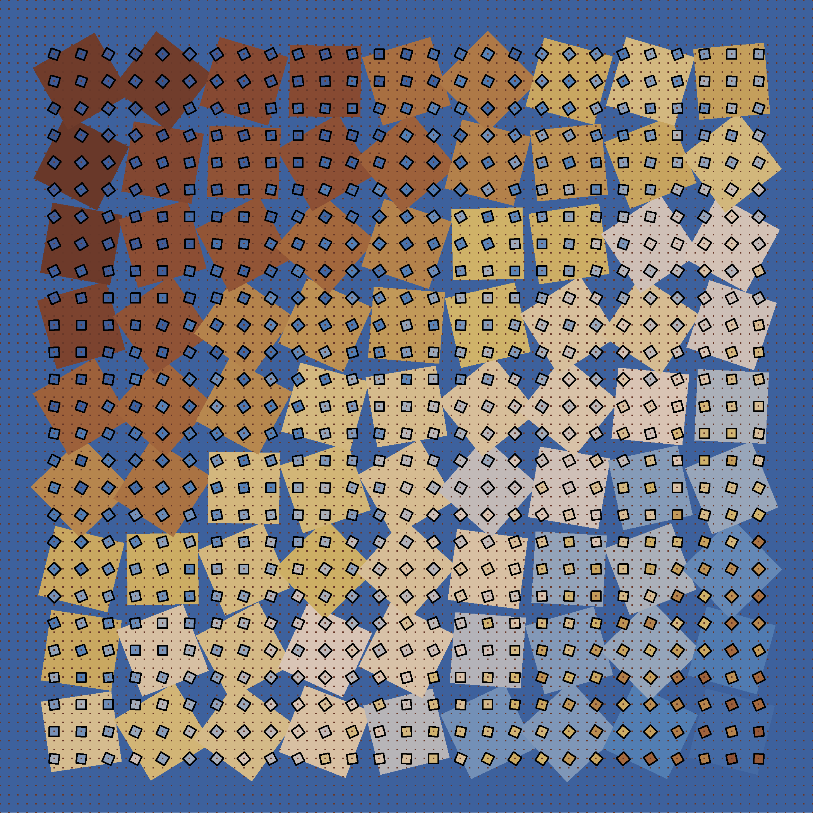

<!-- README.md is generated from README.Rmd. Please edit that file -->

# A grid inside a grid

<!-- badges: start -->
<!-- badges: end -->

The prompt for Day 15 is to draw grids inside grids.

For this piece I use the following packages:

``` r
library(dplyr) # A Grammar of Data Manipulation
#> 
#> Attaching package: 'dplyr'
#> The following objects are masked from 'package:stats':
#> 
#>     filter, lag
#> The following objects are masked from 'package:base':
#> 
#>     intersect, setdiff, setequal, union
library(ggforce) # Accelerating 'ggplot2' # Accelerating 'ggplot2' 
#> Loading required package: ggplot2
library(ggplot2) # Create Elegant Data Visualisations Using the Grammar of Graphics
library(MetBrewer) # Color Palettes Inspired by Works at the Metropolitan Museum of Art 
library(MexBrewer) # Color Palettes Inspired by Works of Mexican Painters and Muralists
#> Registered S3 method overwritten by 'MexBrewer':
#>   method        from     
#>   print.palette MetBrewer
library(PrettyCols) # Pretty Colour Palettes
#> Registered S3 method overwritten by 'PrettyCols':
#>   method        from     
#>   print.palette MexBrewer
```

## Generate a random seed

``` r
seed <- sample.int(100000000, 1)
# seed <- 83744970
```

## Generate grids

Grid 1:

``` r
set.seed(seed)

sign_1 <- sample(c(-1, 1), 1)
sign_2 <- sample(c(-1, 1), 1)

df <- expand.grid(x = seq(1, 9, 1), 
                  y = seq(1, 9, 1)) |>
  mutate(angle = runif(1, 0, 2 * pi) + sign_1 * pi * x/9 + sign_2 * pi * y/9 + runif(n(), -pi/16, pi/16),
         fill = sign_1 * x + sign_2 * y + runif(n(), 0, 3))
```

Grid 2:

``` r
set.seed(seed)

df2 <- expand.grid(x = seq(2/3, 9 + 1/3, 1/3), 
                   y = seq(2/3, 9 + 1/3, 1/3)) |>
  mutate(angle = runif(1, 0, 2 * pi) - sign_1 * pi * x/9 - sign_2 * pi * y/9 + runif(n(), -pi/24, pi/24),
         fill = 5 - sign_1 * x - sign_2 * y + runif(n(), 0, 3))
```

Grid :3

``` r
df3 <- expand.grid(x = seq(0, 10, 1/9), 
                   y = seq(0, 10, 1/9))
```

# Render

Randomly select a color palette from package
[{MexBrewer}](https://CRAN.R-project.org/package=MexBrewer) or
[{MetBrewer}](https://CRAN.R-project.org/package=MetBrewer). The color
palette will consist of as many colors as columns in the grid:

``` r
set.seed(seed)

# color_edition <- sample(c("MetBrewer", "MexBrewer"), 1)
# 
# if(color_edition == "MetBrewer"){
#   col_palette_name <- sample(c("Archambault", "Austria", "Benedictus", "Cassatt1", "Cassatt2", "Cross", "Degas", "Demuth", "Derain", "Egypt", "Gauguin", "Greek", "Hiroshige", "Hokusai1", "Hokusai2", "Hokusai3", "Homer1", "Homer2", "Ingres", "Isfahan1", "Isfahan2", "Java", "Johnson", "Juarez", "Kandinsky", "Klimt", "Lakota", "Manet", "Moreau", "Morgenstern", "Nattier", "Navajo", "NewKingdom", "Nizami", "OKeeffe1", "OKeeffe2", "Paquin", "Peru1", "Peru2", "Pillement", "Pissaro", "Redon", "Renoir", "Signac", "Tam", "Tara", "Thomas", "Tiepolo", "Troy", "Tsimshian", "VanGogh1", "VanGogh2", "VanGogh3", "Veronese", "Wissing"), 1)
#   col_palette <- met.brewer(col_palette_name)
# }else{
#   col_palette_name <- sample(c("Alacena", "Atentado", "Aurora", "Casita1", "Casita2", "Casita3", "Concha", "Frida", "Huida", "Maiz", "Ofrenda", "Revolucion", "Ronda", "Taurus1", "Taurus2", "Tierra", "Vendedora"), 1)
#   col_palette <- mex.brewer(col_palette_name)
# }
# 

color_edition <- sample(c("MetBrewer", "MexBrewer", "PrettyCols"), 1)

if(color_edition == "MetBrewer"){
  col_palette_name <- sample(c("Archambault", "Austria", "Benedictus", "Cassatt1", "Cassatt2", "Cross", "Degas", "Demuth", "Derain", "Egypt", "Gauguin", "Greek", "Hiroshige", "Hokusai1", "Hokusai2", "Hokusai3", "Homer1", "Homer2", "Ingres", "Isfahan1", "Isfahan2", "Java", "Johnson", "Juarez", "Kandinsky", "Klimt", "Lakota", "Manet", "Moreau", "Morgenstern", "Nattier", "Navajo", "NewKingdom", "Nizami", "OKeeffe1", "OKeeffe2", "Paquin", "Peru1", "Peru2", "Pillement", "Pissaro", "Redon", "Renoir", "Signac", "Tam", "Tara", "Thomas", "Tiepolo", "Troy", "Tsimshian", "VanGogh1", "VanGogh2", "VanGogh3", "Veronese", "Wissing"), 1)
  col_palette <- met.brewer(col_palette_name)
}else if(color_edition == "MexBrewer"){
  col_palette_name <- sample(c("Alacena", "Atentado", "Aurora", "Casita1", "Casita2", "Casita3", "Concha", "Frida", "Huida", "Maiz", "Ofrenda", "Revolucion", "Ronda", "Taurus1", "Taurus2", "Tierra", "Vendedora"), 1)
  col_palette <- mex.brewer(col_palette_name)
}else if(color_edition == "PrettyCols"){
  col_palette_name <- sample(c("Blues", "Purples", "Tangerines", "Greens", "Pinks", "Teals", "PurpleGreens", "PinkGreens", "TangerineBlues", "PurpleTangerine", "PurplePinks", "TealGreens", "Bold", "Dark", "Light", "Neon", "Relax", "Autumn", "Winter", "Rainbow"), 1)
  col_palette <- prettycols(col_palette_name)
}


if(sample(c(TRUE, FALSE), 1)){
  col_palette <- rev(col_palette)
}
```

Plot:

``` r
set.seed(seed)

set_colors <- sample(col_palette, 2)

ggplot() + 
  geom_regon(data = df,
             aes(x0 = x, 
                 y0 = y, 
                 sides = 4, 
                 r = 0.62, 
                 angle = angle,
                 fill = fill)) + 
  geom_regon(data = df2,
             aes(x0 = x, 
                 y0 = y, 
                 sides = 4, 
                 r = 4/48, 
                 angle = angle,
                 fill = fill),
             color = "black") +
  geom_point(data = df3,
             aes(x = x,
                 y = y),
             color = set_colors[1],
             size = 0.1) +
  scale_fill_gradientn(colors = col_palette) +
  coord_equal(expand = FALSE) +
  theme_void() +
  theme(legend.position = "none",
        panel.background = element_rect(color = NA,
                                        fill = set_colors[2]))

ggsave(filename = glue::glue("outputs/grid-in-grid-{col_palette_name}-{seed}.png"),
       height = 7,
       width = 7)
```


