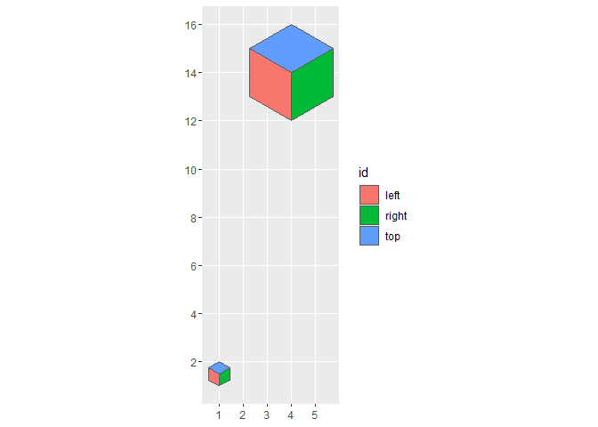
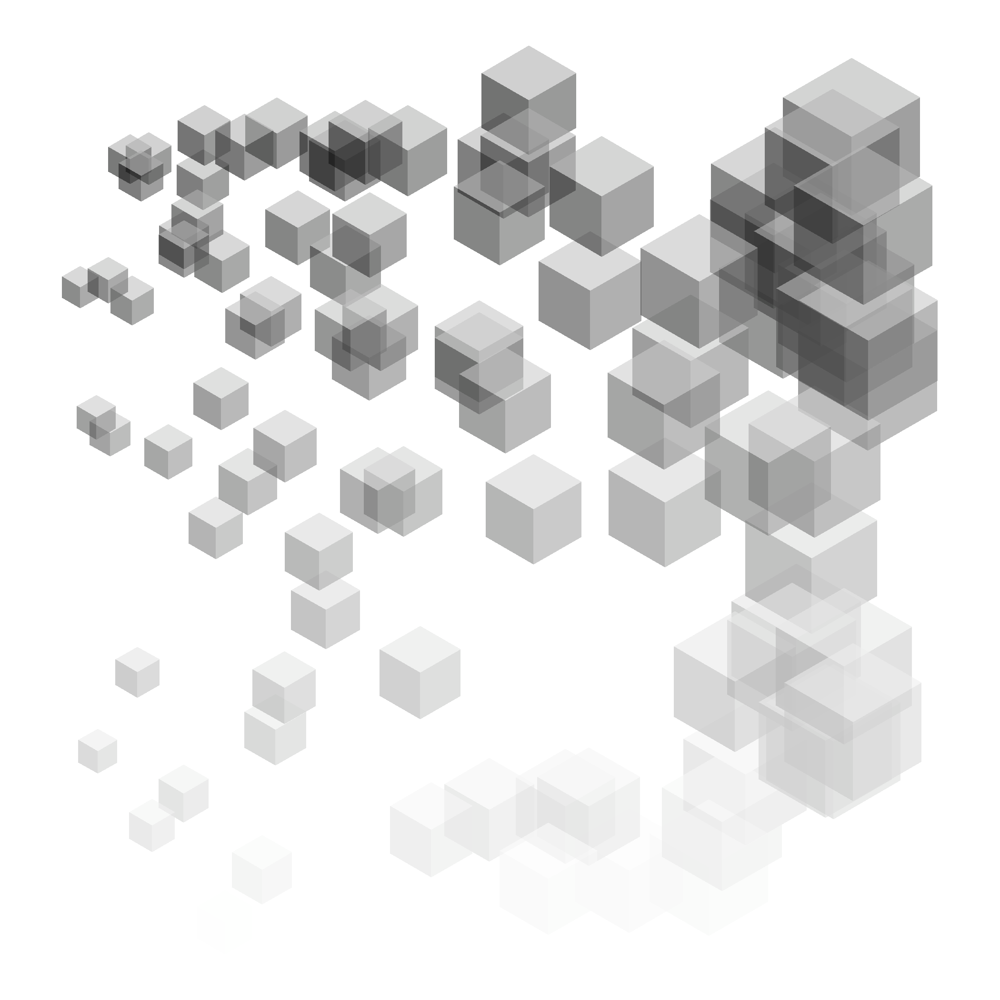
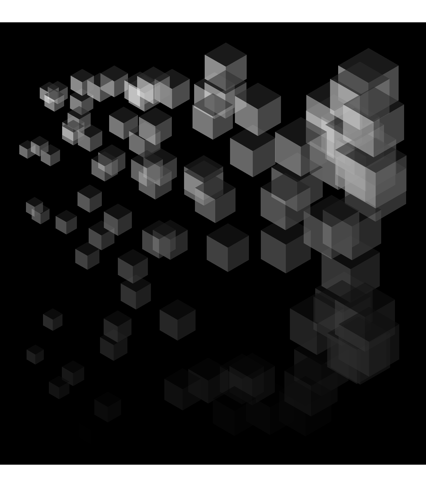

<!-- README.md is generated from README.Rmd. Please edit that file -->
<!-- README.md is generated from README.Rmd. Please edit that file -->

# Black and white

<!-- badges: start -->
<!-- badges: end -->

Monotone [cubescapes](https://github.com/paezha/cubescapes).

I use these packages:

``` r
library(dplyr) # A Grammar of Data Manipulation
#> 
#> Attaching package: 'dplyr'
#> The following objects are masked from 'package:stats':
#> 
#>     filter, lag
#> The following objects are masked from 'package:base':
#> 
#>     intersect, setdiff, setequal, union
library(ggplot2) # Create Elegant Data Visualisations Using the Grammar of Graphics
library(glue) # Interpreted String Literals
library(purrr) # Functional Programming Tools
library(sf) # Simple Features for R
#> Linking to GEOS 3.9.1, GDAL 3.4.3, PROJ 7.2.1; sf_use_s2() is TRUE
```

Create a function to generate the faces of an isometric cube “up”
direction:

``` r
cube_up <- function(x, y){
  face_1 <- matrix(c(x, y, 
                     x-sqrt(3)/2, y + 1/2,
                     x -sqrt(3)/2, y + 1 + 1/2,
                     x, y + 1,
                     x, y),
                   ncol = 2,
                   byrow = TRUE)
  
  # Convert coordinates to polygons and then to simple features
  face_1 <- data.frame(id = "left",
                       geometry = st_polygon(list(face_1)) %>% 
                         st_sfc()) %>% 
    st_as_sf()
  
  # Face 2
  face_2 <- matrix(c(x, y,
                     x, y + 1,
                     x + sqrt(3)/2, y + 1 + 1/2,
                     x + sqrt(3)/2, y + 1/2,
                     x, y),
                   ncol = 2,
                   byrow = TRUE)
  
  # Convert coordinates to polygons and then to simple features
  face_2 <- data.frame(id = "right",
                       geometry = st_polygon(list(face_2)) %>% 
                         st_sfc()) %>% 
    st_as_sf()
  
  # Face 3
  face_3 <- matrix(c(x, y + 1,
                     x - sqrt(3)/2, y + 1 + 1/2,
                     x, y + 2,
                     x + sqrt(3)/2, y + 1 + 1/2,
                     x, y + 1),
                   ncol = 2,
                   byrow = TRUE)
  
  # Convert coordinates to polygons and then to simple features
  face_3 <- data.frame(id = "top",
                       geometry = st_polygon(list(face_3)) %>% 
                         st_sfc()) %>% 
    st_as_sf()
  
  rbind(face_1,
        face_2,
        face_3)
}
```

Test function:

``` r
cube_1 <- cube_up(2, 2)
cube_2 <- cube_up(2, 6)

ggplot() +
  geom_sf(data = cube_1 |>
            mutate(geometry = geometry * 0.5),
          aes(fill = id)) + 
  geom_sf(data = cube_2 |>
            mutate(geometry = geometry * 2),
          aes(fill = id)) 
```

<!-- -->

## Generate a random seed

Randomly sample a value to obtain a random seed:

``` r
seed <- sample(100000000, 1)
```

## Generate the cubescape

Select the number of cubes:

``` r
set.seed(seed)

n_cube <- runif(1, 
                min = 50, 
                max = 100)
```

Create `n_cube` cubes:

``` r
# Collect elements for assembling the mosaic
x_c <- rep(0, n_cube)
y_c <- rep(0, n_cube)

## NOTE: purrr does not like it when .id is used, complains that geometry column not present: why?

cubescape <- purrr::pmap_dfr(list(x_c, y_c), 
                             cube_up, 
                             .id = "id")
```

Create random translations for the cubes

``` r
set.seed(seed)
c_trans <- data.frame(x = rep(runif(n_cube, min = 0, max = 20),
                              each = 3), 
                      y = rep(runif(n_cube, min = 0, max = 20),
                              each = 3)) |>
  st_as_sf(coords = c("x", "y"))
```

## Render

Plot with a white background:

``` r
set.seed(seed)

cubescape |>
  mutate(scale_p = rep(runif(n_cube,
                             min = 0.5,
                             max = 2),
                       each = 3),
         geometry = (geometry * scale_p) + c_trans$geometry,
         #alpha = rep(runif(n_cube),
         #              each = 3),
         alpha = 0.5,
         fill = rep(runif(n_cube), each = 3),
         fill_adj = rep(sample(c(1, 0.7, 0.3)), n_cube)) |>
  ggplot() +
  geom_sf(aes(fill = fill * fill_adj,
              alpha = alpha),
          color = NA) +
  scale_fill_gradient(low = "white", high = "black") +
  theme_void() + 
  theme(legend.position = "none")

# Save image
ggsave(glue("outputs/cubescape-w-b-{seed}.png"),
       width = 7,
       height = 7,
       units = "in")
```



Plot with a black background:

``` r
set.seed(seed)

cubescape |>
  mutate(scale_p = rep(runif(n_cube,
                             min = 0.5,
                             max = 2),
                       each = 3),
         geometry = (geometry * scale_p) + c_trans$geometry,
         #alpha = rep(runif(n_cube),
         #              each = 3),
         alpha = 0.5,
         fill = rep(runif(n_cube), each = 3),
         fill_adj = rep(sample(c(0.5, 0.3, 0.1)), n_cube)) |>
  ggplot() +
  geom_sf(aes(fill = fill * fill_adj,
              alpha = alpha),
          color = NA) +
  scale_fill_gradient(low = "black", high = "white") +
  theme_void() + 
  theme(legend.position = "none",
        panel.background = element_rect(fill = "black"))

# Save image
ggsave(glue("outputs/cubescape-b-w-{seed}.png"),
       #width = 8,
       height = 8,
       units = "in")
#> Saving 7 x 8 in image
```


