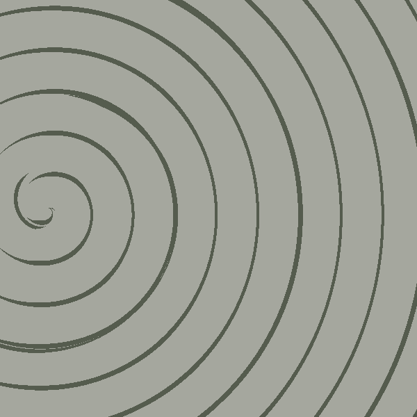

<!-- README.md is generated from README.Rmd. Please edit that file -->

# More Moiré

<!-- badges: start -->
<!-- badges: end -->

For today’s prompt I stole the wonderfully compact and efficient code
that [George Savva](https://github.com/georgemsavva/) created in 10
minutes for Day 2 of Genuary 2023.

The code is all written in base `R` and package `gifski` is used to
create the animation. Besides experimenting with some parameters, the
only change I make is draw colors from my
[`MexBrewer`](https://github.com/paezha/MexBrewer) package:

``` r
library(gifski) # Highest Quality GIF Encoder 
library(glue)
library(MexBrewer) # Color Palettes Inspired by Works of Mexican Muralists
```

## Generate a random seed

``` r
seed <- sample.int(100000000, 1)
```

Randomly select a color palette from package
[`MexBrewer`](https://CRAN.R-project.org/package=MexBrewer) or
[`MetBrewer`](https://CRAN.R-project.org/package=MetBrewer). The color
palette will consist of as many colors as columns in the grid:

``` r
set.seed(seed)

color_edition <- sample(c("MetBrewer",
                          "MexBrewer"),
                        1)

if(color_edition == "MetBrewer"){
  col_palette_name <- sample(c("Archambault", "Austria", "Benedictus", "Cassatt1", "Cassatt2", "Cross", "Degas", "Demuth", "Derain", "Egypt", "Gauguin", "Greek", "Hiroshige", "Hokusai1", "Hokusai2", "Hokusai3", "Homer1", "Homer2", "Ingres", "Isfahan1", "Isfahan2", "Java", "Johnson", "Juarez", "Kandinsky", "Klimt", "Lakota", "Manet", "Moreau", "Morgenstern", "Nattier", "Navajo", "NewKingdom", "Nizami", "OKeeffe1", "OKeeffe2", "Paquin", "Peru1", "Peru2", "Pillement", "Pissaro", "Redon", "Renoir", "Signac", "Tam", "Tara", "Thomas", "Tiepolo", "Troy", "Tsimshian", "VanGogh1", "VanGogh2", "VanGogh3", "Veronese", "Wissing"), 1)
  col_palette <- met.brewer(col_palette_name, n = 10)
}else{
  col_palette_name <- sample(c("Alacena", "Atentado", "Aurora", "Casita1", "Casita2", "Casita3", "Concha", "Frida", "Huida", "Maiz", "Ofrenda", "Revolucion", "Ronda", "Taurus1", "Taurus2", "Tierra", "Vendedora"), 1)
  col_palette <- mex.brewer(col_palette_name, n = 10)
}
```

## George Savva’s animated spiral

Create spiral(s) and plot:

``` r
set.seed(seed = seed)

colrs <- sample(col_palette, 2)

plotFun <- \(FUN) image(outer(x,y,FUN),
                        axes=F,
                        col=c(colrs[1], 
                              colrs[2]),
                        asp=1,
                        useR=TRUE)

# th controls the thickness of the line
# w controls the frequency
spiral<-\(z,t,w,th) (Mod(z)+w/2/pi*(Arg(z)-t))%%w<(w*th) 

N=600
y=x=seq(-1,1,l=N)

gifski::save_gif(lapply(seq(0,2*pi,l=60),\(t){
  par(mar=c(0,0,0,0))
  plotFun(\(x,y){
    w=1/5; th=runif(1, 0.2, 0.3)
    z = x+1i*y
    spiral(z+0.8,+t,w,th)+spiral(z + 0.77,+t,w,th/runif(1, 1.5, 2.5))+spiral(z+0.76,+t,w + 1/10,th/runif(1, 2.5, 3.5))
    })
  }),
  gif_file =glue::glue("outputs/more-moire-{seed}.gif"), 
  width = N,
  height=N,
  delay = 1/60)
#> [1] "C:\\Antonio\\Rtistry\\genuary2023\\2022-01-23_More-Moire\\outputs\\more-moire-80566413.gif"
```


