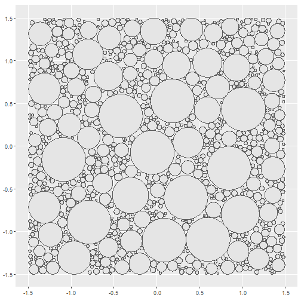

<!-- README.md is generated from README.Rmd. Please edit that file -->


# Yayoi Kusama

<!-- badges: start -->

<!-- badges: end -->


For this piece I use the following packages:

```r
library(dplyr) # A Grammar of Data Manipulation
library(ggplot2) # Create Elegant Data Visualisations Using the Grammar of Graphics
library(glue) # Interpreted String Literals
library(MetBrewer) # Color Palettes Inspired by Works at the Metropolitan Museum of Art 
library(MexBrewer) # Color Palettes Inspired by Works of Mexican Muralists
library(rayrender) # Create Maps and Visualize Data in 2D and 3D
library(sf)
library(tidyr)
```

## Generate a random seed


```r
seed <- sample.int(100000000, 1)
# seed <- 83744970
```

## Circle packing


```r
st_circle_packer <- function(p, max_circles = 100, max_radius = 1, min_radius = 0.1){
  
  # p = a simple features object with n >= 1 or more polygon features
  # max_circles = a number with the maximum number of candidate points for drawing circles
  # max_radius = a value with the maximum radius for drawing circles; can be a vector of size n so that the largest radius is different by polygon
  # min_radius = a value with the minimum radius for drawing circles; can be a vector of size n so that the smalest radius is different by polygon
  
  # Initialize the table with circles
  circles <- data.frame()
  
  # Initialize table with tolerance parameters
  radius_pars <- data.frame(id = p$id, 
                            min_radius, 
                            max_radius)
  
  # Convert polygons to lines
  p_lines <- p %>%
    st_cast(to = "MULTILINESTRING")
  
  # Create initial set of points for potential circles in the space of the bounding box of the polygons
  region <- st_bbox(p)
  c_points <- data.frame(x = runif(n = max_circles,
                                   min = region[1],
                                   max = region[3]),
                         y = runif(n = max_circles,
                                   min = region[2],
                                   max = region[4]))
  
  # Convert the points to simple features and add a unique point identifier (PID)
  c_points <- c_points %>%
    st_as_sf(coords = c("x", "y")) %>%
    mutate(PID = 1:n())
  
  # Find any points that fall outside of a polygon and remove
  c_points <- c_points %>%
    st_join(p) %>%
    drop_na(id)
  
  # Initialize stopping criterion
  stopping_criterion <- TRUE
  
  while(stopping_criterion){
    # Sample one point from each polygon: these points are candidates for circles
    circle_candidates <- c_points %>% 
      group_by(id) %>%
      slice_sample(n =1) %>%
      ungroup()
    
    # Remove the points sampled from the table of points so that they are not considered again in the future
    c_points <- c_points %>%
      anti_join(circle_candidates %>%
                  st_drop_geometry() %>%
                  select(PID),
                by = "PID")
    
    # Find the distance of the candidate points to the boundaries of the polygons if no circles exist yet
    if(nrow(circles) == 0){
      circle_candidates$r <- circle_candidates %>%
        st_distance(p_lines) %>% 
        data.frame() %>%
        apply(1, min)
    }# Find the distance of the candidate points to the boundaries of the polygons and circles if they exist
    else{
      circle_candidates$r <- circle_candidates %>%
        st_distance(rbind(p_lines, 
                          circles %>%
                            select(-PID))) %>% 
        data.frame() %>%
        apply(1, min)
    }
    
    # Join the tolerance parameters and filter candidates with a radius greater than the minimum
    circle_candidates <- circle_candidates %>% 
      left_join(radius_pars, by = "id") %>%
      filter(r >= min_radius)
    
    # Make sure that the radius does not exceed the maximum
    circle_candidates <- circle_candidates %>%
      mutate(r = ifelse(r >= max_radius, max_radius, r)) %>%
      select(-c(min_radius, max_radius)) # Drop tolerance parameters from table, no longer needed
    
    # If there are candidates points with a radius above the tolerance then create circles
    if(nrow(circle_candidates) > 0){
      # Use the points and buffers to create circles that are added to the existing table of circles
      circles <- rbind(circles,
                       circle_candidates %>%
                         st_buffer(dist = circle_candidates$r))
      
      # Clear points that are now _inside_ a circle from the candidates (the radius will _not_ be NA)
      c_points <- c_points %>%
        select(-c(r)) %>% 
        st_join(circles %>%
                  select(r)) %>%
        filter(is.na(r))
    }
    stopping_criterion <- nrow(c_points) > 0
  }
  return(circles)
}
```

Crear polígono para la imagen:

```r
container_polygon <- matrix(c(-1.5, -1.5, 
                              -1.5, 1.5, 
                              1.5, 1.5,  
                              1.5, -1.5,
                              -1.5, -1.5),
                            ncol = 2,
                            byrow = TRUE)

# Convert coordinates to polygons and then to simple features
container_polygon <- data.frame(id = 1,
                                r = NA,
                                geometry = st_polygon(list(container_polygon)) %>% 
                                  st_sfc()) %>% 
  st_as_sf()
```

Empacar la secuencia de círculos:

```r
# Set random seed
seed <- sample.int(100000, 1)
set.seed(seed)

# Pack polygons
circles <- container_polygon %>% 
  st_circle_packer(max_circles = 6000, 
                   max_radius = runif(1, 0.15, 0.4),
                   min_radius = runif(1, 0.01, 0.05))
```


```r
ggplot2::ggplot() + 
  geom_sf(data = circles)
```




```r
coords <- circles |>
  st_centroid() |>
  st_coordinates()
#> Warning in st_centroid.sf(circles): st_centroid assumes attributes are constant over geometries of x
```


```r
df <- circles |>
  mutate(x = coords[,1], 
         y = coords[,2])
```

Randomly select a color palette from package [`MexBrewer`](https://CRAN.R-project.org/package=MexBrewer) or [`MetBrewer`](https://CRAN.R-project.org/package=MetBrewer). The color palette will consist of as many colors as columns in the grid:

```r
set.seed(seed)

color_edition <- sample(c("MetBrewer",
                          "MexBrewer"),
                        1)

if(color_edition == "MetBrewer"){
  col_palette_name <- sample(c("Archambault", "Austria", "Benedictus", "Cassatt1", "Cassatt2", "Cross", "Degas", "Demuth", "Derain", "Egypt", "Gauguin", "Greek", "Hiroshige", "Hokusai1", "Hokusai2", "Hokusai3", "Homer1", "Homer2", "Ingres", "Isfahan1", "Isfahan2", "Java", "Johnson", "Juarez", "Kandinsky", "Klimt", "Lakota", "Manet", "Moreau", "Morgenstern", "Nattier", "Navajo", "NewKingdom", "Nizami", "OKeeffe1", "OKeeffe2", "Paquin", "Peru1", "Peru2", "Pillement", "Pissaro", "Redon", "Renoir", "Signac", "Tam", "Tara", "Thomas", "Tiepolo", "Troy", "Tsimshian", "VanGogh1", "VanGogh2", "VanGogh3", "Veronese", "Wissing"), 1)
  col_palette <- met.brewer(col_palette_name, n = nrow(df) + 1)
}else{
  col_palette_name <- sample(c("Alacena", "Atentado", "Aurora", "Casita1", "Casita2", "Casita3", "Concha", "Frida", "Huida", "Maiz", "Ofrenda", "Revolucion", "Ronda", "Taurus1", "Taurus2", "Tierra", "Vendedora"), 1)
  col_palette <- mex.brewer(col_palette_name, n = nrow(df) + 1)
}
```

Next, I create a data frame with the parameters for the position, radius, and height of the columns. The position in x is on the plane (left-right), y is the vertical axis, and z is on the plane (front-back). The element used for the columns is essentially a plane (no depth) and the dimensions are given by parameters `xwidth` and `ywidth`. Given the effect I wish to achieve, the center of this thin element will be centered on $y = 5$. The height of the columns should be at least twice this value to ensure that the columns are not "floating". Also, an angle can be used to rotate the thin plane on any of the three axes. Here, the angle will be for a rotation on the y-axis (vertical). In this data frame, the chosen color palette is also used to assign colors either at random or sorted (as an alternative the colors could be a function of position, angle, or other attribute of the columns):

```r
set.seed(seed)

# Choose at random whether to randomize or sort the colors
color_scheme <- sample(c("Random", "Sorted"), 1)

# Add the coloring scheme
if(color_scheme == "Random"){
  df <- df |>
    mutate(color = sample(col_palette, n(), replace = TRUE))
}else{
  df <- df |>
    mutate(color = r)
}
```

Here I initialize an empty data frame and then use `df` to populate the parameters that go into `rayrender::sphere()`  to create the thin planes that become my "columns". The material of the columns is chosen at random:

```r
set.seed(seed)

obj <- data.frame()

material <- sample(c("Diffuse", "Metal", "Glossy"), 1)
#material <- "Metal"


if(material == "Diffuse"){
  for(i in 1:nrow(df)){
    obj <- rbind(obj,
                 sphere(x = df$x[i],
                        y = 0,
                        z = df$y[i],
                        radius = df$r[i],
                         material = diffuse(color=df$color[i])))
  }
}else if(material == "Metal"){
  for(i in 1:nrow(df)){
    obj <- rbind(obj,
                 sphere(x = df$x[i],
                        y = 0,
                        z = df$y[i],
                        radius = df$r[i],
                        material = metal(color=df$color[i])))
  }
}else if(material == "Glossy"){
  for(i in 1:nrow(df)){
    obj <- rbind(obj,
                 sphere(x = df$x[i],
                        y = 0,
                        z = df$y[i],
                        radius = df$r[i],
                         material = glossy(color=df$color[i])))
  }
}
```

In this chunk of code, the scene for the rayrendering is initialized. The color of the ground is chosen randomly from the color palette in use:

```r
set.seed(seed)

scene <- generate_ground(spheresize = 100000,
                         material = diffuse(color = "black"))
```

After initializing the scene, it is now possible to add the objects (i.e., the columns). Also, I like to include either one or two source of light with random position:

```r
set.seed(seed)

n_lights <- sample(c("One", "Two"), 1)

if(n_lights == "One"){
  # Randomly choose the position of the light source along the z-axis
  z_pos <- runif(1, 5, 10)
  
  scene <- scene |>
    add_object(objects = obj) |>
    #light source
    add_object(sphere(x = runif(1, -5, 5),
                      y = runif(1, -5, 5),
                      z = z_pos,
                      r = 1,
                      material=light(intensity = 10000,
                                     invisible = TRUE)))
  
}else{
  # Randomly choose the position of the light source along the z-axis; the lights are positioned an equal distance away from z=0
  z_pos <- runif(1, 5, 10)
  
  scene <- scene |> 
    add_object(objects = obj) |>
    # first light source
    add_object(sphere(x = runif(1, -5, 0),
                      y = runif(1, 0, 5),
                      z = -z_pos,
                      r = 1,
                      material=light(intensity = 5000,
                                     invisible = TRUE))) |>
    # second light source
    add_object(sphere(x = runif(1, 0, 5),
                      y = runif(1, -5, 0),
                      z = z_pos,
                      r = 1,
                      material=light(intensity = 5000,
                                     invisible = TRUE)))
}
```

## Render the scene

Render the scene: 

```r
set.seed(seed)

# Stipulate the point of view; this is where a lot of the work happens, finding parameters that produce pleasing perpsectives
x_from <- 1.0 
z_from <- 15 
y_from <- 1.0

render_scene(file = glue::glue("outputs/{material}-{n_lights}-{seed}.png"),
  scene, 
  parallel = TRUE,
  ambient_light = TRUE,
  aperture = 0.01,
  clamp_value = 2,
  # Square
  width = 2000, 
  height = 2000,
  # Mastodon Header
  #width = 1500, 
  #height = 500,#1500,
  # iPhone 11
  #width = 828, 
  #height = 1792, 
  # windows wallpaper
  #width = 2560, 
  #height = 1440, 
  samples = 400, 
  lookfrom = c(x_from, z_from, y_from),
  lookat = c(0.0, -1, 0.0)
  )
#> --------------------------Interactive Mode Controls---------------------------
#> W/A/S/D: Horizontal Movement: | Q/Z: Vertical Movement | Up/Down: Adjust FOV | ESC: Close
#> Left/Right: Adjust Aperture  | 1/2: Adjust Focal Distance | 3/4: Rotate Environment Light 
#> P: Print Camera Info | R: Reset Camera |  TAB: Toggle Orbit Mode |  E/C: Adjust Step Size
#> K: Save Keyframe | L: Reset Camera to Last Keyframe (if set) | F: Toggle Fast Travel Mode
#> Left Mouse Click: Change Look At (new focal distance) | Right Mouse Click: Change Look At
#> Error in render_scene_rcpp(camera_info = camera_info, scene_info = scene_info): Index out of bounds: [index=3; extent=2].
```


```
#> Error in knitr::include_graphics(glue("outputs/{material}-{n_lights}-{seed}.png")): Cannot find the file(s): "outputs/Metal-Two-27169.png"
```


