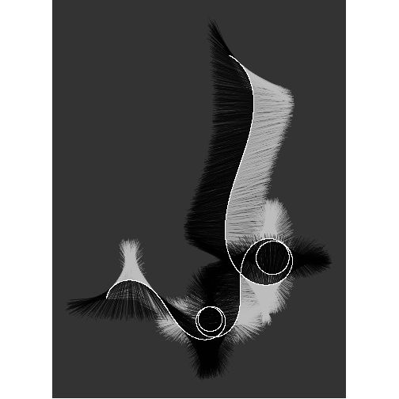
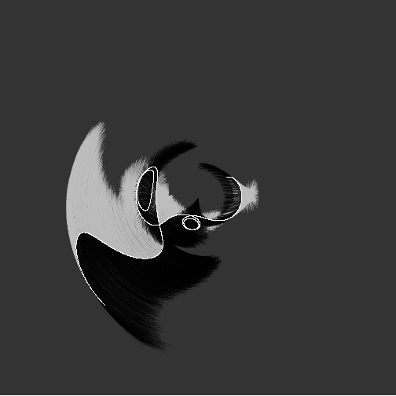

<!-- README.md is generated from README.Rmd. Please edit that file -->


# My kid could have done that

<!-- badges: start -->

<!-- badges: end -->


For this piece I use the following packages:

```r
library(dplyr) # A Grammar of Data Manipulation
library(ggplot2) # Create Elegant Data Visualisations Using the Grammar of Graphics
library(glue) # Interpreted String Literals
library(MetBrewer) # Color Palettes Inspired by Works at the Metropolitan Museum of Art 
library(MexBrewer) # Color Palettes Inspired by Works of Mexican Muralists
#library(tidyr)
```


## Generate a random seed


```r
seed <- sample.int(100000000, 1)
```


```r
n_sine <- sample.int(4, 1)

A <- runif(n_sine, 0, 2 * pi)
f <- runif(n_sine, 1, 5)
phi <- runif(n_sine, 0, 2 * pi)
```


```r
T_f <- 1
n_t <- 6000

t <- seq(0, T_f * 2 * pi, length = T_f * n_t)

x <- 0  
y <- 0
idx <- 0

df <- data.frame(x = numeric(length = T_f * n_t),
                 y = numeric(length = T_f * n_t),
                 theta = numeric(length = T_f * n_t)) 


for(i in t){
  idx <- idx + 1
  theta <- 0
  for(j in 1:n_sine){
    theta <- theta + A[j] * sin(f[j] * t[idx] + phi[j])
  }
  df$x[idx] <- cos(theta)
  df$y[idx] <- sin(theta)
  df$theta[idx] <- theta
}


df <- df |>
  mutate(x = x + cumsum(x),
         y = y + cumsum(y))


# Length of stroke
x_range <- max(df$x) - min(df$x)
y_range <- max(df$y) - min(df$y)

l <- max(x_range, y_range)


l <- runif(1, 0.05, 0.15) * l

l_r <- runif(nrow(df), 0.90, 1.10)

# df <- df |>
#   mutate(xstart =  x - l_r * l * cos(theta * runif(n(), 0.97, 1.03)),
#          ystart = y - l_r * l * sin(theta * runif(n(), 0.97, 1.03)),
#          xend = x + l_r * l * cos(theta * runif(n(), 0.97, 1.03)),
#          yend = y + l_r * l * sin(theta * runif(n(), 0.97, 1.03)))

df <- df |>
  mutate(xstart =  x + l_r * l * sin(theta * runif(n(), 0.97, 1.03)),
         ystart = y + l_r * l * cos(theta * runif(n(), 0.97, 1.03)),
         xend = x - l_r * l * sin(theta * runif(n(), 0.97, 1.03)),
         yend = y - l_r * l * cos(theta * runif(n(), 0.97, 1.03)))
```


```r
ggplot(data = df) + 
  geom_segment(aes(x = x, y = y,
                   xend = xstart, yend = ystart,
                   #alpha = theta
  ),
  alpha = 0.25,
  color = "gray",
  linewidth = 0) +
  geom_segment(aes(x = x, y = y,
                   xend = xend, yend = yend,
                   #alpha = theta
  ),
  alpha = 0.25,
  color = "black",
  linewidth = 0) +
  geom_path(aes(x = x,
                y = y),
            color = "white") +
  coord_equal() +
  theme_void() +
  theme(plot.background = element_rect(color = NA,
                                       fill = "gray20"))
```



```r

if(x_range > y_range){
  # Save plot
  ggsave(filename = glue::glue("outputs/meandering-paths-{seed}.png"),
         width = 7)
  
}else{
  ggsave(filename = glue::glue("outputs/meandering-paths-{seed}.png"),
         height = 7)
}
#> Saving 7 x 7 in image
```


```r
ggplot(data = df) + 
  geom_segment(aes(x = x, y = y,
                   xend = xstart, yend = ystart,
                   #alpha = theta
  ),
  alpha = 0.25,
  color = "gray",
  linewidth = 0) +
  geom_segment(aes(x = x, y = y,
                   xend = xend, yend = yend,
                   #alpha = theta
  ),
  alpha = 0.25,
  color = "black",
  linewidth = 0) +
  geom_path(aes(x = x,
                y = y),
            color = "white") +
  coord_polar() +
  theme_void() +
  theme(plot.background = element_rect(color = NA,
                                       fill = "gray20"))
```



```r

# Save plot
  ggsave(filename = glue::glue("outputs/meandering-paths-polar-{seed}.png"),
         height = 7,
         width = 7)
```


