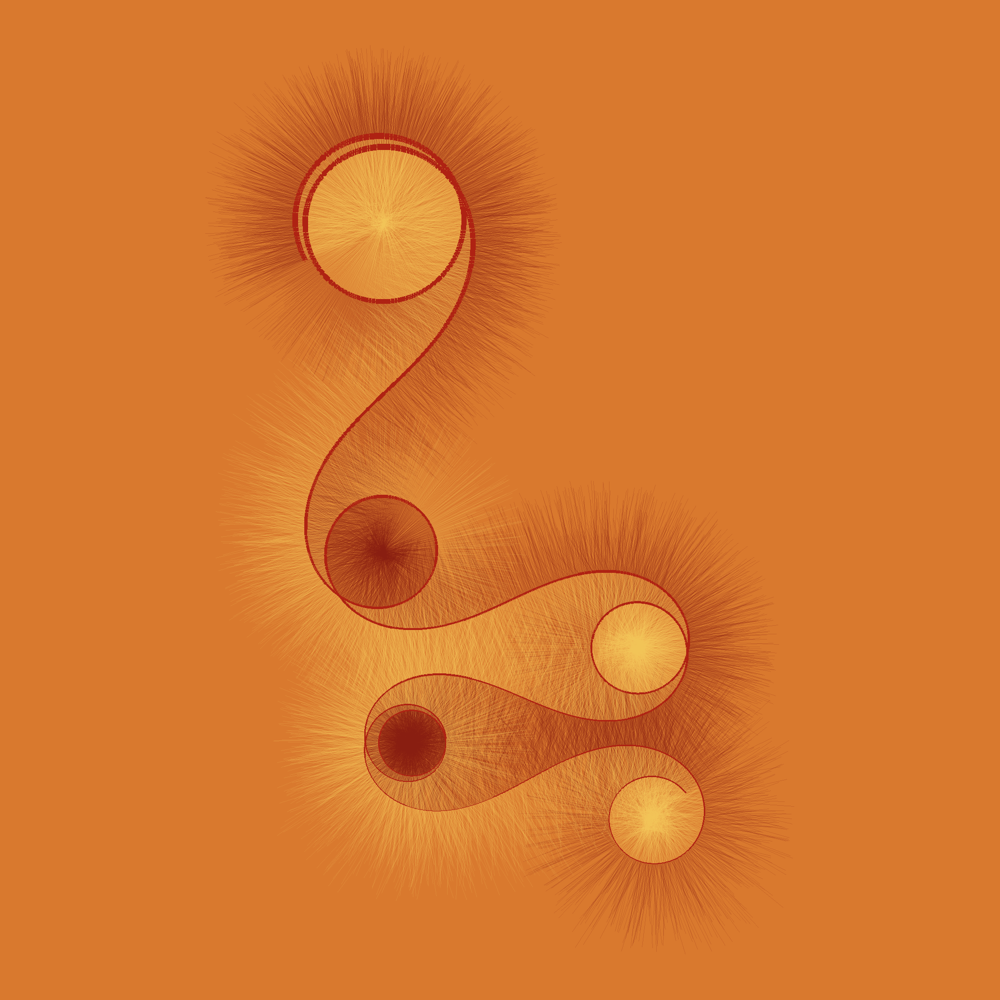

<!-- README.md is generated from README.Rmd. Please edit that file -->

# My kid could have done that

<!-- badges: start -->
<!-- badges: end -->

When my son Leo was little, he had an amazing drawing style. He made
some monsters that were all spirals, spikes, huge bug-eyes, and lots and
lots of skinny legs.

The sinuous meander paths of [David
Chappelle](doi.org/10.1080/17513472.2015.1092859) may have been inspired
by the mathematics used to represent the geomorphology of streams, but
to me many of the outputs look like the awesome monsters that my son
used to draw as a child.

For this piece I use the following packages:

``` r
library(dplyr) # A Grammar of Data Manipulation
#> 
#> Attaching package: 'dplyr'
#> The following objects are masked from 'package:stats':
#> 
#>     filter, lag
#> The following objects are masked from 'package:base':
#> 
#>     intersect, setdiff, setequal, union
library(ggplot2) # Create Elegant Data Visualisations Using the Grammar of Graphics
library(glue) # Interpreted String Literals
library(MetBrewer) # Color Palettes Inspired by Works at the Metropolitan Museum of Art 
library(MexBrewer) # Color Palettes Inspired by Works of Mexican Muralists
#> Registered S3 method overwritten by 'MexBrewer':
#>   method        from     
#>   print.palette MetBrewer
#library(tidyr)
```

## Generate a random seed

``` r
seed <- sample.int(100000000, 1)
#seed <- 8336784
```

## Generate meandering path

Select the number of sine curves for the path, and the parameters of the
curves: the amplitude $A$, frequency $f$, and phase $phi$ ($\phi$).

``` r
set.seed(seed)

n_sine <- sample.int(4, 1)

A <- runif(n_sine, 0, 2 * pi)
f <- runif(n_sine, 1, 5) |> sort(decreasing = TRUE)
phi <- runif(n_sine, 0, 2 * pi)
```

Select the number of points to use to draw the path. Fewer points
produce less curved, more angular paths.

``` r
# Number of times to repeat a full 2pi cycle
T_f <- 1
# Number of points
n_t <- 12000

# Points
t <- seq(0, T_f * 2 * pi, length = T_f * n_t)
```

Select the starting point of the meander and an index value. Use these
to initialize a data frame. The angle ($theta$ or $\theta$) is the
tangent of the meander at $t$ with respect to the x-axis (see
Chappelle).

``` r
# Starting point of the path
x <- 0  
y <- 0
idx <- 0

df <- data.frame(x = numeric(length = T_f * n_t),
                 y = numeric(length = T_f * n_t),
                 theta = numeric(length = T_f * n_t)) 
```

The angle at $t$ is calculated as follows: $$
\theta(t) = \mu_0 + \sum_{i = 1}^{n_sine}A_i\sin(2\pi f_it + \phi_i)
$$ That is the discrete approximation of the integral of the expression
for the angle. The term $\mu_0$ is used to ensure that the patterns
repeat on the horizontal axis but I have not figured out quite yet how
to calculate it, so I will ignore it for the moment.

The $x$ and $y$ coordinates of the path are a function of the angle and
$t$: $$
\begin{array}
x(t) = x_0 + \int_0^t \cos(\theta(t))dt\\
y(t) = y_0 + \int_0^t \sin(\theta(t))dt
\end{array}
$$ The values of $x_0$ and $y_0$ are the coordinates of the starting
point of the path.

In this chunk of code the angle is calculated and used to obtain the
values of $x$ and $y$:

``` r
for(i in t){
  idx <- idx + 1
  theta <- 0
  for(j in 1:n_sine){
    theta <- theta + A[j] * sin(f[j] * t[idx] + phi[j])
  }
  df$x[idx] <- cos(theta)
  df$y[idx] <- sin(theta)
  df$theta[idx] <- theta
}
```

Next is the discrete approximation of the integral:

``` r
df <- df |>
  mutate(x = x + cumsum(x),
         y = y + cumsum(y))
```

To decorate the path strokes are drawn. The length of the strokes
depends on the range covered by the path. This value is randomly chosen
to be between 5% and 15% of the maximum extent in $x$ or $y$

``` r
# Extent of the path in x and y is the difference between the max and min coordinates
x_range <- max(df$x) - min(df$x)
y_range <- max(df$y) - min(df$y)

# Length of stroke is between 5 and 15% of the maximum range
l <- max(x_range, y_range)
l <- runif(1, 0.05, 0.15) * l

# The length is modified by a random factor to avoid an overly uniform aspect
l_r <- runif(nrow(df), 0.50, 1.50)
```

Having chosen the length of the strokes, the coordinates of the
endpoints are calculated. There are several ways of doing this, for
example, strokes that are tangent to the curve, or strokes that are
perpendicular to the tangent. Each gives a characteristic look. In
addition to randomizing the lenght of each stroke, the angle is also
randomized:

``` r
# Perpendicular to the tangent
df <- df |>
  mutate(xstart =  x + l_r * l * sin(theta * runif(n(), 0.95, 1.05)),
         ystart = y - l_r * l * cos(theta * runif(n(), 0.95, 1.05)),
         xend = x - l_r * l * sin(theta * runif(n(), 0.95, 1.05)),
         yend = y + l_r * l * cos(theta * runif(n(), 0.95, 1.05)),
         lw = sqrt((x - mean(x))^2 + (y - mean(x))^2))

# Parallel to the tangent
# df <- df |>
#   mutate(xstart =  x - l_r * l * sin(theta * runif(n(), 0.97, 1.03)),
#          ystart = y - l_r * l * cos(theta * runif(n(), 0.97, 1.03)),
#          xend = x + l_r * l * sin(theta * runif(n(), 0.97, 1.03)),
#          yend = y + l_r * l * cos(theta * runif(n(), 0.97, 1.03)))
```

## Render

Randomly select a color palette from package
[`MexBrewer`](https://CRAN.R-project.org/package=MexBrewer) or
[`MetBrewer`](https://CRAN.R-project.org/package=MetBrewer).

``` r
set.seed(seed)

color_edition <- sample(c("Monotone", "MetBrewer", "MexBrewer"), 1)

if(color_edition == "Monotone"){
  col_palette <- c("white", "grey", "grey20", "black")
}else if(color_edition == "MetBrewer"){
  col_palette_name <- sample(c("Archambault", "Austria", "Benedictus", "Cassatt1", "Cassatt2", "Cross", "Degas", "Demuth", "Derain", "Egypt", "Gauguin", "Greek", "Hiroshige", "Hokusai1", "Hokusai2", "Hokusai3", "Homer1", "Homer2", "Ingres", "Isfahan1", "Isfahan2", "Java", "Johnson", "Juarez", "Kandinsky", "Klimt", "Lakota", "Manet", "Moreau", "Morgenstern", "Nattier", "Navajo", "NewKingdom", "Nizami", "OKeeffe1", "OKeeffe2", "Paquin", "Peru1", "Peru2", "Pillement", "Pissaro", "Redon", "Renoir", "Signac", "Tam", "Tara", "Thomas", "Tiepolo", "Troy", "Tsimshian", "VanGogh1", "VanGogh2", "VanGogh3", "Veronese", "Wissing"), 1)
  col_palette <- met.brewer(col_palette_name, n = 4)
}else if(color_edition == "MexBrewer"){
  col_palette_name <- sample(c("Alacena", "Atentado", "Aurora", "Casita1", "Casita2", "Casita3", "Concha", "Frida", "Huida", "Maiz", "Ofrenda", "Revolucion", "Ronda", "Taurus1", "Taurus2", "Tierra", "Vendedora"), 1)
  col_palette <- mex.brewer(col_palette_name, n = 4)
}

if(sample(c(TRUE, FALSE), 1)){
  col_palette <- rev(col_palette)
}
```

Plot:

``` r
p <- ggplot(data = df) + 
  geom_segment(aes(x = x, y = y,
                   xend = xstart, yend = ystart,
                   #alpha = theta
  ),
  alpha = 0.2,
  color = col_palette[1],
  #color = "gray",
  linewidth = 0) +
  geom_segment(aes(x = x, y = y,
                   xend = xend, yend = yend,
                   #alpha = theta
  ),
  alpha = 0.2,
  color = col_palette[4],
  linewidth = 0) +
  geom_path(aes(x = x,
                y = y,
                linewidth = lw),
            color = col_palette[2]
            #color = "white"
  ) +
  scale_linewidth(range = c(0.2, 1.5)) +
  coord_equal() +
  theme_void() +
  theme(legend.position = "none",
        plot.background = element_rect(color = NA,
                                       fill = col_palette[3]
                                       #fill = "gray20"
  ))

if(x_range > y_range){
  # Save plot
  ggsave(p, 
         filename = glue::glue("outputs/meandering-paths-{seed}.png"),
         width = 7)

}else{
  ggsave(p,
         filename = glue::glue("outputs/meandering-paths-{seed}.png"),
         height = 7)
}
#> Saving 7 x 7 in image
```



Some paths are interesting when plotted in polar coordinates, but some
look like unattractive messes. This is the code to plot in polar
coordinates if desired.

``` r
ggplot(data = df) + 
  geom_segment(aes(x = x, y = y,
                   xend = xstart, yend = ystart,
                   #alpha = theta
  ),
  alpha = 0.25,
  color = col_palette[2],
  #color = "gray",
  linewidth = 0) +
  geom_segment(aes(x = x, y = y,
                   xend = xend, yend = yend,
                   #alpha = theta
  ),
  alpha = 0.25,
  color = "black",
  linewidth = 0) +
  geom_path(aes(x = x,
                y = y),
            color = col_palette[1]
            #color = "white"
              ) +
  coord_polar() +
  theme_void() +
  theme(plot.background = element_rect(color = NA,
                                       fill = col_palette[3]
                                       #fill = "gray20"
                                         ))

# Save plot
  ggsave(filename = glue::glue("outputs/meandering-paths-polar-{seed}.png"),
         height = 7,
         width = 7)
```
