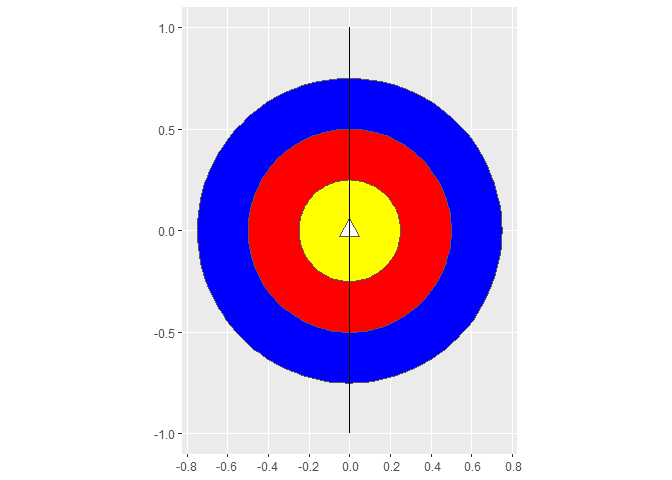
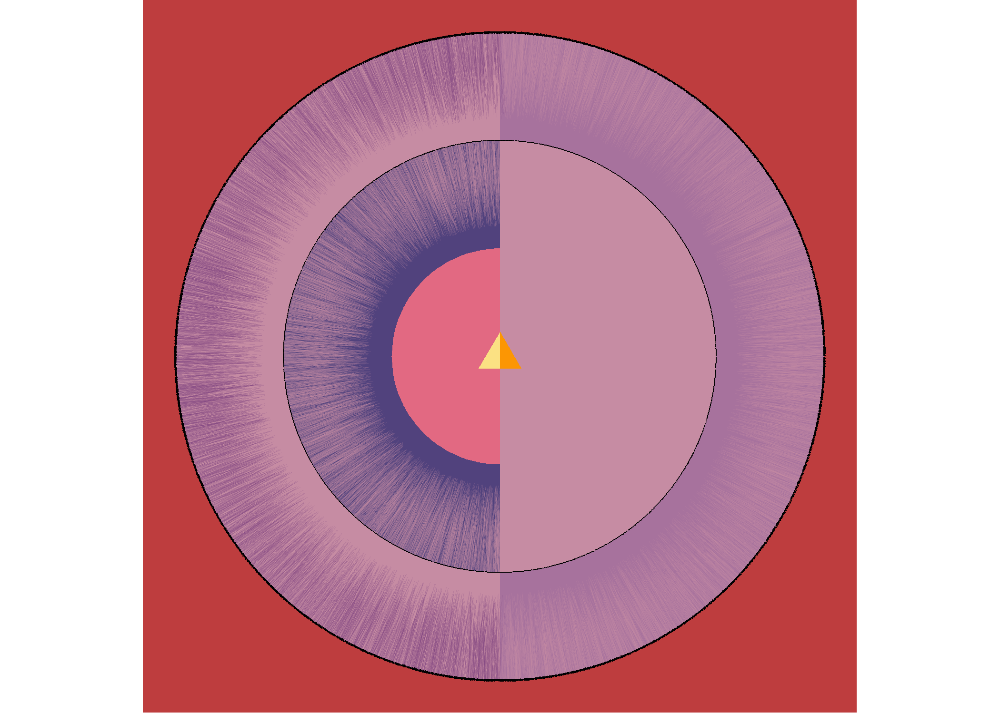

<!-- README.md is generated from README.Rmd. Please edit that file -->

# Hilma af Klint

<!-- badges: start -->
<!-- badges: end -->

Hilma af Klint was a woman ahead of her times. Her abstract work
predates that of Kandinski, Mondrian, and Malevitch.

For this piece, I draw inspiration from
[Svanen](https://en.wikipedia.org/wiki/Hilma_af_Klint#/media/File:Hilma_af_Klint,_1915,_Svanen,_No._17.jpg)
(The Swan). Despite the abstraction and apparent simplicity, this piece
is full of symbolism: duality, inner and outer elements, sharing,
communion and separation, and hard and soft.

In this notebook I use the following packages:

``` r
library(dplyr) # A Grammar of Data Manipulation
#> 
#> Attaching package: 'dplyr'
#> The following objects are masked from 'package:stats':
#> 
#>     filter, lag
#> The following objects are masked from 'package:base':
#> 
#>     intersect, setdiff, setequal, union
library(ggplot2) # Create Elegant Data Visualisations Using the Grammar of Graphics
library(glue) # Interpreted String Literals 
library(lwgeom) # Bindings to Selected 'liblwgeom' Functions for Simple Features
#> Linking to liblwgeom 3.0.0beta1 r16016, GEOS 3.9.1, PROJ 7.2.1
library(MetBrewer) # Color Palettes Inspired by Works at the Metropolitan Museum of Art
library(MexBrewer) # Color Palettes Inspired by Works of Mexican Painters and Muralists
#> Registered S3 method overwritten by 'MexBrewer':
#>   method        from     
#>   print.palette MetBrewer
library(sf) # Simple Features for R
#> Linking to GEOS 3.9.1, GDAL 3.4.3, PROJ 7.2.1; sf_use_s2() is TRUE
```

## Generate a random seed

``` r
seed <- sample.int(100000000, 1)
```

# Create primitive polygons

Create a triangle:

``` r
triangle <- matrix(c(-0.05, -0.05 * tan(pi/6), 
                     0, 0.05 * tan(pi/3) - 0.05 * tan(pi/6), 
                     0.05, -0.05 * tan(pi/6),  
                     -0.05, -0.05 * tan(pi/6)),
                   ncol = 2,
                   byrow = TRUE)

# Convert coordinates to polygons and then to simple features
triangle <- data.frame(id = 1,
                       geometry = st_polygon(list(triangle)) |> 
                         st_sfc()) |> 
  st_as_sf()
```

Create circles:

``` r
center <- data.frame(x = 0, y = 0) |>
  st_as_sf(coords = c("x", "y"))

circle_1 <- center |>
  st_buffer(dist = 0.25)

circle_2 <- center |>
  st_buffer(dist = 0.5)

circle_3 <- center |>
  st_buffer(dist = 0.75)
```

## Create blade

Create a blade to split the primitive geometries:

``` r
blade <- matrix(c(0, -1,#2 + sqrt(4^2 - 2^2)/2,
                  0, 1), #2 + sqrt(4^2 - 2^2)/2),
                nrow = 2,
                byrow = TRUE)

# Convert coordinates to lines and then to simple features
blade <- data.frame(id = 1,
                    geometry = st_linestring(blade) |> 
                      st_sfc()) |> 
  st_as_sf()
```

Plot the primitive polygons and blade:

``` r
ggplot() + 
  geom_sf(data = circle_3,
          fill = "blue") + 
  geom_sf(data = circle_2,
          fill = "red") + 
  geom_sf(data = circle_1,
          fill = "yellow") + 
  geom_sf(data = triangle,
          fill = "white") +
  geom_sf(data = blade)
```

<!-- -->

Create data frames for the “texture” (thin segments to resemble
brushwork):

``` r
set.seed(seed)

df <- data.frame(theta = runif(12000, 0, 2*pi) |> sort()) |>
  mutate(x = 0.75 * cos(theta),
         y = 0.75 * sin(theta),
         l = 0.15 * runif(n(), 0.5, 1.35),
         lw = runif(n(), 0.90, 1.10) * ifelse(sample(c(TRUE, FALSE), 1), abs(x) + y, x + y^2),
         theta = atan(x/y) + runif(n(), -pi/32, pi/32),
         xend = case_when(y >= 0 ~ x - l * sin(theta),
                          y <= 0 ~ x + l * sin(theta)),
         yend = case_when(y >= 0 ~ y - l * cos(theta),
                          y <= 0 ~ y + l * cos(theta)))

df2 <- data.frame(theta = runif(12000, 0, 2*pi) |> sort()) |>
  mutate(x = 0.5 * cos(theta),
         y = 0.5 * sin(theta),
         l = 0.15 * runif(n(), 0.5, 1.35),
         lw = runif(n(), 0.90, 1.10) * ifelse(sample(c(TRUE, FALSE), 1), abs(x) + y, x + y^2),
         theta = atan(x/y) + runif(n(), -pi/32, pi/32),
         xend = case_when(y >= 0 ~ x - l * sin(theta),
                          y <= 0 ~ x + l * sin(theta)),
         yend = case_when(y >= 0 ~ y - l * cos(theta),
                          y <= 0 ~ y + l * cos(theta)))
```

Split the primitive geometries:

``` r
triangle_2 <- triangle |>
  st_split(blade) |>
  st_collection_extract(c("POLYGON"))

circle_12 <- circle_1 |>
  st_split(blade) |>
  st_collection_extract(c("POLYGON"))  |>
  slice_sample(n = 1)

circle_22 <- circle_2 |>
  st_split(blade) |>
  st_collection_extract(c("POLYGON"))

circle_32 <- circle_3 |>
  st_split(blade) |>
  st_collection_extract(c("POLYGON")) 
```

Choose a color palette at random:

``` r
set.seed(seed)

color_edition <- sample(c("MetBrewer", "MexBrewer"), 1)

if(color_edition == "MetBrewer"){
  col_palette_name <- sample(c("Archambault", "Austria", "Benedictus", "Cassatt1", "Cassatt2", "Cross", "Degas", "Demuth", "Derain", "Egypt", "Gauguin", "Greek", "Hiroshige", "Hokusai1", "Hokusai2", "Hokusai3", "Homer1", "Homer2", "Ingres", "Isfahan1", "Isfahan2", "Java", "Johnson", "Juarez", "Kandinsky", "Klimt", "Lakota", "Manet", "Moreau", "Morgenstern", "Nattier", "Navajo", "NewKingdom", "Nizami", "OKeeffe1", "OKeeffe2", "Paquin", "Peru1", "Peru2", "Pillement", "Pissaro", "Redon", "Renoir", "Signac", "Tam", "Tara", "Thomas", "Tiepolo", "Troy", "Tsimshian", "VanGogh1", "VanGogh2", "VanGogh3", "Veronese", "Wissing"), 1)
  col_palette <- met.brewer(col_palette_name, n = 20)
}else if(color_edition == "MexBrewer"){
  col_palette_name <- sample(c("Alacena", "Atentado", "Aurora", "Casita1", "Casita2", "Casita3", "Concha", "Frida", "Huida", "Maiz", "Ofrenda", "Revolucion", "Ronda", "Taurus1", "Taurus2", "Tierra", "Vendedora"), 1)
  col_palette <- mex.brewer(col_palette_name, n = 20)
}

if(sample(c(TRUE, FALSE), 1)){
  col_palette <- rev(col_palette)
}
```

Add color values to the data frames with the primitive geometries and
strokes:

``` r
set.seed(seed)

df <- df |>
  mutate(color = ifelse(x < 0, sample(col_palette, 1), sample(col_palette, 1)))

df2 <- df2 |>
  mutate(color = sample(col_palette, 1))

triangle <- triangle_2 |>
  mutate(fill = sample(col_palette[1:7], 2))

circle_1 <- circle_12 |>
  mutate(fill = sample(col_palette[8:12], 1))

circle_2 <- circle_22 |>
  mutate(fill = sample(col_palette[12:16], 2))

circle_3 <- circle_32 |>
  mutate(fill = sample(col_palette[12:16], 2))
```

## Render

Plot and save:

``` r
p <- ggplot() + 
  geom_sf(data = circle_3,
          aes(fill = fill),
          color = NA) + 
  geom_sf(data = circle_2,
          aes(fill = fill),
          color = NA) + 
  geom_sf(data = circle_1,
          aes(fill = fill),
          color = NA) + 
  geom_sf(data = triangle,
          aes(fill = fill),
          color = NA) + 
  geom_segment(data = df,
               aes(x = x, 
                   y = y,
                   xend = xend,
                   yend = yend,
                   color = color),
               alpha = 0.20,
               #color = "lightblue",
               linewidth = 0) +
  geom_segment(data = df2,
               aes(x = x, 
                   y = y,
                   xend = xend,
                   yend = yend,
                   color = color),
               alpha = 0.20,
               #color = "lightblue",
               linewidth = 0) +
  geom_path(data = df,
            aes(x = x,
                y = y,
                linewidth = lw)) +
  geom_path(data = df2,
            aes(x = x,
                y = y,
                linewidth = lw)) +
  scale_color_identity() +
  scale_fill_identity() + 
  scale_linewidth(range = c(0.2, 0.7)) +
  theme_void() +
  theme(legend.position = "none",
        panel.background = element_rect(color = NA,
                                        fill = sample(col_palette, 1)))

# Save plot
ggsave(p,
       filename = glue::glue("outputs/hilda-af-klint-{col_palette_name}-{seed}.png"),
       #height = 7,
       width = 7)
#> Saving 7 x 5 in image
```


