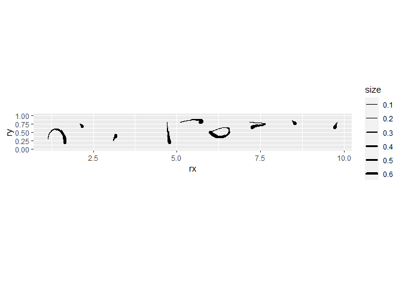
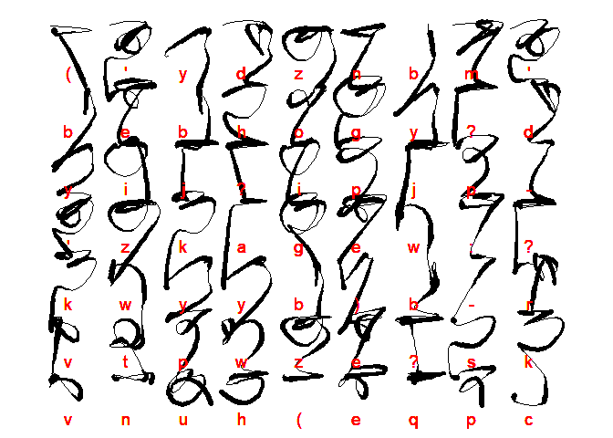

<!-- README.md is generated from README.Rmd. Please edit that file -->

# Generative poetry

<!-- badges: start -->
<!-- badges: end -->

None of the forms of generative poetry that I could think of were
appealing or feasible for a quick project. According to [Lamb et
al.](https://doi.org/10.1080/17513472.2017.1373561), generative poetry
techniques range from *mere generation*, through *human enhancement*, to
*computer enhancement*, depending on how big the role of the computer
is.

The idea of mere generation was not appealing - pushing words together
is not as simple or as aesthetically pleasing as pushing lines or
squares together. Also, with developments in Generative Pre-Trained
models (GPT), including ChatGPT, I am uncomfortable using a technique
that mashes up the words of others without proper credit. Other
alternatives crossed some sort of line between generative and computer
assisted for me.

So instead of mashing up the words of others, or getting assistance from
a computer with my own words, I decided to revisit my system of [asemic
glyphs](https://github.com/paezha/genuary2023/tree/master/2022-01-14_Aesemic).

I was not super happy with the aspect of the glyphs that I had created
before. Creating splines with points at random produced glyphs that were
convoluted and not very elegant in my opinion. [Pierre
Casadebaig](https://github.com/picasa/generative_examples) has a
beautiful system that [hunts for
attractors](https://github.com/picasa/generative_examples/blob/master/R/attractors_collection.rmd),
which is a computationally more complex procedure than just randomly
sampling control points in a defined space.

Something I discovered in the course of Genuary2023 is that I could
“enhance” the aspect of my asemic glyphs by introducing “accents”, that
is, designed “strokes” that could be used in combination with the
randomly generated splines. But then, the most pleasing part of that
system were the “accents” not the glyphs!

So I decided to experiment with those “accents”. Instead of generating
glyphs at random, I thought I could design a few “accents” or strokes,
and then combine them at random to generate the glyphs. The end result
is a system that resembles the calligraphy of Eastern Asian scripts, and
that I find more aesthetically pleasing than my earlier efforts with
asemic scripts.

Begin by loading the packages used in this notebook:

``` r
library(dplyr) # A Grammar of Data Manipulation
#> 
#> Attaching package: 'dplyr'
#> The following objects are masked from 'package:stats':
#> 
#>     filter, lag
#> The following objects are masked from 'package:base':
#> 
#>     intersect, setdiff, setequal, union
library(ggforce) # Accelerating 'ggplot2'
#> Loading required package: ggplot2
library(ggplot2) # Create Elegant Data Visualisations Using the Grammar of Graphics
library(glue) # Interpreted String Literals
library(stringr) # Simple, Consistent Wrappers for Common String Operations
library(tidyr) # Tidy Messy Data
```

## Generate a random seed

``` r
seed <- sample.int(100000000, 1)
```

## Create a set of glyphs

Set the parameters for creating the glyphs, that is, the number of
glyphs (corresponding to letters), the number of points to generate each
glyph (used by the splines function), and the cutoff for the thickness
of the lines; notice that special characters are added to the set of
letters:

``` r
#set.seed(seed)

l <- c(letters, "'", "-", ":", "?", "(", ")") 
n_glyphs <- length(l) # Number of letters/glyphs
```

Create strokes:

``` r

strokes <- c("stroke1", "stroke2", "stroke3", "stroke4", "stroke5", "stroke6", "stroke7", "stroke8", "stroke9")
n_strokes <- length(strokes)

strokes <- data.frame(stroke = factor(rep(strokes, each = 4)))

#n_strokes <- nlevels(strokes$stroke)

strokes$rx <- c(0.15, 0.15, 0.65, 0.65,
                0.1, 0.125, 0.15, 0.175,
                0.1, 0.125, 0.15, 0.175,
                0.7, 0.725, 0.75, 0.775,
                0.1, 0.4, 0.9, 0.7,
                0.0, 1.0, 0.5, 0.0,
                0.175, 1.2, 0.225, 0.25,
                0.45, 0.475, 0.5, 0.53,
                0.8, 0.773, 0.75, 0.72)

# Did not quite like what happens when I randomize the coordinates
# strokes$rx <- c(runif(4, 0.15, 0.65) |> sort(),
#                 runif(4, 0.1, 0.175) |> sort(),
#                 runif(4, 0.1, 0.175) |> sort(),
#                 runif(4, 0.7, 0.8),
#                 runif(4, 0.1, 0.7),
#                 runif(4, 0.0, 1))

strokes$ry <- c(0.30, 0.70, 0.70, 0.20,
                0.75, 0.725, 0.7, 0.675,
                0.25, 0.3, 0.35, 0.4,
                0.8, 0.6, 0.4, 0.2,
                0.8, 0.9, 0.9, 0.8,
                0.5, 1.0, 0, 0.5,
                0.8, 0.75, 0.7, 0.65,
                0.85, 0.825, 0.8, 0.775,
                0.8, 0.75, 0.7, 0.65)

# strokes$ry <- c(runif(4, 0.3, 0.7),
#                 runif(4, 0.675, 0.75),
#                 runif(4, 0.25, 0.4),
#                 runif(4, 0.2, 0.8),
#                 runif(4, 0.8, 0.9),
#                 runif(4, 0.0, 1))

strokes$size <- rep(c(0.1, 0.3, 0.5, 0.7), n_strokes)
```

Plot individual strokes:

``` r
strokes |> 
  mutate(x = as.numeric(stroke),
         rx = rx + x) |>
  ggplot() +
  geom_bspline2(aes(x = rx, 
                    y = ry, 
                    #color = type, 
                    group = stroke,
                    linewidth = size),
                n = 800, 
                lineend = "round") + 
  scale_linewidth(range = c(0.2,2)) +
  ylim(c(0, 1)) +
  coord_equal()
```

<!-- -->

The strokes are not random. But they are used to randomly create asemic
glyphs. Here, I select number of glyphs and randomly choose 1) the
number of strokes; and 2) the strokes for the glyphs:

``` r
set.seed(seed)

glyphs <-  data.frame(glyph = 1:n_glyphs) |>
  # Join the corresponding letters
  left_join(data.frame(letter = l, 
                       glyph = 1:n_glyphs),
            by = "glyph") |>
  # Randomly choose number of strokes for each glyph
  mutate(n_strokes = sample.int(2, n(), replace = TRUE) + sample.int(2, n(), replace = TRUE)) |>
  # Uncount to have as many rows per glyph as number of strokes
  uncount(n_strokes) |>
  # Sample the strokes for the glyph
  mutate(stroke = sample(unique(strokes$stroke), n(), replace = TRUE)) |>
  # Create an identifier for the glyph-stroke pair
  mutate(gs = factor(1:n())) |>
  # Group by glyph
  group_by(glyph) |>
  # Create identifier for position of stroke in glyph
  mutate(s = 1:n()) |>
  # Ungroup data frame
  ungroup() |>
  distinct(gs, .keep_all = TRUE)  
```

Join strokes to glyphs:

``` r
glyphs <- glyphs |>
  left_join(strokes,
            by = "stroke")
```

Generate a test “text” by choosing number of rows and number of columns:

``` r
set.seed(seed)

n_row <- 8
n_col <- 6

text <- expand.grid(x = seq(0, n_row, 1), y = seq(n_col, 0, -1)) |>
  # Generate id for the position of glyphs in the text
  mutate(id = 1:n(),
         # Sample glyph identifiers
         glyph = sample.int(n_glyphs, 
                            n(), 
                            replace = TRUE)) |>
  # Join strokes corresponding to each glyph identifier
  left_join(glyphs,
            by = "glyph") |> 
  # Randomize the positions and sizes of the strokes by a small amount
  mutate(rx = x + rx + runif(n(), 0.95, 1.05) + s * runif(n(), 0.01, 0.10),
         ry = y + ry + runif(n(), 0.95, 1.05),
         size = 3 * size * runif(n(), 0.95,1.05))
```

Plot test text:

``` r
text  |>
  ggplot() +
  geom_bspline2(aes(x = rx, 
                    y = ry, 
                    #color = type, 
                    group = x, #try x and id
                    linewidth = size),
                n = 800, 
                lineend = "round") + 
  # Add the identifier of the glyph for comparison
  geom_text(aes(x =  x + 1.5,
                y = y + 1,
                label = letter),
            color = "red", 
            size = 5) +
  scale_linewidth(range = c(0.0, 2.5)) +
  coord_equal() +
  #coord_equal(xlim = c(-1, 30), ylim = c(0, 2))# +
  theme_void() +
  theme(legend.position = "none")
```

<!-- -->

## Use poem

Data frame with text (poem by Lady [Ono no
Komachi](https://allpoetry.com/Visible-colours)):

``` r
tanka <- data.frame(text = c("Visible colours", 
                             "(Invisible passions)", 
                             "Fade from", 
                             "This world's", 
                             "Human hearts", 
                             "And flowers.")) |>
  # Convert all to lower case
  mutate(text = str_to_lower(text))
```

Prepare text:

``` r
#find the maximum width of a line in number of characters
pad <- max(str_length(tanka$text))

# Pad the strings to have the same width
tanka <- tanka |>
  mutate(text = str_pad(text, width = pad, side = "right"))

cols <- nrow(tanka)
```

## Join text to glyphs

Convert text to single characters and add the coordinates to place the
glyphs in the block of text:

``` r
set.seed(seed)

# These sequences are for right-left, top-down writing. Select the spacing between columns:
s_cols <- 2
atext <- data.frame(x = rep(seq(s_cols * cols, s_cols * 1, -s_cols), each = pad),
                    y = rep(pad:1, cols),
                    letter = str_split(tanka$text, pattern = "") |> 
                      unlist(),
                    type = "text") |>
  mutate(id = 1:n()) |>
  left_join(data.frame(letter = l, glyph = 1:n_glyphs),
            by = "letter") |>
  # Join strokes coresponding to each glyph identifier
  left_join(glyphs,
            by = "glyph") |> 
  # Randomize the strokes position and size by a small amount
  mutate(rx = x + rx + runif(n(), 0.95, 1.05) + s * runif(n(), 0.01, 0.10),
         ry = y + ry + runif(n(), 0.95, 1.05),
         size = 3 * size * runif(n(), 0.95,1.05)) |>
  drop_na()
```

Parameters for saving the image. Find the dimensions of the plot and set
the size for saving accordingly:

``` r
# Find the x and y extents
x_range <- max(atext$x) - min(atext$x)
y_range <- max(atext$y) - min(atext$y)


if(x_range > y_range){
  # If wider than taller
  w = 7
  h = 7 * y_range/x_range
}else{
   # If taller than wider
  w = 7 * x_range/y_range
  h = 7
}
```

Plot. Here I go for a minimalist black and white look, but could
experiment later with high contrast combinations of colors:

``` r
atext |>
  #slice_head(n = 73) |>
  ggplot() +
  geom_bspline2(aes(x = rx, 
                    y = ry, 
                    #color = type, 
                    group = x, #try x and id
                    linewidth = size),
                n = 800, 
                lineend = "round") + 
  scale_linewidth(range = c(0.0, 1.5)) +
  coord_equal() +
  theme_void() +
  theme(legend.position = "none",
        panel.background = element_rect(color = NA,
                                        fill = "white"))

# Save named image
ggsave(glue::glue("outputs/asemic-poetry-{seed}.png"),
height = h,
width = w,
units = "in")
```


Here is the same poem written in various randomly generated asemic
scripts using the same 9 strokes defined above.

> Visible colours  
> (Invisible passions)  
> Fade from  
> This world’s  
> Human hearts  
> And flowers.  
> Lady Ono no Komachi (c. 825 - c. 900)


