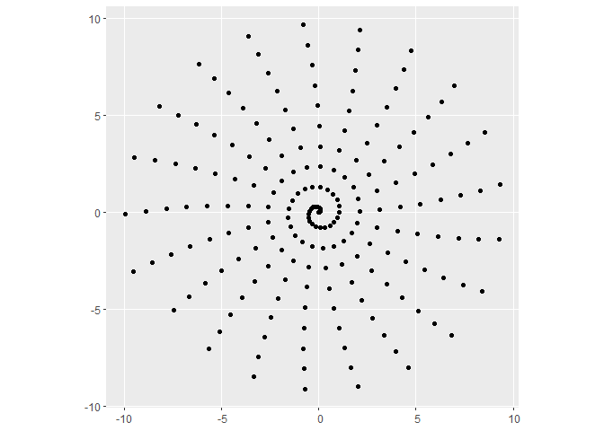
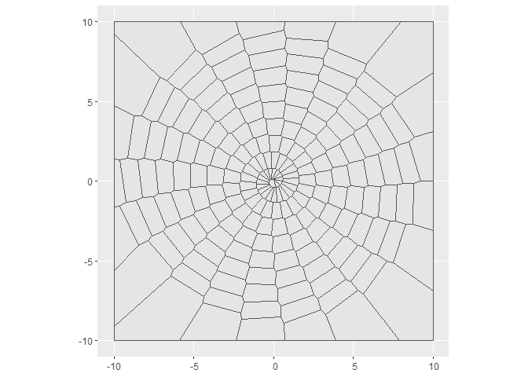
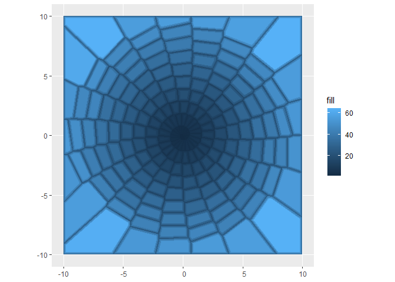
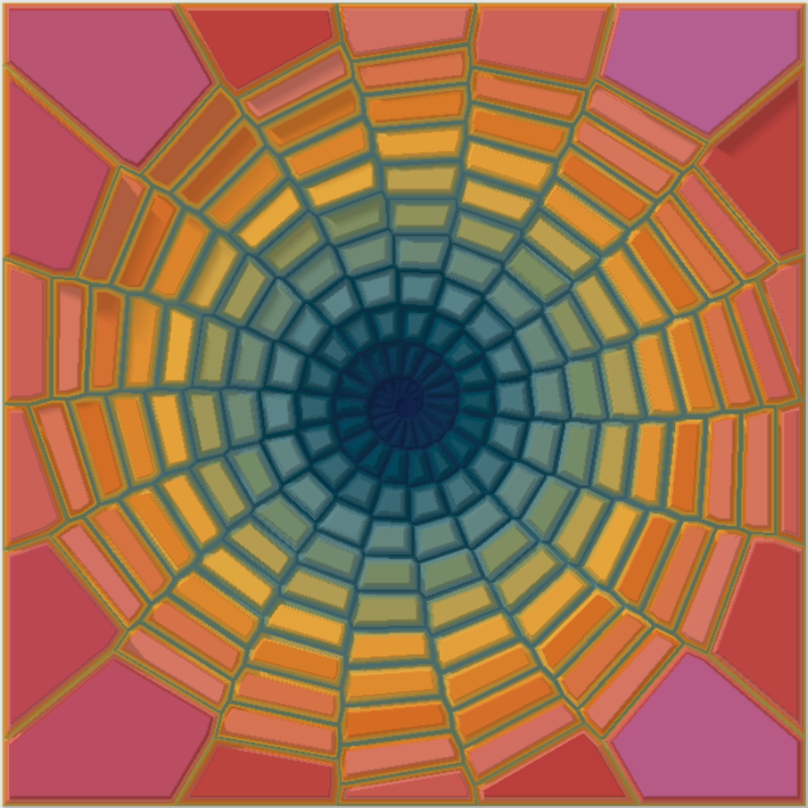

<!-- README.md is generated from README.Rmd. Please edit that file -->

# Break a previous image

<!-- badges: start -->
<!-- badges: end -->

I broke images in three mini-projects this Genuary. For this prompt I
“break” one of my [previous
images](https://github.com/paezha/genuary2023/tree/master/2022-01-12_Tessellation),
by “unshattering” it.

For this piece I use the following packages:

``` r
library(dplyr) # A Grammar of Data Manipulation
#> 
#> Attaching package: 'dplyr'
#> The following objects are masked from 'package:stats':
#> 
#>     filter, lag
#> The following objects are masked from 'package:base':
#> 
#>     intersect, setdiff, setequal, union
library(ggplot2) # Create Elegant Data Visualisations Using the Grammar of Graphics
library(glue) # Interpreted String Literals
library(gsubfn) # Utilities for Strings and Function Arguments
#> Loading required package: proto
library(lwgeom) # Bindings to Selected 'liblwgeom' Functions for Simple Features
#> Linking to liblwgeom 3.0.0beta1 r16016, GEOS 3.9.1, PROJ 7.2.1
library(MetBrewer) # Color Palettes Inspired by Works at the Metropolitan Museum of Art 
library(MexBrewer) # Color Palettes Inspired by Works of Mexican Muralists
#> Registered S3 method overwritten by 'MexBrewer':
#>   method        from     
#>   print.palette MetBrewer
library(rayshader) # Create Maps and Visualize Data in 2D and 3D
library(stringr) # Simple, Consistent Wrappers for Common String Operations
library(sf) # Simple Features for R # Simple Features for R
#> Linking to GEOS 3.9.1, GDAL 3.4.3, PROJ 7.2.1; sf_use_s2() is TRUE
```

## Generate a random seed

``` r
seed <- sample.int(100000000, 1)
# seed <- 83744970
```

## Bounding box

Create a bounding box to contain a spiral that will be used to generate
a Voronoi tessellation:

``` r
bbox <- matrix(c(-10, -10, 
                 -10, 10, 
                 10, 10,  
                 10, -10,
                 -10, -10),
               ncol = 2,
               byrow = TRUE)

# Convert coordinates to polygons and then to simple features
bbox <- data.frame(id = 1,
                   geometry = st_polygon(list(bbox)) |> 
                     st_sfc()) |> 
  st_as_sf()
```

## Points for tessellation

The generative process is a spiral. The following chunk of code
implements two types of spirals: An Archimedean spiral, or a
[phyllotactic
spiral](https://www.r-bloggers.com/2019/01/playing-around-with-phyllotactic-spirals/)
with a randomly chosen angle:

``` r
set.seed(seed)

if(sample(c(TRUE, FALSE), 1)){
  # Archimedean spiral
  k <- sample.int(4, 1)
  
  sprl <- data.frame(t = seq(0, 10, 0.05)) |>
    mutate(id = 1:n(),
           x_sp = t * cos((5 + k) * t),
           y_sp = t * sin((5 + k) * t),
           x = t * cos((5 + k) * t),
           y = t * sin((5 + k) * t),
           color_angle = atan2(y = y,
                               x = x) ## get angle between x-axis and the vector from the origin to x,y
    ) |>
    st_as_sf(coords = c("x", "y"))
}else{
  # Number of points for the spiral; this parameter is the square of the radius of the spiral 
  n <- 300
  
  # Choose an angle 
  angle <- sample(c("pi*(3-sqrt(5))", # Golden angle
                    "sqrt(2)",
                    "sqrt(3)",
                    "sqrt(5)",
                    "pi/7",
                    "pi/9",
                    "pi/46",
                    "2",
                    "2"),
                  1)
  
  eval(parse(text = paste0("angle <-", angle)))
  
  theta <- runif(1, 0, 2 * pi)
  
  # Data frame with spiral points is converted to simple features
  sprl <- data.frame(
    idx = c(0:(n-1))) |> ## you can increase the number here to use more lines.
    mutate(t = seq(0,2*pi,length.out=n()),  ## since I used 0 to 1800 above, need to add 1
           r = sqrt(idx), ## radius   
           x_sp = r * cos(theta * angle * idx),
           y_sp = r * sin(theta * angle * idx),
           x = r * cos(theta * angle * idx),
           y = r * sin(theta * angle * idx),
           color_angle = atan2(y = y,
                               x = x) ## get angle between x-axis and the vector from the origin to x,y
    )  |>
    st_as_sf(coords = c("x", "y"))
}
```

Plot the base spiral:

``` r
ggplot() + 
  geom_sf(data = sprl)
```

<!-- -->

Use the points of the spiral to create a Voronoi tessellation:

``` r
# The function `do.call(what, arg)` applies a function
# `what` to the argument `arg`. In this case, we extract 
# the geometry of the `sf` object (i.e., the coordinates 
# of the points) and apply the function `c()` to concatenate 
# the coordinates to obtain a MULTIPOINT object.   
# The pipe operator passes the MuLTIPOINT object to function `st_voronoi()`
sprl_v<- do.call(c, st_geometry(sprl)) %>% 
  st_voronoi() %>% 
  # The output of `st_voronoi()` is a collection of geometries, 
  # which we pass to the following function for extraction.
  st_collection_extract()

sprl_v <- sprl |>
  st_set_geometry(st_geometry(sprl_v)) |>
  st_intersection(bbox)
#> Warning: attribute variables are assumed to be spatially constant throughout all
#> geometries

coords <- sprl_v |>
  st_centroid() |> 
  st_coordinates()
#> Warning in st_centroid.sf(sprl_v): st_centroid assumes attributes are constant
#> over geometries of x

sprl_v <- sprl_v |>
  mutate(x_v = coords[,1],
         y_v = coords[,2],
         id.1 = 0)
```

Plot tessellation:

``` r
ggplot() +
  geom_sf(data = sprl_v)
```

<!-- -->

Here I buffer the Voronoi polygons:

``` r
sprl_b2 <- sprl_v |>
  st_buffer(dist = c(-0.05)) |>
  mutate(id.1 = 2)

sprl_b3 <- sprl_v |>
  st_buffer(dist = c(-0.1)) |>
  mutate(id.1 = 3)

sprl_b4 <- sprl_v |>
  st_buffer(dist = c(-0.15)) |>
  mutate(id.1 = 4)

sprl_b5 <- sprl_v |>
  st_buffer(dist = c(-0.20)) |>
  mutate(id.1 = 5)

sprl_b <- rbind(sprl_v,
                sprl_b2,
                sprl_b3,
                sprl_b4,
                sprl_b5)
```

The colors will be chosen based on the coordinates of the original
polygons, offset by the level of the buffer:

``` r
# Add the coordinates of the polygon centroids and create a variable for the fill
sprl_b |>
  mutate(fill =  2.75 * sqrt((x_v + x_v * id.1/max(id.1))^2 + (y_v + y_v * id.1/max(id.1))^2) * runif(n(), 0.94, 1.05)) |>
  ggplot() +
  geom_sf(aes(fill = fill),
          color = NA)
```

<!-- -->

## Render

Randomly select a color palette from package
[{MexBrewer}](https://paezha.github.io/MexBrewer/) or
[{MetBrewer}](https://CRAN.R-project.org/package=MetBrewer):

``` r
set.seed(seed)

color_edition <- sample(c("MetBrewer", "MexBrewer"), 1)

if(color_edition == "MetBrewer"){
  col_palette_name <- sample(c("Archambault", "Austria", "Benedictus", "Cassatt1", "Cassatt2", "Cross", "Degas", "Demuth", "Derain", "Egypt", "Gauguin", "Greek", "Hiroshige", "Hokusai1", "Hokusai2", "Hokusai3", "Homer1", "Homer2", "Ingres", "Isfahan1", "Isfahan2", "Java", "Johnson", "Juarez", "Kandinsky", "Klimt", "Lakota", "Manet", "Moreau", "Morgenstern", "Nattier", "Navajo", "NewKingdom", "Nizami", "OKeeffe1", "OKeeffe2", "Paquin", "Peru1", "Peru2", "Pillement", "Pissaro", "Redon", "Renoir", "Signac", "Tam", "Tara", "Thomas", "Tiepolo", "Troy", "Tsimshian", "VanGogh1", "VanGogh2", "VanGogh3", "Veronese", "Wissing"), 1)
}else{
  col_palette_name <- sample(c("Alacena", "Atentado", "Aurora", "Casita1", "Casita2", "Casita3", "Concha", "Frida", "Huida", "Maiz", "Ofrenda", "Revolucion", "Ronda", "Taurus1", "Taurus2", "Tierra", "Vendedora"), 1)
}
```

Create plot:

``` r
set.seed(seed)

p <- sprl_b |>
  mutate(fill =  2.75 * sqrt((x_v + x_v * id.1/max(id.1))^2 + (y_v + y_v * id.1/max(id.1))^2) * runif(n(), 0.94, 1.05)) |>
  ggplot() +
  geom_sf(aes(fill = fill),
          color = NA)
if(color_edition == "MetBrewer"){
  p <- p +
    scale_fill_met_c(col_palette_name, 
                     direction = sample(c(-1, 1), 1)) +
    theme(legend.position = "none",
          axis.text = element_text(color = "white"),
          panel.background = element_rect(fill = "white"),
          axis.ticks = element_line(color = "white"))
}else{
  p <- p +
    scale_fill_mex_c(col_palette_name, 
                     direction = sample(c(-1, 1), 1)) +
    theme(legend.position = "none",
          axis.text = element_text(color = "white"),
          panel.background = element_rect(fill = "white"),
          axis.ticks = element_line(color = "white"))
}
```

Convert the ggplot object to a 3D image using {rayshader} and save:

``` r
plot_gg(p,
        phi = 90,
        theta = 0,
        pointcontract = 0,
        height_aes = "fill",
        raytrace = TRUE,
        windowsize = c(4000, 4000))
#> Warning in make_shadow(heightmap, shadowdepth, shadowwidth, background, :
#> `magick` package required for smooth shadow--using basic shadow instead.

# Save image
rgl::snapshot3d(glue("outputs/unsmashed-tessellations-{seed}.png"),
                fmt = 'png',
                webshot = TRUE,
                width = 2100,
                height = 2100)

# Close rgl device
rgl::rgl.close()
```


