<!-- README.md is generated from README.Rmd. Please edit that file -->

```{r, include = FALSE}
knitr::opts_chunk$set(
  collapse = TRUE,
  comment = "#>"
)
```

# genuary2023

<!-- badges: start -->
<!-- badges: end -->

This repository is for [genuary2023](https://genuary.art/), a month of generative art. A great opportunity to learn something new coding-wise, while indulging in some Rtistry.

## Day 1: [Perfect loop](2022-01-01_Perfect-loop/fiesta-t-74202868.gif)

For this I revisit a system that I designed a few months ago, called "Fiesta". 

```{r echo=FALSE, out.width="500px"}
# Display image
knitr::include_graphics("2022-01-01_Perfect-loop/outputs/fiesta-t-74202868.gif")
```

## Day 2: [Made in ten minutes](https://github.com/paezha/genuary2023/tree/master/2022-01-02_Made-in-10-minutes)

Coding Sol LeWitt's wall drawing instructions in ten minutes. 

```{r echo=FALSE, out.width="500px"}
# Display image
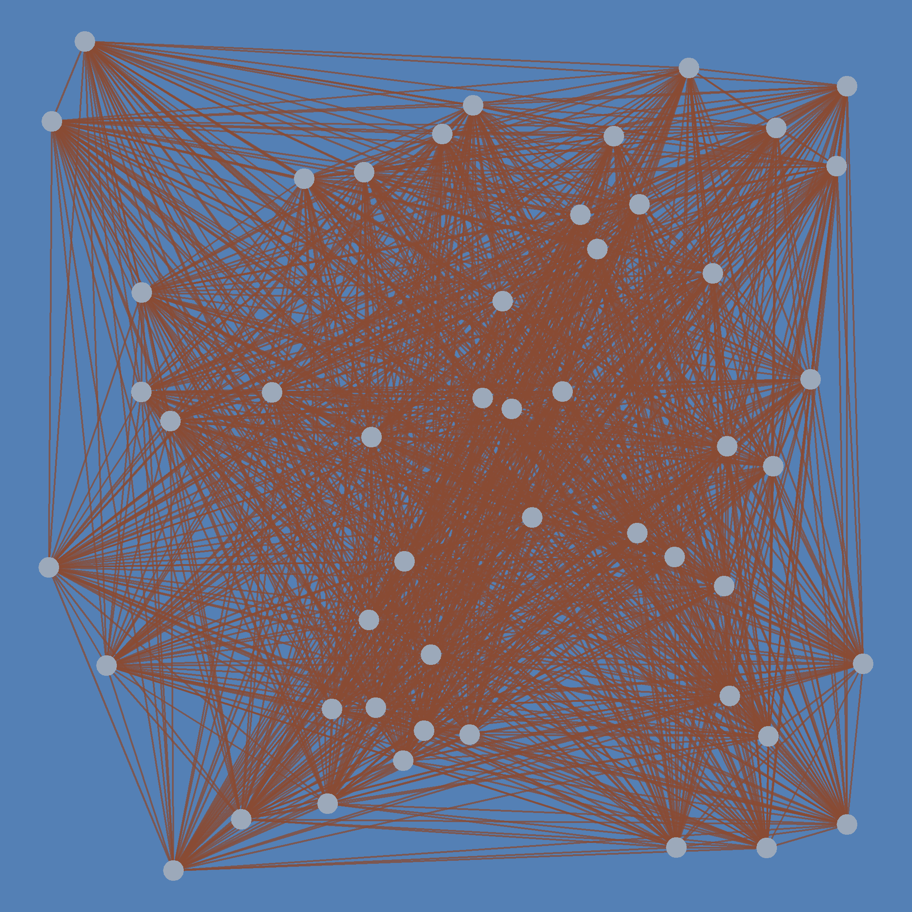
```

## Day 3: [Glitch art](https://github.com/paezha/genuary2023/tree/master/2022-01-03_Glitch-Art)

Glitching geometries.

```{r echo=FALSE, out.width="500px"}
# Display image
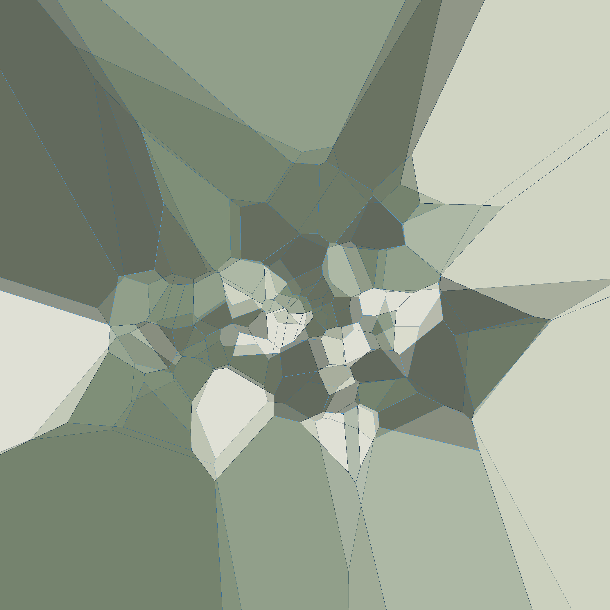
```

## Day 4: [Intersections](https://github.com/paezha/genuary2023/tree/master/2022-01-04_Intersections)

Intersections of bands and polygons to create transchromations in polar and cartesian coordinates.

```{r echo=FALSE, out.width="500px"}
# Display image
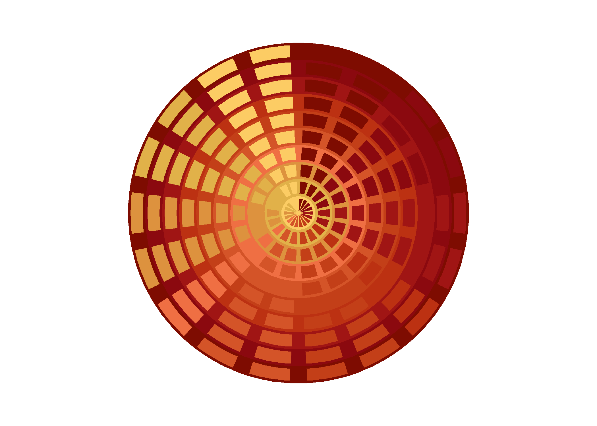
```

```{r echo=FALSE, out.width="500px"}
# Display image
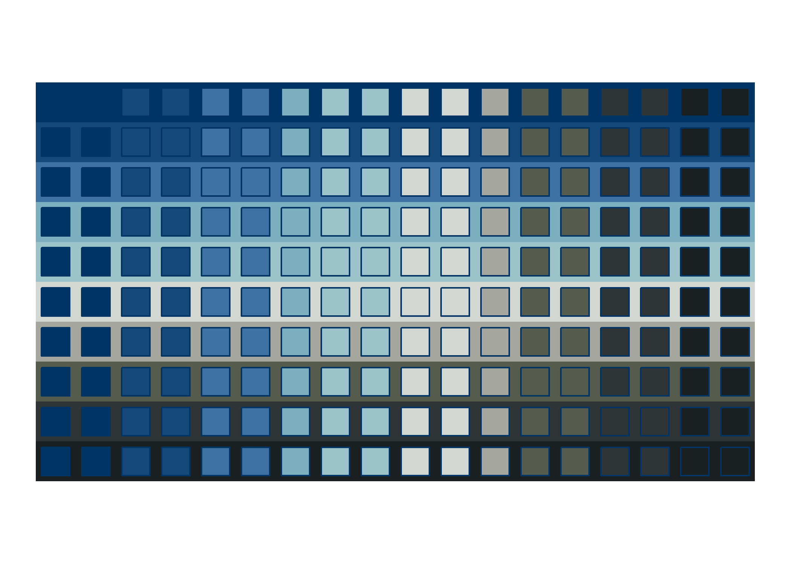
```

## Day 5: [Debug view](https://github.com/paezha/genuary2023/tree/master/2022-01-05_Debug-View)

Debugging a wave.

```{r echo=FALSE, out.width="500px"}
# Display image
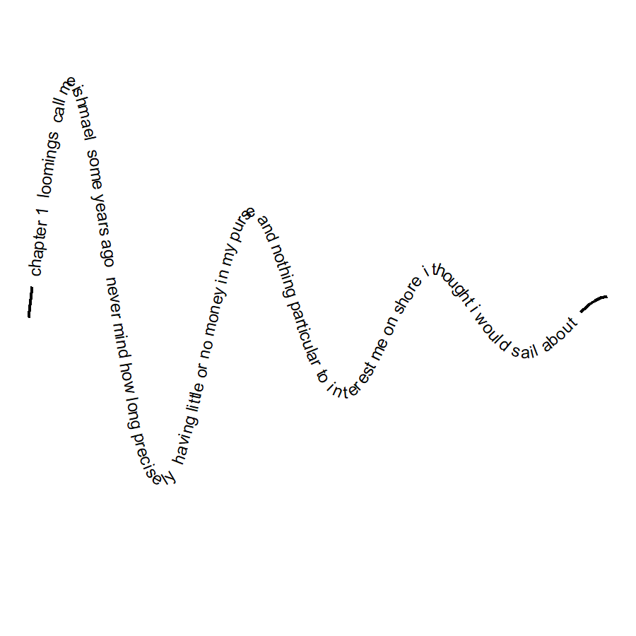
```


## Day 6: [Steal like an artist](https://github.com/paezha/genuary2023/tree/master/2022-01-06_Steal-Like-An-Artist)

Stealing code from [George Savva](https://mastodon.online/@georgemsavva@genart.social/109622524704727827).

```{r echo=FALSE, out.width="500px"}
# Display image
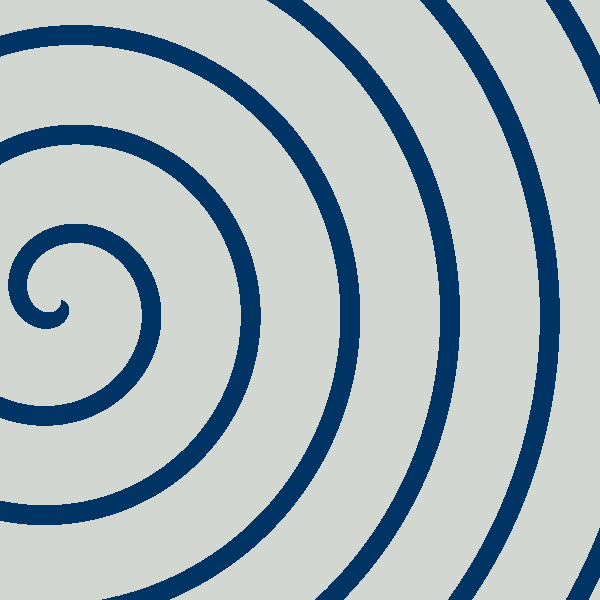
```

## Day 7: [Sample a color palette](https://github.com/paezha/genuary2023/tree/master/2022-01-07_Sample-a-color-palette)

Truchet mosaic with colors sampled from Studio Ghibli's Laputa: Castle in the Sky provided by package [{ghibli}](https://ewenme.github.io/ghibli/).

```{r echo=FALSE, out.width="500px"}
# Display image
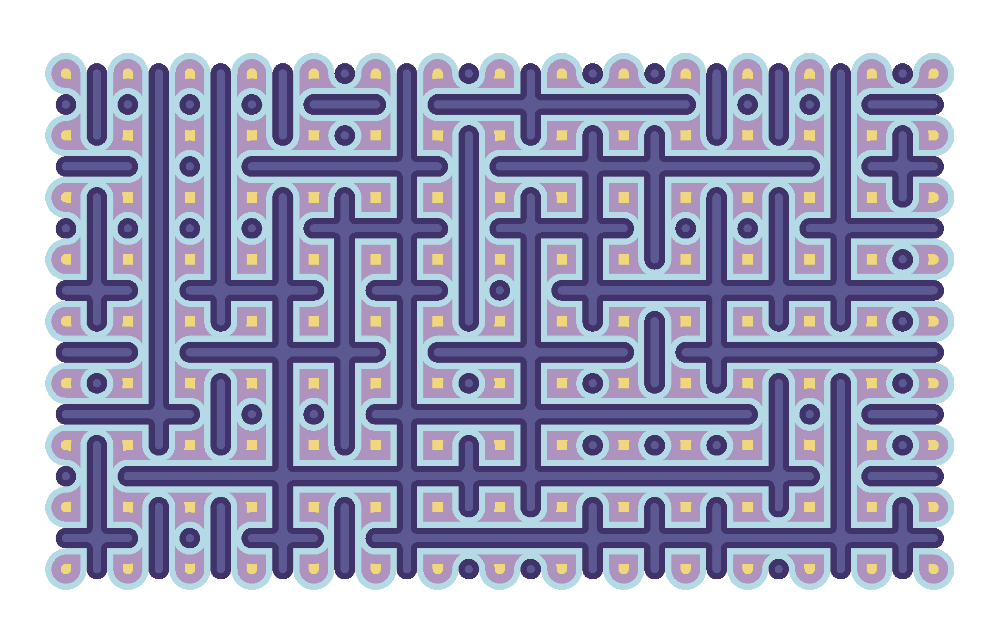
```

## Day 8: [Signed distance functions](https://github.com/paezha/genuary2023/tree/master/2022-01-08_Signed-Distance-Functions)

Colorful signed distance functions of three split regular polygons.

```{r echo=FALSE, out.width="500px"}
# Display image
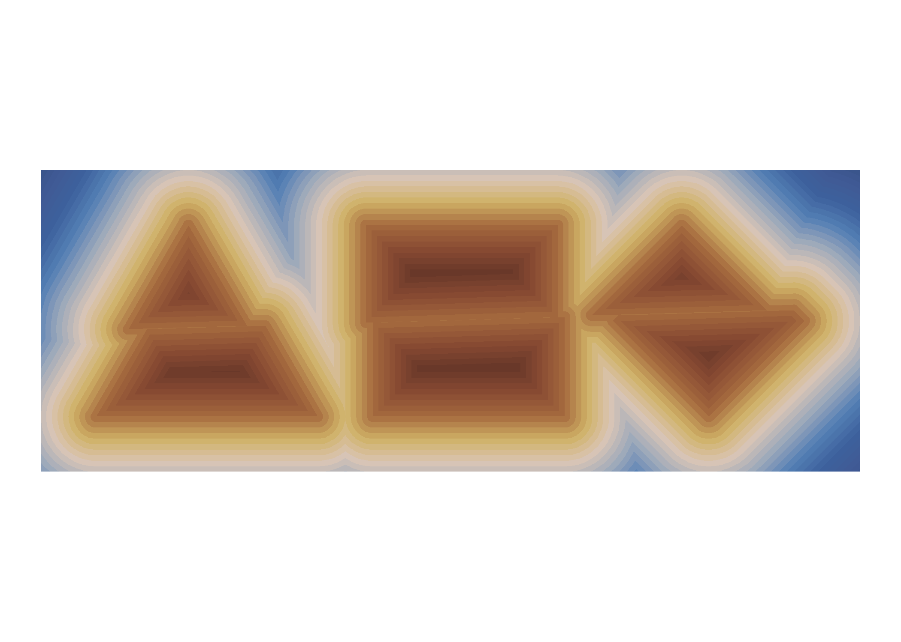
```

## Day 9: [Plants](https://github.com/paezha/genuary2023/tree/master/2022-01-09_Plants)

[Pierre Casadebaig's](https://casadebaig.netlify.app/) system for generative plants.

```{r echo=FALSE, out.width="500px"}
# Display image
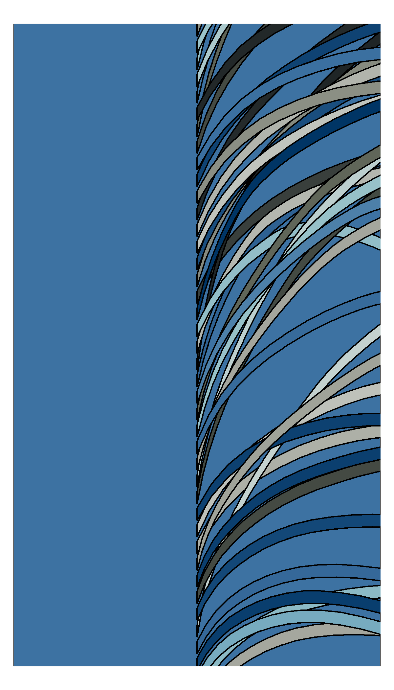
```

## Day 10: [Generative music](https://github.com/paezha/genuary2023/tree/master/2022-01-10_Generative-music)

The colors of the leaves are chosen based on the notes of Bach's [Crab Canon](https://www.youtube.com/watch?v=36ykl2tJwZM)

```{r echo=FALSE, out.width="500px"}
# Display image
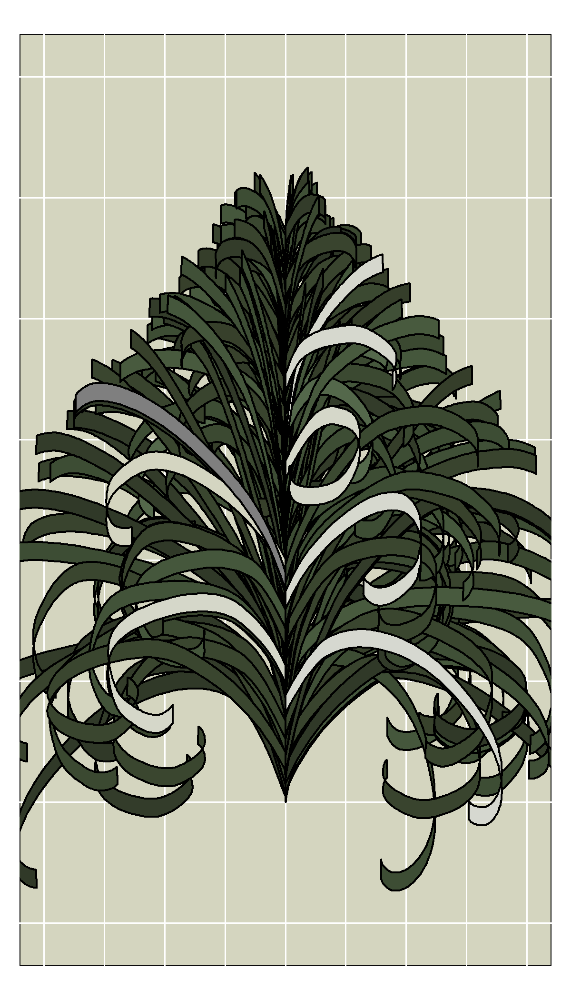
```

## Day 10: [Suprematism: Supreme walks](https://github.com/paezha/genuary2023/tree/master/2022-01-11_Suprematism)

Geometry and limited use of color may not be sufficient to algorithmically recreate the supremacy of "pure artistic feeling". Or maybe they are. Who am I to say?

```{r echo=FALSE, out.width="500px"}
# Display image
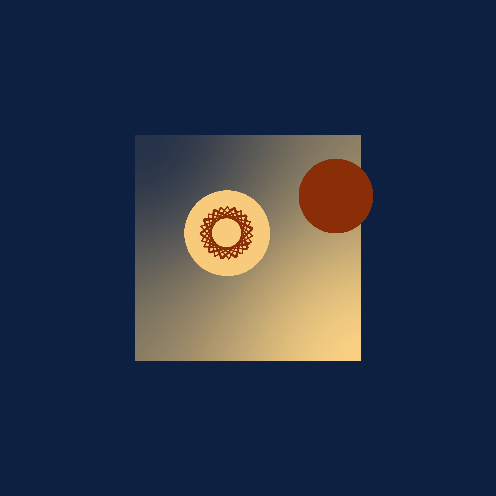
```
