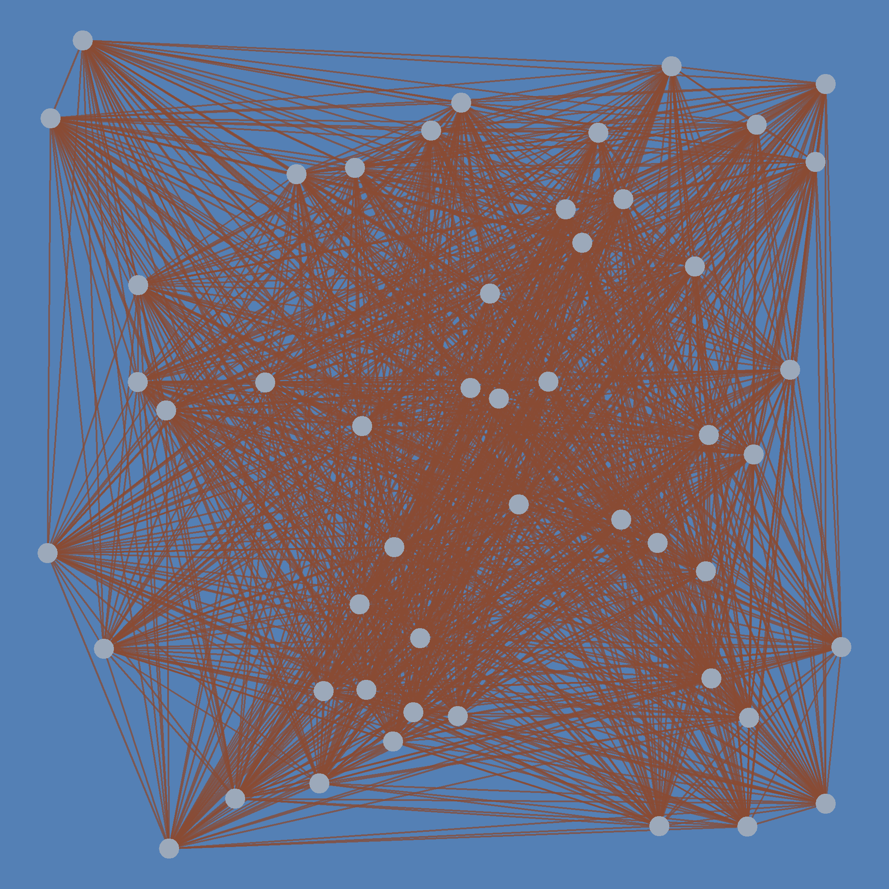
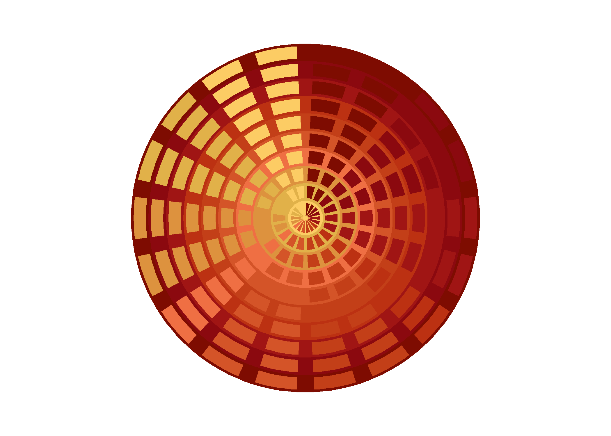
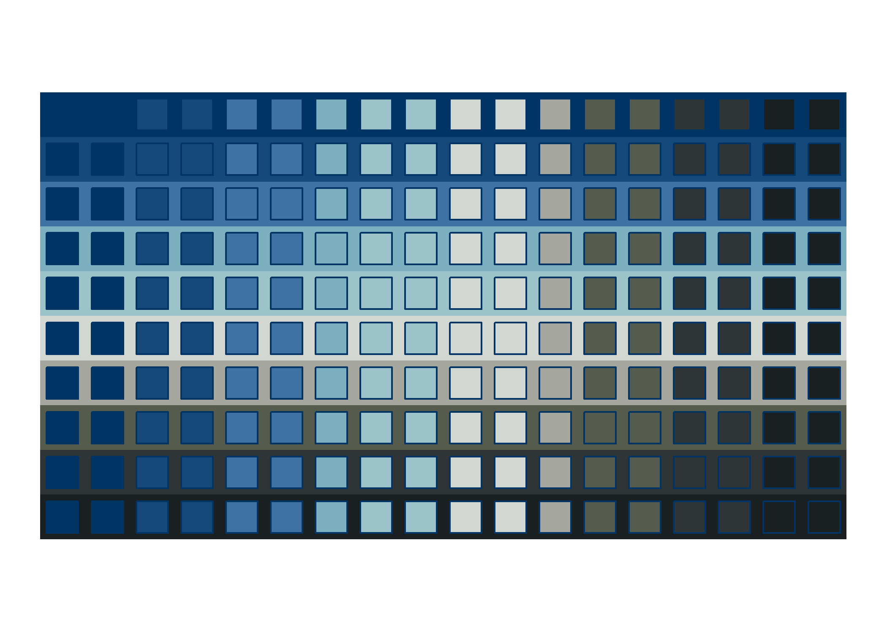

<!-- README.md is generated from README.Rmd. Please edit that file -->

```{r, include = FALSE}
knitr::opts_chunk$set(
  collapse = TRUE,
  comment = "#>"
)
```

# genuary2023

<!-- badges: start -->
<!-- badges: end -->

This repository is for [genuary2023](https://genuary.art/), a month of generative art. A great opportunity to learn something new coding-wise, while indulging in some Rtistry.

## Day 1: [Perfect loop](2022-01-01_Perfect-loop/fiesta-t-74202868.gif)

For this I revisit a system that I designed a few months ago, called "Fiesta". 

```{r echo=FALSE, out.width="500px"}
# Display image
knitr::include_graphics("2022-01-01_Perfect-loop/fiesta-t-74202868.gif")
```

## Day 2: [Made in ten minutes](https://github.com/paezha/genuary2023/tree/master/2022-01-02_Made-in-10-minutes)

Coding Sol LeWitt's wall drawing instructions in ten minutes. 

```{r echo=FALSE, out.width="500px"}
# Display image

```

## Day 3: [Glitch art](https://github.com/paezha/genuary2023/tree/master/2022-01-03_Glitch-Art)

Glitching geometries.

```{r echo=FALSE, out.width="500px"}
# Display image
knitr::include_graphics("2022-01-03_Glitch-art/glitched-voronoi-46709552.png")
```

## Day 4: [Intersections](https://github.com/paezha/genuary2023/tree/master/2022-01-04_Intersections)

Intersections of bands and polygons to create transchromations in polar and cartesian coordinates.

```{r echo=FALSE, out.width="500px"}
# Display image

```

```{r echo=FALSE, out.width="500px"}
# Display image

```
