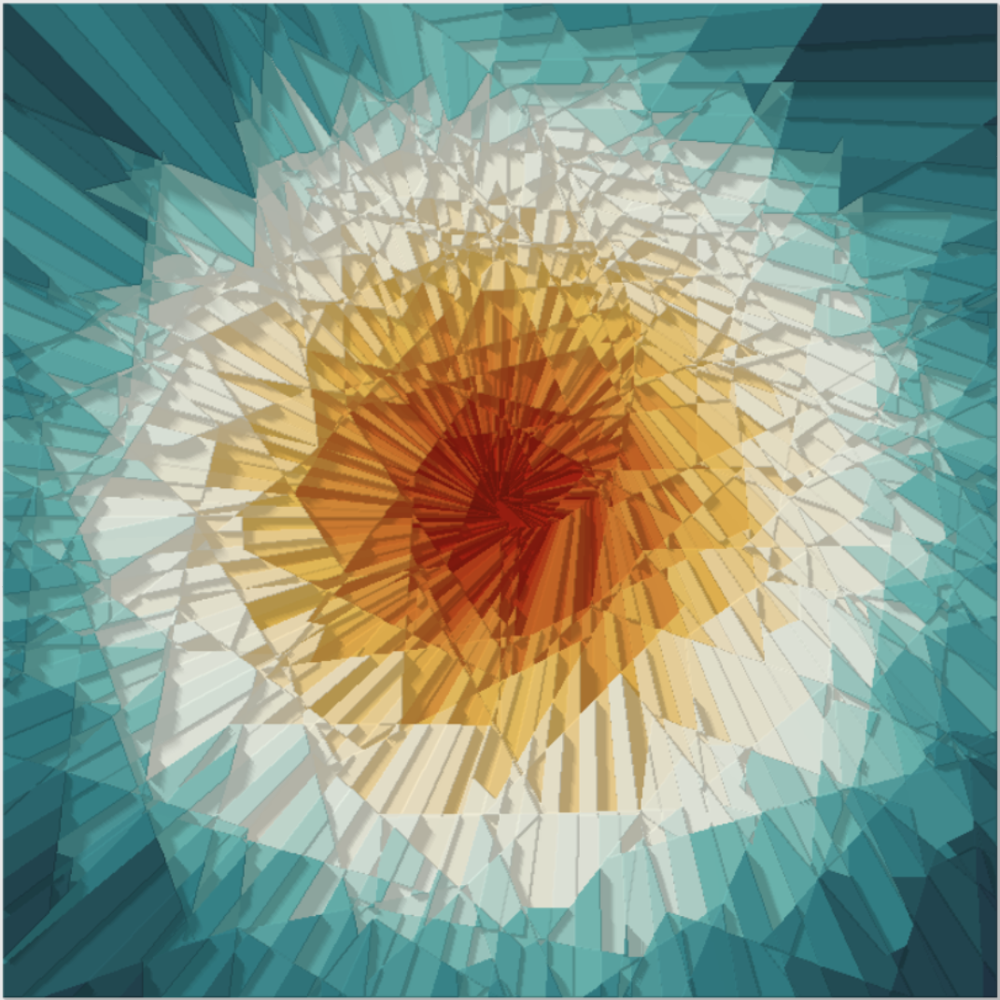
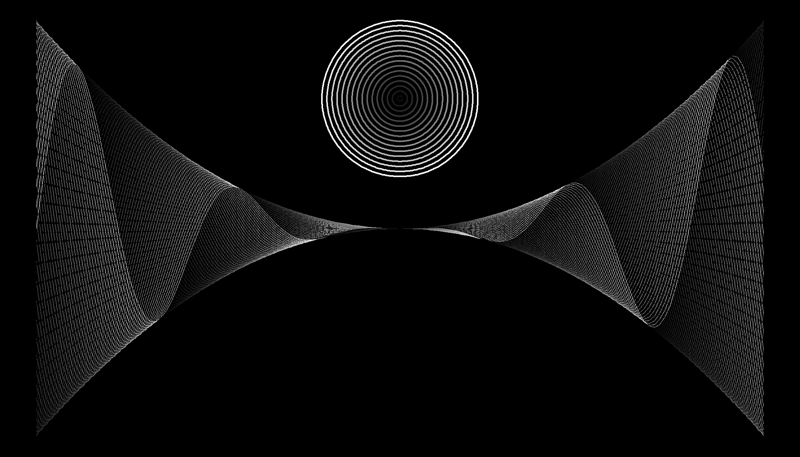
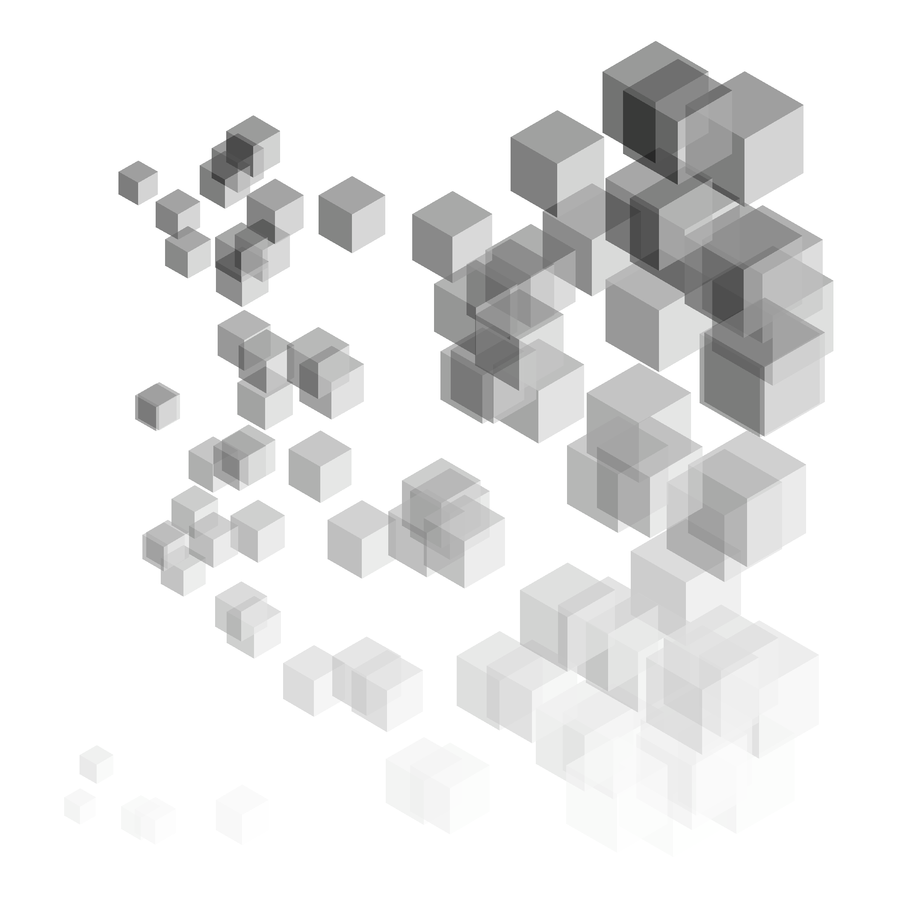
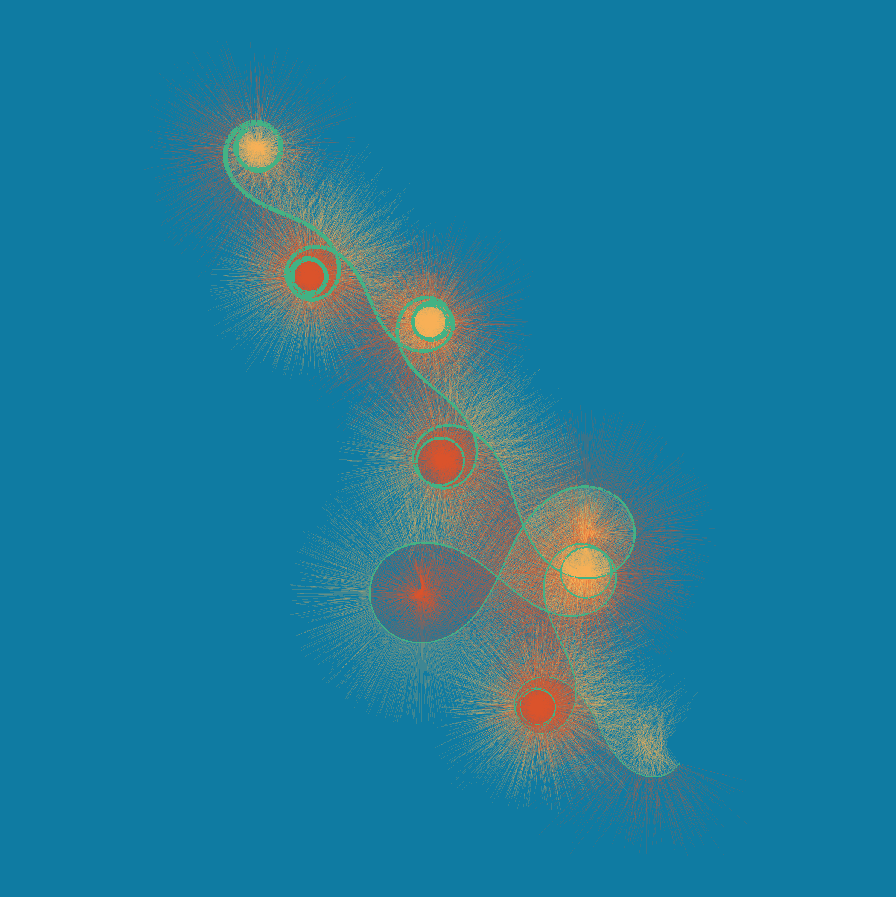

<!-- README.md is generated from README.Rmd. Please edit that file -->

```{r, include = FALSE}
knitr::opts_chunk$set(
  collapse = TRUE,
  comment = "#>"
)
```

# genuary2023

<!-- badges: start -->
<!-- badges: end -->

This repository is for [genuary2023](https://genuary.art/), a month of generative art. A great opportunity to learn something new coding-wise, while indulging in some Rtistry.

## Day 1: [Perfect loop](2022-01-01_Perfect-loop/fiesta-t-74202868.gif)

For this I revisit a system that I designed a few months ago, called "Fiesta". 

```{r echo=FALSE, out.width="500px"}
# Display image
knitr::include_graphics("2022-01-01_Perfect-loop/outputs/fiesta-t-74202868.gif")
```

## Day 2: [Made in ten minutes](https://github.com/paezha/genuary2023/tree/master/2022-01-02_Made-in-10-minutes)

Coding Sol LeWitt's wall drawing instructions in ten minutes. 

```{r echo=FALSE, out.width="500px"}
# Display image
knitr::include_graphics("2022-01-02_Made-in-10-minutes/outputs/ten-minutes-658618151.png")
```

## Day 3: [Glitch art](https://github.com/paezha/genuary2023/tree/master/2022-01-03_Glitch-Art)

Glitching geometries.

```{r echo=FALSE, out.width="500px"}
# Display image
knitr::include_graphics("2022-01-03_Glitch-Art/outputs/glitched-voronoi-46709552.png")
```

## Day 4: [Intersections](https://github.com/paezha/genuary2023/tree/master/2022-01-04_Intersections)

Intersections of bands and polygons to create transchromations in polar and cartesian coordinates.

```{r echo=FALSE, out.width="500px"}
# Display image
knitr::include_graphics("2022-01-04_Intersections/outputs/transchromation-10322117.png")
```

```{r echo=FALSE, out.width="500px"}
# Display image
knitr::include_graphics("2022-01-04_Intersections/outputs/transchromation-45039195.png")
```

## Day 5: [Debug view](https://github.com/paezha/genuary2023/tree/master/2022-01-05_Debug-View)

Debugging a wave.

```{r echo=FALSE, out.width="500px"}
# Display image
knitr::include_graphics("2022-01-05_Debug-View/outputs/debug-view.gif")
```


## Day 6: [Steal like an artist](https://github.com/paezha/genuary2023/tree/master/2022-01-06_Steal-Like-An-Artist)

Stealing code from [George Savva](https://mastodon.online/@georgemsavva@genart.social/109622524704727827).

```{r echo=FALSE, out.width="500px"}
# Display image
knitr::include_graphics("2022-01-06_Steal-Like-An-Artist/outputs/steal-like-an-artist.gif")
```

## Day 7: [Sample a color palette](https://github.com/paezha/genuary2023/tree/master/2022-01-07_Sample-a-color-palette)

Truchet mosaic with colors sampled from Studio Ghibli's Laputa: Castle in the Sky provided by package [{ghibli}](https://ewenme.github.io/ghibli/).

```{r echo=FALSE, out.width="500px"}
# Display image
knitr::include_graphics("2022-01-07_Sample-a-color-palette/outputs/truchet-ghibli-48318679.png")
```

## Day 8: [Signed distance functions](https://github.com/paezha/genuary2023/tree/master/2022-01-08_Signed-Distance-Functions)

Colorful signed distance functions of three split regular polygons.

```{r echo=FALSE, out.width="500px"}
# Display image
knitr::include_graphics("2022-01-08_Signed-Distance-Functions/outputs/sdf-88696514.png")
```

## Day 9: [Plants](https://github.com/paezha/genuary2023/tree/master/2022-01-09_Plants)

[Pierre Casadebaig's](https://casadebaig.netlify.app/) system for generative plants.

```{r echo=FALSE, out.width="500px"}
# Display image

```

## Day 10: [Generative music](https://github.com/paezha/genuary2023/tree/master/2022-01-10_Generative-music)

The colors of the leaves are chosen based on the notes of Bach's [Crab Canon](https://www.youtube.com/watch?v=36ykl2tJwZM)

```{r echo=FALSE, out.width="500px"}
# Display image
knitr::include_graphics("2022-01-10_Generative-music/outputs/crab-plant-775875665.png")
```

## Day 11: [Suprematism: Supreme walks](https://github.com/paezha/genuary2023/tree/master/2022-01-11_Suprematism)

Geometry and limited use of color may not be sufficient to algorithmically recreate the supremacy of "pure artistic feeling". Or maybe they are. Who am I to say?

```{r echo=FALSE, out.width="500px"}
# Display image

```

## Day 12: [Tessellation](https://github.com/paezha/genuary2023/tree/master/2022-01-12_Tessellation)

Smashing Voronoi.

```{r echo=FALSE, out.width="500px"}
# Display image

```

## Day 13: [Something I've always wanted to learn](https://paezha.github.io/MexBrewer/)

How to submit an `R` package to CRAN. Today I submitted my [{MexBrewer}](https://paezha.github.io/MexBrewer/) package to CRAN, and now I am waiting the results of the checks.

```{r echo=FALSE, out.width="500px"}
# Display image
knitr::include_graphics("2022-01-13_Something-you’ve-always-wanted-to-learn/MexBrewer.png")
```

UPDATE: Yay!

https://CRAN.R-project.org/package=MexBrewer


## Day 14: [Asemic](https://github.com/paezha/genuary2023/tree/master/2022-01-14_Aesemic)

Asemic haiku.

```{r echo=FALSE, out.width="500px"}
# Display image
knitr::include_graphics("2022-01-14_Aesemic/outputs/asemic-haiku-lr-31693569.png")
```

## Day 15: [Sine waves](https://github.com/paezha/genuary2023/tree/master/2022-01-15_Sine-waves)

Sinescape.

```{r echo=FALSE, out.width="500px"}
# Display image

```

## Day 16: [Reflection of a reflection]()

WIP.

```{r echo=FALSE, out.width="500px"}
# Display image
#
```

## Day 17: [Grid in a grid](https://github.com/paezha/genuary2023/tree/master/2022-01-17_A-grid-inside-a-grid-inside-a-grid)

A grid inside a grid...

```{r echo=FALSE, out.width="500px"}
# Display image
knitr::include_graphics("2022-01-17_A-grid-inside-a-grid-inside-a-grid/outputs/grid-in-grid-Maiz-65863013.png")
```

## Day 18: [Definitely not a grid in a grid]()

WIP

```{r echo=FALSE, out.width="500px"}
# Display image
#knitr::include_graphics("2022-01-17_A-grid-inside-a-grid-inside-a-grid/outputs/grid-in-grid-Maiz-65863013.png")
```

## Day 19: [Black and white](https://github.com/paezha/genuary2023/tree/master/2022-01-19_Black-and-white)

Matching Black \& White and White \& Black images.

```{r echo=FALSE, out.width="500px"}
# Display image
knitr::include_graphics("2022-01-19_Black-and-white/outputs/cubescape-b-w-44498798.png")
```

```{r echo=FALSE, out.width="500px"}
# Display image

```

## Day 20: [Art Deco]()

WIP

```{r echo=FALSE, out.width="500px"}
# Display image
#knitr::include_graphics("2022-01-19_Black-and-white/outputs/cubescape-b-w-44498798.png")
```

## Day 21: [Persian rug]()

WIP

```{r echo=FALSE, out.width="500px"}
# Display image
#knitr::include_graphics("2022-01-19_Black-and-white/outputs/cubescape-b-w-44498798.png")
```

## Day 22: [Shadows](https://github.com/paezha/genuary2023/tree/master/2022-01-22_Shadows)

Rayrendering shadows.

```{r echo=FALSE, out.width="500px"}
# Display image
knitr::include_graphics("2022-01-22_Shadows/outputs/shadows-37843230.png")
```

## Day 23: [More Moiré](https://github.com/paezha/genuary2023/tree/master/2022-01-23_More-Moire)

Patterns of interference between three rotating spirals.

```{r echo=FALSE, out.width="500px"}
# Display image
knitr::include_graphics("2022-01-23_More-Moire/outputs/more-moire-51730484.gif")
```

## Day 24: [Textile](https://github.com/paezha/genuary2023/tree/master/2022-01-24_Textile)

Here I use a form of [dithering](https://en.wikipedia.org/wiki/Dither) to give an image the aspect of woven art.

```{r echo=FALSE, out.width="500px"}
# Display image
knitr::include_graphics("2022-01-24_Textile/outputs/calaverita-2-textile-42988148.png")
```

## Day 25: [Yayoi Kusama](https://github.com/paezha/genuary2023/tree/master/2022-01-25_Yayoi-Kusama)

Circle packing meets simple features meets rayrendering meets Yayoi Kusama.

```{r echo=FALSE, out.width="500px"}
# Display image
knitr::include_graphics("2022-01-25_Yayoi-Kusama/outputs/Glossy-Redon-One-18751918.png")
```

## Day 26: [My kid could have done that](https://github.com/paezha/genuary2023/tree/master/2022-01-26_My-kid-could-have-done-that)

Sinuous meandering patterns that resemble the monsters that my son used to draw when he was little.

```{r echo=FALSE, out.width="500px"}
# Display image

```

