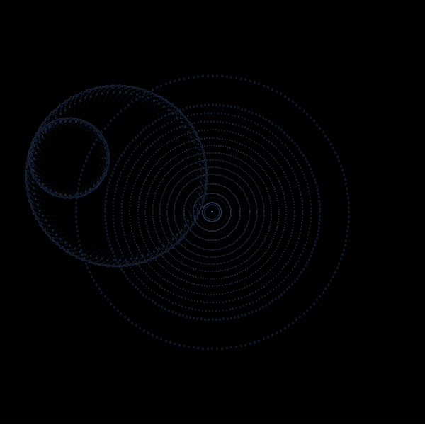

<!-- README.md is generated from README.Rmd. Please edit that file -->

# genuary2023

<!-- badges: start -->
<!-- badges: end -->

This repository is for [genuary2023](https://genuary.art/), a month of
generative art. A great opportunity to learn something new coding-wise,
while indulging in some Rtistry.

## Day 1: Perfect loop

For this I will revisit a system that I designed a few months ago,
called “Fiesta”.

<!---->

