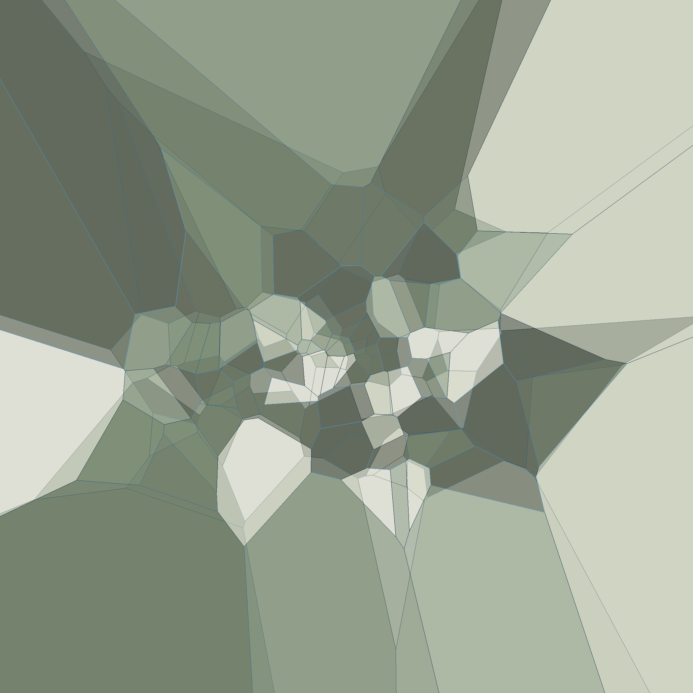
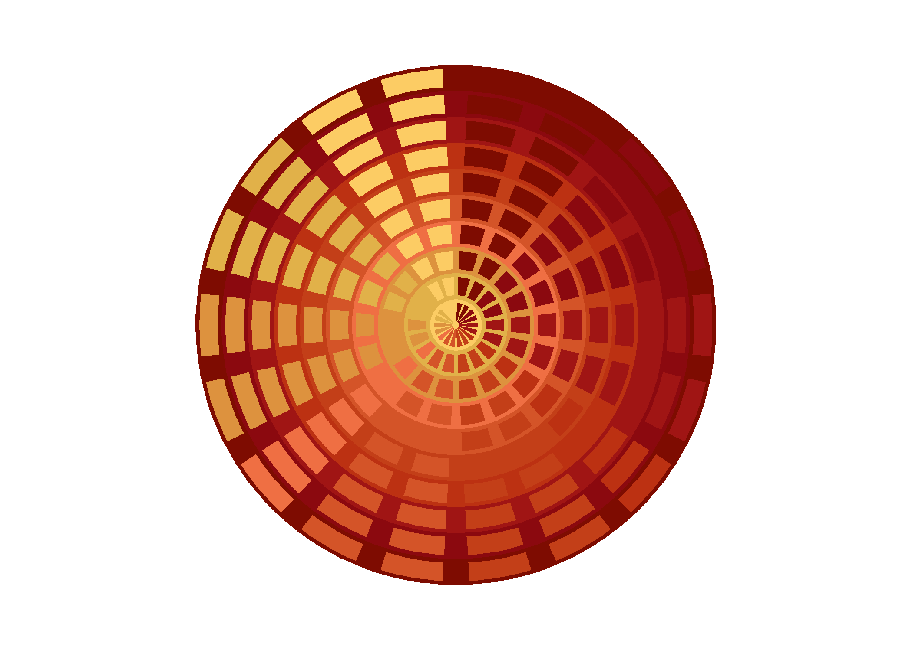
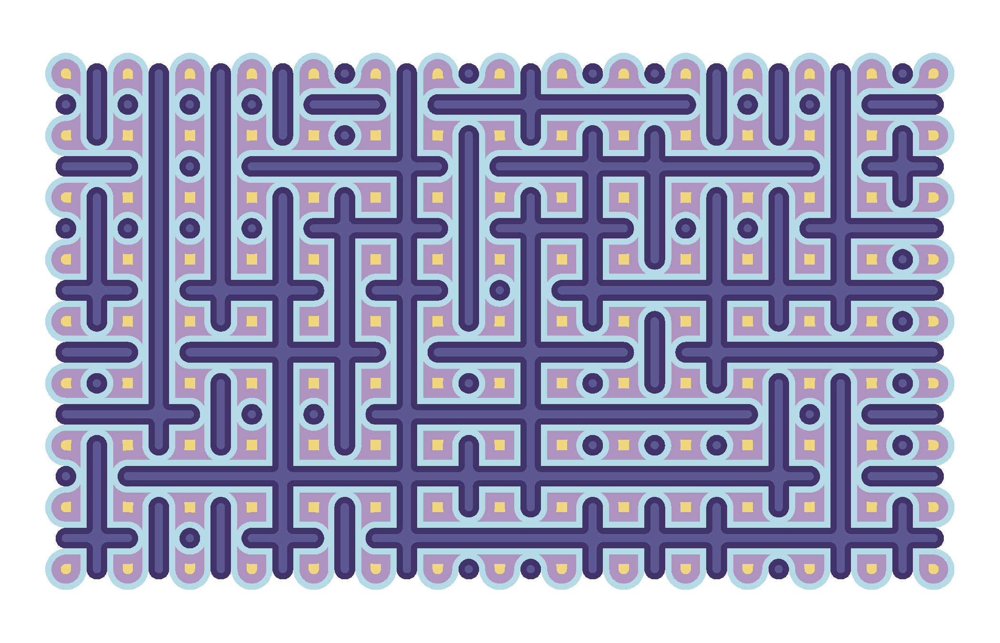
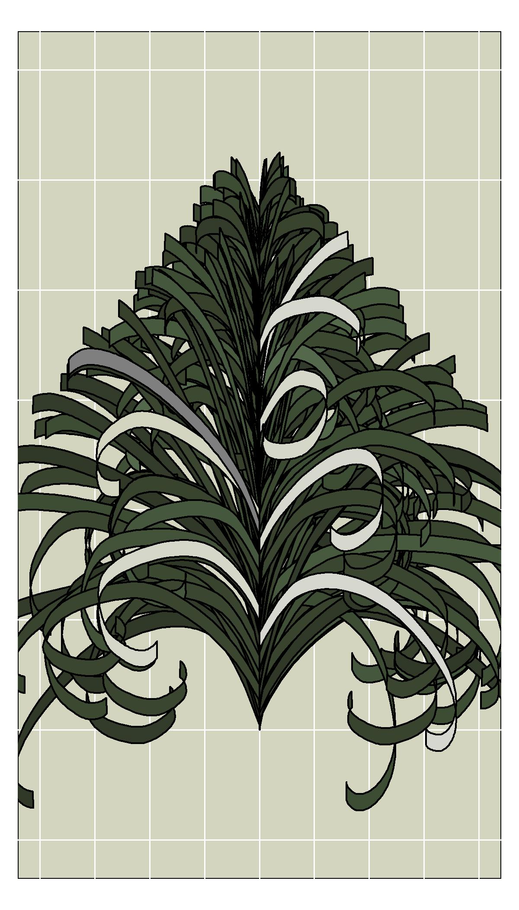
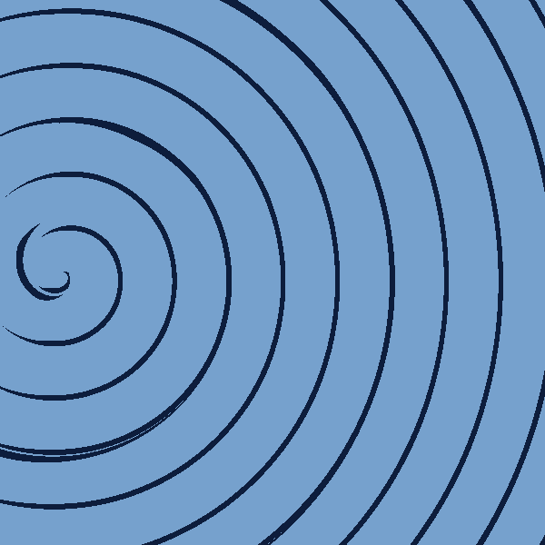
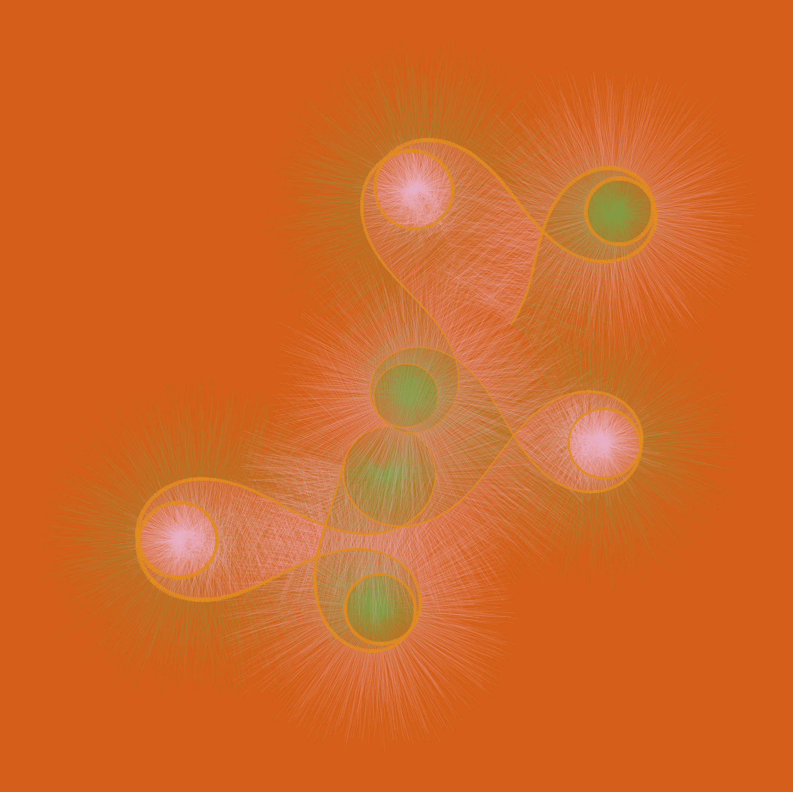

<!-- README.md is generated from README.Rmd. Please edit that file -->

# genuary2023

<!-- badges: start -->
<!-- badges: end -->

This repository is for [genuary2023](https://genuary.art/), a month of
generative art. A great opportunity to learn something new coding-wise,
while indulging in some Rtistry.

## Day 1: [Perfect loop](2022-01-01_Perfect-loop/fiesta-t-74202868.gif)

For this I revisit a system that I designed a few months ago, called
“Fiesta”.

## Day 2: [Made in ten minutes](https://github.com/paezha/genuary2023/tree/master/2022-01-02_Made-in-10-minutes)

Coding Sol LeWitt’s wall drawing instructions in ten minutes.

## Day 3: [Glitch art](https://github.com/paezha/genuary2023/tree/master/2022-01-03_Glitch-Art)

Glitching geometries.

## Day 4: [Intersections](https://github.com/paezha/genuary2023/tree/master/2022-01-04_Intersections)

Intersections of bands and polygons to create transchromations in polar
and cartesian coordinates.

## Day 5: [Debug view](https://github.com/paezha/genuary2023/tree/master/2022-01-05_Debug-View)

Debugging a wave.

## Day 6: [Steal like an artist](https://github.com/paezha/genuary2023/tree/master/2022-01-06_Steal-Like-An-Artist)

Stealing code from [George
Savva](https://mastodon.online/@georgemsavva@genart.social/109622524704727827).

## Day 7: [Sample a color palette](https://github.com/paezha/genuary2023/tree/master/2022-01-07_Sample-a-color-palette)

Truchet mosaic with colors sampled from Studio Ghibli’s Laputa: Castle
in the Sky provided by package
[{ghibli}](https://ewenme.github.io/ghibli/).

## Day 8: [Signed distance functions](https://github.com/paezha/genuary2023/tree/master/2022-01-08_Signed-Distance-Functions)

Colorful signed distance functions of three split regular polygons.

## Day 9: [Plants](https://github.com/paezha/genuary2023/tree/master/2022-01-09_Plants)

[Pierre Casadebaig’s](https://casadebaig.netlify.app/) system for
generative plants.

## Day 10: [Generative music](https://github.com/paezha/genuary2023/tree/master/2022-01-10_Generative-music)

The colors of the leaves are chosen based on the notes of Bach’s [Crab
Canon](https://www.youtube.com/watch?v=36ykl2tJwZM)

## Day 11: [Suprematism: Supreme walks](https://github.com/paezha/genuary2023/tree/master/2022-01-11_Suprematism)

Geometry and limited use of color may not be sufficient to
algorithmically recreate the supremacy of “pure artistic feeling”. Or
maybe they are. Who am I to say?

## Day 12: [Tessellation](https://github.com/paezha/genuary2023/tree/master/2022-01-12_Tessellation)

Smashing Voronoi.

## Day 13: [Something I’ve always wanted to learn](https://paezha.github.io/MexBrewer/)

How to submit an `R` package to CRAN. Today I submitted my
[{MexBrewer}](https://paezha.github.io/MexBrewer/) package to CRAN, and
now I am waiting the results of the checks.

UPDATE: Yay!

<https://CRAN.R-project.org/package=MexBrewer>

## Day 14: [Asemic](https://github.com/paezha/genuary2023/tree/master/2022-01-14_Aesemic)

Asemic haiku.

## Day 15: [Sine waves](https://github.com/paezha/genuary2023/tree/master/2022-01-15_Sine-waves)

Sinescape.

## Day 16: [Reflection of a reflection]()

WIP.

## Day 17: [Grid in a grid](https://github.com/paezha/genuary2023/tree/master/2022-01-17_A-grid-inside-a-grid-inside-a-grid)

A grid inside a grid…

## Day 18: [Definitely not a grid in a grid]()

WIP

## Day 19: [Black and white](https://github.com/paezha/genuary2023/tree/master/2022-01-19_Black-and-white)

Matching Black & White and White & Black images.

## Day 20: [Art Deco]()

WIP

## Day 21: [Persian rug]()

WIP

## Day 22: [Shadows](https://github.com/paezha/genuary2023/tree/master/2022-01-22_Shadows)

Rayrendering shadows.

## Day 23: [More Moiré](https://github.com/paezha/genuary2023/tree/master/2022-01-23_More-Moire)

Patterns of interference between three rotating spirals.

## Day 24: [Textile](https://github.com/paezha/genuary2023/tree/master/2022-01-24_Textile)

Here I use a form of [dithering](https://en.wikipedia.org/wiki/Dither)
to give an image the aspect of woven art.

## Day 25: [Yayoi Kusama](https://github.com/paezha/genuary2023/tree/master/2022-01-25_Yayoi-Kusama)

Simple features meets circle packing meets rayrendering meets Yayoi
Kusama.

## Day 26: [My kid could have done that](https://github.com/paezha/genuary2023/tree/master/2022-01-26_My-kid-could-have-done-that)

Sinuous meandering patterns that resemble the monsters that my son used
to draw when he was little.

UPDATED to use color palettes from [Nicola
Rennie’s](https://github.com/nrennie)
[{PrettyCols}](https://nrennie.github.io/PrettyCols/) package.

## Day 27: [Hilma af Klint](https://github.com/paezha/genuary2023/tree/master/2022-01-27_Hilma-Af-Klint)

Inspired by The Swan.

## Day 28: [Generative poetry](https://github.com/paezha/genuary2023/tree/master/2022-01-28_Generative-Poetry)

A poem by [Lady Ono no
Komachi](https://en.wikipedia.org/wiki/Ono_no_Komachi) (c. 825 - c. 900)
written in randomly generated asemic glyphs:

> Visible colours  
> (Invisible passions)  
> Fade from  
> This world’s  
> Human hearts  
> And flowers.

## Day 29: [Maximalism: *Pluribus unum Multorum chaos*](https://github.com/paezha/genuary2023/tree/master/2022-01-29_Maximalism)

For this prompt I looked into Chinese Maximalism, and the work of the
work of [Xu Hongming](https://www.wikiart.org/en/xu-hongming). This
piece (that I call *Pluribus unum Multorum chaos*) is inspired by
Hongming’s [“Human Condition
One”](https://www.wikiart.org/en/xu-hongming/-1994) (人态一 : Rén tài
yī)

## Day 30: [Minimalism](https://github.com/paezha/genuary2023/tree/master/2022-01-30_Minimalism)

Three lines, three or four colors.

## Day 31: [Break a previous image](https://github.com/paezha/genuary2023/tree/master/2022-01-31_Break-a-previous-image)

For some reason I did quite some breaking during this Genuary, including
[here](https://github.com/paezha/genuary2023/tree/master/2022-01-08_Signed-Distance-Functions),
[here](https://github.com/paezha/genuary2023/tree/master/2022-01-12_Tessellation),
and
[here](https://github.com/paezha/genuary2023/tree/master/2022-01-29_Maximalism).
For this prompt I break a previous image by “ubreaking” it. The image
below is an unshattered version of the shattered voronoi polygons of Day
12.

UPDATED to use color palettes from [Nicola
Rennie’s](https://github.com/nrennie)
[{PrettyCols}](https://nrennie.github.io/PrettyCols/) package.

